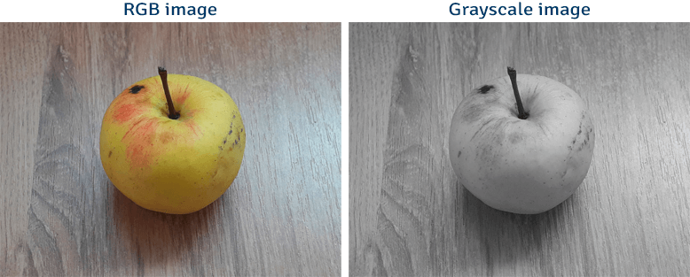

# 1.1: What is Image Processing?

Image Processing is a technique used to perform operations on images to improve their quality or to extract important information from them. It is a key technology in fields such as computer vision, medical imaging, remote sensing, and many more.
Your browser does not support the video tag.


<video src="photows/INTRO.mp4" width="800" height="410" controls>
  </video>

---

##  Why is it Important?

-Enhances Image Quality: Helps improve the overall quality of an image, such as noise removal, contrast adjustment, and sharpening. This is especially useful in situations where images are captured under low-light conditions or have poor quality due to camera limitations.

-Feature Extraction for Computer Vision: Enables the identification and extraction of specific features from an image (such as edges, corners, and textures). This is critical for tasks like object recognition, face detection, and image classification.

Used in Various Fields:

-Medical Imaging: Facilitates the analysis of medical images, such as X-rays, MRIs, and CT scans, to identify health conditions or abnormalities.

-Satellite Imaging: Used to process images from satellites for applications such as weather forecasting, environmental monitoring, and urban planning.

-Face Recognition: Powers biometric systems for security by analyzing and recognizing facial features.

-Agriculture: Assists in analyzing aerial images of crops to monitor growth, detect diseases, and estimate yields.

-Autonomous Vehicles: Image processing is essential for the navigation systems of self-driving cars, enabling them to interpret the environment and avoid obstacles.

-Improved Decision Making: By processing and analyzing images, it becomes easier to make informed decisions in real-time, especially in fields like security, surveillance, and robotics.

-Image Compression: Reduces the size of images without significantly compromising quality, making it easier to store and transmit large amounts of visual data.

##  Python Code Example (OpenCV)

``` python
# Import the OpenCV library for image processing
import cv2
# Import Matplotlib for displaying images
import matplotlib.pyplot as plt

# Read the image using OpenCV and convert it to grayscale
img = cv2.imread('sample.jpg', cv2.IMREAD_GRAYSCALE)

# Display the grayscale image using Matplotlib, setting the colormap to gray
plt.imshow(img, cmap='gray')

# Add a title to the image
plt.title('Grayscale Image')

# Hide the axes (since the image is the only important part here)
plt.axis('off')

# Show the image
plt.show()
```

