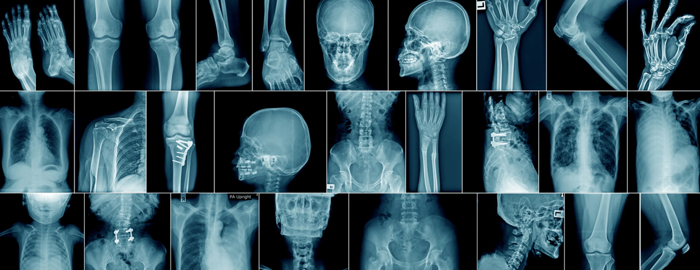
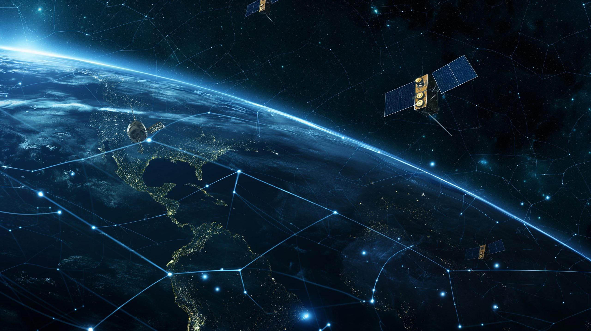
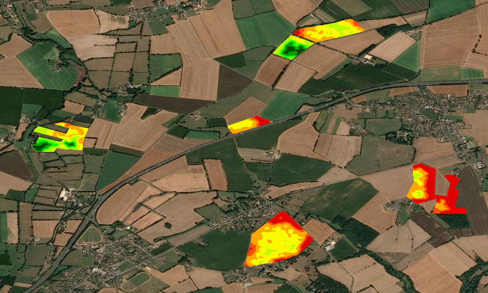
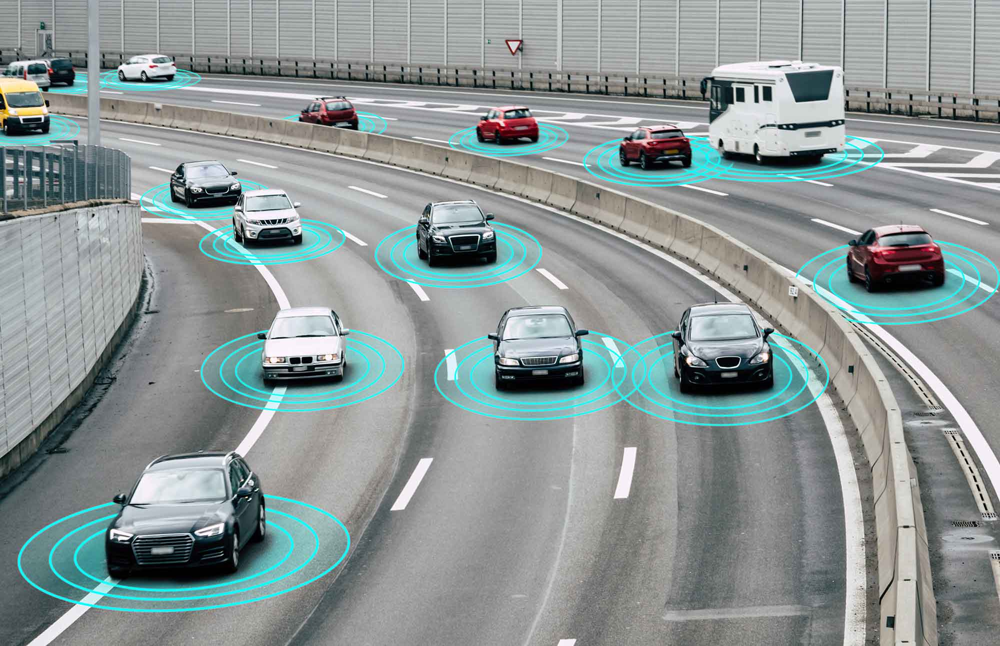
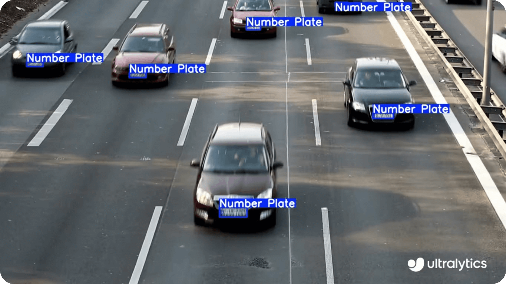
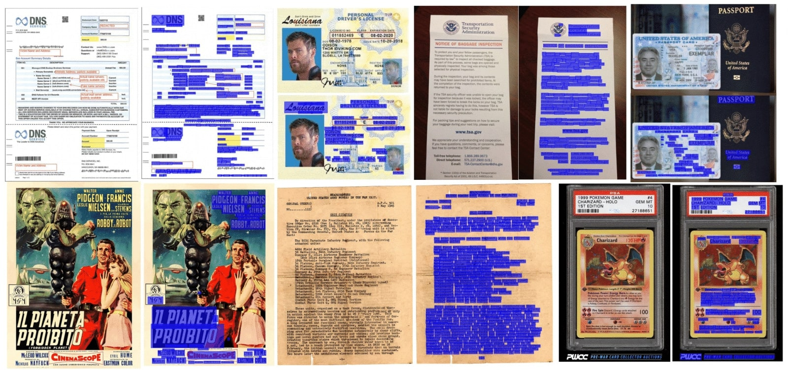
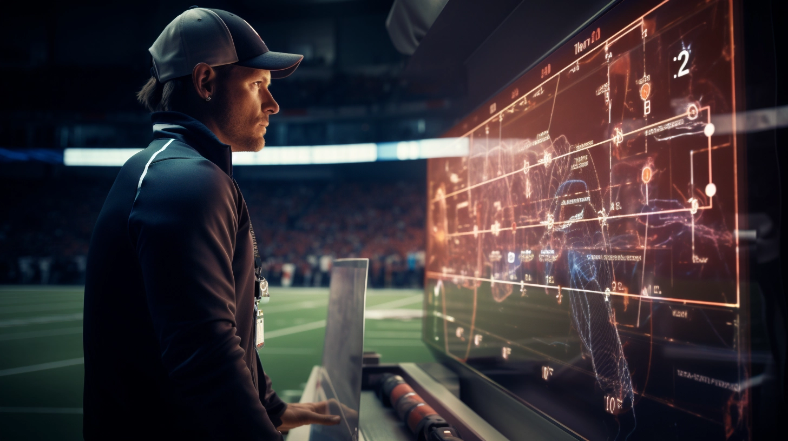

# 1.3: Applications of Image Processing

* Image processing has a wide range of applications across various industries. Here are some of the key areas where it is extensively used:
---

  <video src="photows/applications.mp4" width="800" height="410" controls>
  </video>


---

## 1. **Medical Imaging**
- **X-rays**, **MRI (Magnetic Resonance Imaging)**, and **CT scans (Computed Tomography)**: Image processing techniques are used to analyze medical images for detecting conditions such as tumors, fractures, and cardiovascular issues.
- **Improving Image Quality**: Image processing helps enhance the quality of medical images by reducing noise and improving contrast, aiding doctors in making more accurate diagnoses.


---

## 2. **Face Recognition**
- **Security Systems**: Image processing plays a vital role in facial recognition technology used in security systems, enabling automatic identification of individuals in surveillance and access control systems.
- **Smartphones**: Many modern smartphones use facial recognition to unlock the device, such as Apple's Face ID.


---

## 3. **Remote Sensing**
- **Satellite Imaging**: Image processing is used to analyze satellite images for applications like environmental monitoring, urban planning, and disaster management. It helps in detecting changes in land use, deforestation, and urban expansion.
- **Weather Forecasting**: Weather satellites use image processing techniques to capture and analyze images of cloud formations, storms, and temperature patterns, aiding in accurate forecasting.
- 


---

## 4. **Agriculture**
- **Crop Monitoring**: Drones and satellite imagery are used in agriculture to monitor crop health, detect diseases, estimate yields, and manage irrigation more efficiently through image processing techniques.
- **Precision Agriculture**: Image processing helps in precision farming, allowing farmers to make data-driven decisions for optimized use of resources like water, fertilizer, and pesticides.



---

## 5. **Industrial Automation**
- **Quality Control**: Image processing systems are used in manufacturing for inspecting products, detecting defects, and ensuring quality control. Automated vision systems can identify flaws in real-time, improving efficiency and reducing errors.
- **Robotics**: Robots use image processing to navigate and interact with their environment, enabling tasks like assembly, sorting, and packaging.


---

## 6. **Autonomous Vehicles**
- **Self-Driving Cars**: Image processing plays a crucial role in the development of autonomous vehicles. Cameras and sensors capture images of the surroundings, which are then processed to detect obstacles, road signs, pedestrians, and other vehicles for safe navigation.



---

## 7. **Surveillance and Security**
- **Monitoring Systems**: Image processing is essential in security systems for recognizing faces, tracking movements, and analyzing video feeds to detect unusual behavior or intrusions.
- **License Plate Recognition**: Automated license plate recognition (ANPR) uses image processing to identify vehicle plates in parking lots, toll stations, and border security.



---

## 8. **Entertainment and Media**
- **Image Editing and Enhancement**: Image processing techniques are widely used in photo editing software like Photoshop for tasks such as color correction, image sharpening, and retouching.
- **Film Industry**: Image processing is also applied in special effects, animation, and video editing, helping to create realistic visual effects and improve image quality.


---

## 9. **Document and Text Recognition**
- **OCR (Optical Character Recognition)**: OCR technology uses image processing to convert scanned images of text into editable text formats, widely used in digitizing documents, books, and invoices.
- **Handwriting Recognition**: Image processing also helps in recognizing handwritten text, enabling applications in note-taking, postal services, and document management systems.



---

## 10. **Sports Analytics**
- **Motion Analysis**: In sports, image processing is used to track player movements, analyze game footage, and generate statistics such as player speed and positioning.
- **Injury Prevention**: Through analysis of player motion, image processing helps in identifying potential injury risks and improving player performance.



---
##  example for Face Detection 

##  Python Example

```python
# Import the OpenCV library for image processing
import cv2  

# Load the pre-trained Haar cascade classifier for frontal face detection
face_cascade = cv2.CascadeClassifier(cv2.data.haarcascades + 'haarcascade_frontalface_default.xml')

# Read the input image from the file
img = cv2.imread('face.jpg')

# Convert the image to grayscale, which is necessary for face detection
gray = cv2.cvtColor(img, cv2.COLOR_BGR2GRAY)

# Detect faces in the grayscale image
# The detectMultiScale function detects objects (faces) at different scales
# The first parameter is the image, the second is the scale factor (1.1 means image size is reduced by 10% at each scale),
# and the third parameter is the minimum number of neighbors (4 means at least 4 neighbors to retain a detection)
faces = face_cascade.detectMultiScale(gray, 1.1, 4)

# Draw rectangles around each detected face
for (x, y, w, h) in faces:
    # Draw a rectangle with the given coordinates (x, y) and width (w), height (h)
    # The rectangle color is blue (255, 0, 0) and the thickness is 2 pixels
    cv2.rectangle(img, (x, y), (x+w, y+h), (255, 0, 0), 2)

# Save the output image with the detected faces highlighted
cv2.imwrite('face_detected.jpg', img)
```
---

###  MATLAB Code

```matlab
% Load the pre-trained classifier
faceDetector = vision.CascadeObjectDetector();

% Read the input image
img = imread('face.jpg');

% Convert the image to grayscale
grayImg = rgb2gray(img);

% Detect faces
bbox = step(faceDetector, grayImg);

% Insert rectangles around detected faces
detectedImg = insertShape(img, 'Rectangle', bbox, 'Color', 'red', 'LineWidth', 2);

% Save the output image
imwrite(detectedImg, 'face_detected.jpg');

```
