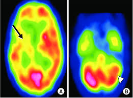

# 1.5:Imaging Modalities

- Imaging modalities refer to the various techniques and technologies used to capture images from different parts of the body or environments. These modalities are essential in multiple fields such as medicine, remote sensing, industrial inspection, and scientific research. Below are some of the most widely used imaging modalities.

---

## 1.X-ray Imaging
- Principle**: X-ray imaging uses ionizing radiation to produce images of the inside of the body. The radiation passes through the body, and a detector captures the transmitted X-rays to create an image.
- Applications:
  - Medical Imaging: Detects bone fractures, infections, and certain cancers.
  - Dental Imaging: Used to examine teeth and bones in the mouth.
  - Industrial Imaging: Inspects the internal structure of materials or mechanical parts.

---

## 2.Magnetic Resonance Imaging (MRI)
- Principle: MRI uses a powerful magnetic field and radio waves to generate detailed images of the organs and tissues inside the body without the use of radiation.
- Applications:
  - Medical Imaging: Especially useful for soft tissue imaging, such as the brain, muscles, and organs.
  - Brain Imaging: Often used in diagnosing neurological conditions like strokes, tumors, and multiple sclerosis.
  - **Joint and Muscle Imaging: Helps in diagnosing issues in muscles, ligaments, and joints.

---

## 3.Computed Tomography (CT)
- Principle: CT scans combine X-ray images taken from different angles and use computer processing to create cross-sectional images (slices) of bones, blood vessels, and soft tissues.
- Applications:
  - Medical Imaging: Provides more detailed images than traditional X-rays, especially for internal organs and soft tissues.
  - Cancer Detection: Often used to detect and monitor cancerous tumors.
  - Trauma Imaging: Used in emergency settings to detect internal injuries and bleeding.

---

## 4.Ultrasound Imaging
- Principle: Ultrasound imaging uses high-frequency sound waves to create images of the inside of the body. The sound waves bounce off tissues and are captured to form an image.
- Applications:
  - Medical Imaging: Commonly used in obstetrics and gynecology for monitoring pregnancies.
  - Cardiological Imaging: Assists in examining the heart and blood vessels, such as in echocardiography.
  - Abdominal Imaging: Helps visualize organs like the liver, kidneys, and spleen.

---

## 5.Positron Emission Tomography (PET)
- Principle: PET scanning uses radioactive substances that emit positrons, which are detected by special cameras to create images showing how tissues and organs are functioning.
- Applications:
- Cancer Detection: Helps in detecting cancer by visualizing the metabolic activity of tumors.
- Neurological Imaging: Assists in studying brain function and diagnosing conditions such as Alzheimer’s disease.
- Cardiac Imaging: Used to evaluate blood flow and heart conditions.
  
.png)

---

## 6.Single Photon Emission Computed Tomography (SPECT)
- Principle: SPECT uses gamma rays to create 3D images of the inside of the body by detecting radioactive tracers injected into the bloodstream.
- Applications:
  - Medical Imaging: Commonly used to assess blood flow to the heart, and diagnose brain disorders such as epilepsy and stroke.
  - Cancer Imaging: Helps in the detection and monitoring of cancer.
  - Bone Imaging: Can identify bone infections or abnormalities.
  

---

## 7.Optical Imaging
- Principle: Optical imaging uses visible light or near-infrared light to capture images of tissues or surfaces. This modality is non-invasive and typically used for surface-level imaging.
- Applications:
  - Medical Imaging: Used for imaging the skin, eyes, and superficial tissues.
  - Endoscopy: Optical fiber technology is used in endoscopic procedures to visualize internal organs like the gastrointestinal tract.

---

## 8.Infrared Imaging
- Principle: Infrared imaging captures infrared radiation emitted by objects, which is used to visualize temperature differences.

- Applications:
  - Thermal Imaging: Used to detect temperature anomalies in the body, such as inflammation or infection.
  - Industrial Applications: Used to check for electrical faults, insulation failures, or overheating in machinery.
  - 

---

