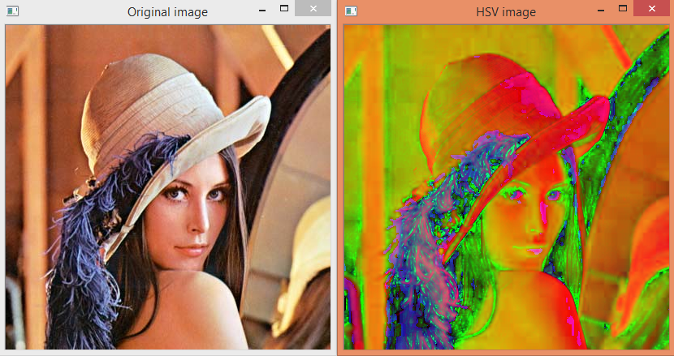
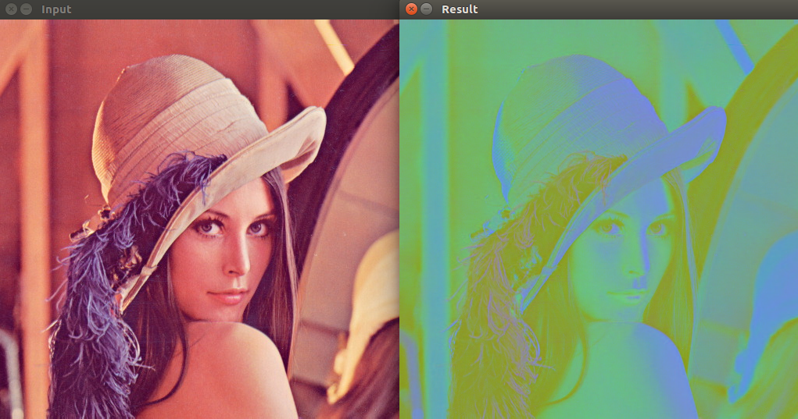

# 10.1 Color Models (RGB, HSV, YCbCr)

<video src="photo/FundamentalsofColoImageProcessing.mp4"  width="800" height="410" controls>
    Your browser does not support the video tag.
  </video>


---

## 📌 Introduction 
* Color models describe how colors can be represented as tuples of numbers. Most common models in image processing:

- **RGB (Red, Green, Blue)**
- **HSV (Hue, Saturation, Value)**
- **YCbCr (Luminance, Chrominance)**

---

## 🎨 RGB Color Model

Each pixel is a triplet (R, G, B).  
Range: 0–255 for 8-bit images.

**Equation (no transformation needed):**
```math
C(x,y) = [R(x,y), G(x,y), B(x,y)]
```

---

## 🎨 HSV Color Model

HSV is often used in color segmentation and enhancement.

**Conversion Formula from RGB:**
```math
V = max(R, G, B)  
S = (V - min(R, G, B)) / V  
H = θ \quad (calculated depending on which channel is max)
```
---

## 🎨 YCbCr Color Model
used Display Technology:
YCbCr is used in various display technologies, including LCD and LED screens, to optimize color reproduction and enhance image quality.

**Conversion Formula from RGB:**
```math
Luminance (Y):Y=0.299R+0.587G+0.114 Y=0.299R+0.587G+0.114B
```
```math

 Chrominance Blue (Cb):Cb=128−0.168736R−0.331264G+0.5B Cb=128−0.168736R−0.331264G+0.5B/
```

```math
Chrominance Red (Cr):r=128+0.5R−0.418688G−0.081312B Cr=128+0.5R−0.418688G−0.081312B

```
---

## 📷 Python Code(OpenCV)

```python
import cv2
# Read the image from file
img = cv2.imread('image.jpg')

# Check if the image was loaded successfully
if img is None:
    print("Error: Image not found or failed to load.")
else:
    # Convert the image from BGR to HSV color space
    hsv = cv2.cvtColor(img, cv2.COLOR_BGR2HSV)

    # Convert the image from BGR to YCbCr color space
    ycbcr = cv2.cvtColor(img, cv2.COLOR_BGR2YCrCb)

    # Display the HSV image
    cv2.imshow("HSV", hsv)

    # Display the YCbCr image
    cv2.imshow("YCbCr", ycbcr)

    # Wait indefinitely until a key is pressed
    cv2.waitKey(0)

    # Close all OpenCV windows
    cv2.destroyAllWindows()

```

---

## 🧠 MATLAB Code
```matlab
% Read the image
img = imread('image.jpg');

% Convert RGB image to HSV color space
hsv = rgb2hsv(img);

% Convert RGB image to YCbCr color space
ycbcr = rgb2ycbcr(img);

% Display HSV image
figure;
imshow(hsv);
title('HSV Image');

% Display YCbCr image
figure;
imshow(ycbcr);
title('YCbCr Image');

```

---

## 🖼️ Images

 RGB to HSV

 

YCbCr Conversion




---

## 📚 Summary

| Model   | Components     | Use Cases                 |
|---------|----------------|---------------------------|
| RGB     | Red, Green, Blue | Display, acquisition     |
| HSV     | Hue, Saturation, Value | Segmentation, enhancement |
| YCbCr   | Luminance, Chrominance | Compression, broadcasting |
