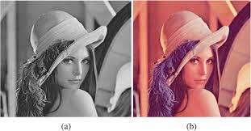
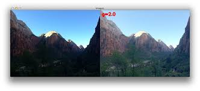

# 10.2 Color Transformation


## 📌 Introduction
Transformation alters color appearance for enhancement, filtering, or correction.

**General Formula:**
```math
g(x,y) = T[f(x,y)]
```

---

## 🔁 RGB Example
```math
S_i = k * R_i \quad 	ext{for i = 1,2,3}
```

---

## 📷 OpenCV Code (Python)
```python
import cv2

# Read the input image
img = cv2.imread('image.jpg')

# Check if the image was loaded successfully
if img is None:
    print("Error: Image not found.")
else:
    # Scale the intensity values of the image (alpha < 1 makes it darker)
    scaled = cv2.convertScaleAbs(img, alpha=0.7)

    # Display the original and scaled images
    cv2.imshow('Original Image', img)
    cv2.imshow('Scaled Image', scaled)

    cv2.waitKey(0)
    cv2.destroyAllWindows()

```

---

## 🧠 MATLAB Code
```matlab
% Read the input image
img = imread('image.jpg');

% If the image is RGB, convert it to grayscale before applying imadjust
if size(img, 3) == 3
    img_gray = rgb2gray(img);
else
    img_gray = img;
end

% Apply gamma correction with gamma = 0.7
scaled = imadjust(img_gray, [], [], 0.7);

% Display original and adjusted images side by side
figure;
subplot(1,2,1), imshow(img_gray), title('Original Grayscale Image');
subplot(1,2,2), imshow(scaled), title('Gamma Corrected Image (\gamma = 0.7)');

```

---

## 🖼️ Image




---

