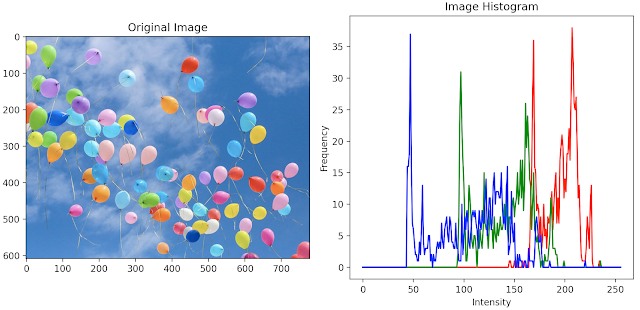
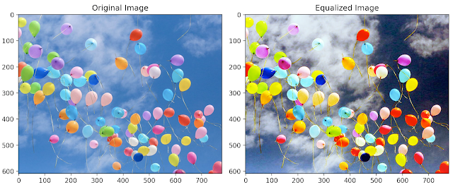

# 10.3 Color Enhancement

<video src="photo/FundamentalsofColoImageProcessing.mp4" width="800" height="410" controls>
  </video>


## 📌 Introduction
Techniques to enhance color contrast and appearance.

---

## 📊 Histogram Equalization (HSI)

Only intensity component should be equalized.

---

## 📷 python Code (OpenCV)
```python
import cv2
import cv2

# Read the input image
img = cv2.imread('image.jpg')

# Check if the image was loaded successfully
if img is None:
    raise FileNotFoundError("Image not found. Please check the file path.")

# Convert the image from BGR to HSV color space
hsv = cv2.cvtColor(img, cv2.COLOR_BGR2HSV)

# Apply histogram equalization on the V channel to enhance brightness/contrast
hsv[:, :, 2] = cv2.equalizeHist(hsv[:, :, 2])

# Convert the image back to BGR color space
enhanced = cv2.cvtColor(hsv, cv2.COLOR_HSV2BGR)

# Display the original and enhanced images side by side
cv2.imshow('Original Image', img)
cv2.imshow('Enhanced Image', enhanced)
cv2.waitKey(0)
cv2.destroyAllWindows()

```

---

## 🧠 MATLAB Code
```matlab
% Read the input image
img = imread('image.jpg');

% Convert RGB image to HSV color space
hsvImg = rgb2hsv(img);

% Apply histogram equalization on the V (brightness) channel
hsvImg(:,:,3) = histeq(hsvImg(:,:,3));

% Convert the HSV image back to RGB color space
enhancedImg = hsv2rgb(hsvImg);

% Display the original and enhanced images side by side
figure;
subplot(1,2,1); imshow(img); title('Original Image');
subplot(1,2,2); imshow(enhancedImg); title('Enhanced Image');

```

---

## 🖼️ Image




---

## 🎥 Video


