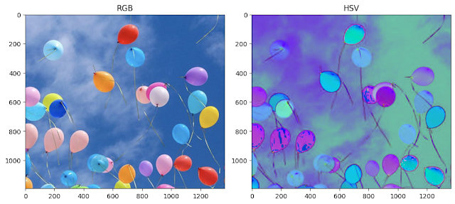

# 10.4 Color Segmentation

<video src="photo/FundamentalsofColoImageProcessing.mp4" width="800" height="410" controls>
  </video>


## 📌 Introduction
Segmentation based on color similarity (e.g., HSV thresholding).

---

## 🧪 HSV Thresholding

**Condition:**
```math
H_{min} \leq H \leq H_{max}, S_{min} \leq S \leq S_{max}, V_{min} \leq V \leq V_{max}
```

---

## 📷 OpenCV Code
```python
hsv = cv2.cvtColor(img, cv2.COLOR_BGR2HSV)
mask = cv2.inRange(hsv, (35, 40, 40), (85, 255,255))
seg = cv2.bitwise_and(img, img, mask=mask)
```

---

## 🧠 MATLAB Code

```matlab
% Convert the RGB image to HSV color space
hsv = rgb2hsv(img);

% Create a binary mask based on Hue values between 0.25 and 0.45 (green range)
mask = (hsv(:,:,1) > 0.25) & (hsv(:,:,1) < 0.45);

% Apply the mask to each channel of the original image
% This retains only the parts of the image within the specified Hue range
seg = bsxfun(@times, img, cast(mask, class(img)));

% Display the original image and the segmented result
figure;
subplot(1,2,1); imshow(img); title('Original Image');
subplot(1,2,2); imshow(seg); title('Segmented Image (Hue 0.25 - 0.45)');

```
