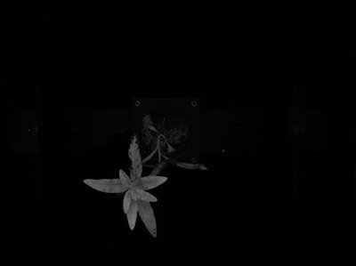
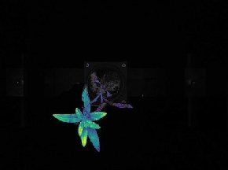

# 10.5 – Pseudo Color and Intensity Slicing


## 🔍 Overview
Pseudo-color image processing enhances grayscale images by mapping intensities to colors to make subtle changes more visible.

### 📌 Intensity Slicing
Intensity slicing partitions grayscale values into intervals and maps them to specific colors.

#### 📐 Mathematical Representation
For a grayscale image `f(x, y)`:
```
f(x, y) = c_k if f(x, y) ∈ v_k
```
Where `c_k` is the color assigned to the interval `v_k` of intensities.

---

## 🧪 OpenCV (Python) Example

```python
import cv2
import numpy as np
import matplotlib.pyplot as plt

# Read the image in grayscale mode
img = cv2.imread('grayscale_sample.png', cv2.IMREAD_GRAYSCALE)

# Apply a color map (JET) to the grayscale image to create a pseudo-color image
color_img = cv2.applyColorMap(img, cv2.COLORMAP_JET)

# Save the pseudo-colored image to a file
cv2.imwrite('pseudo_color_output.png', color_img)

# Convert from BGR to RGB for proper display with matplotlib
plt.imshow(cv2.cvtColor(color_img, cv2.COLOR_BGR2RGB))

# Display the title and remove axes
plt.title('Pseudo Color - JET')
plt.axis('off')

# Show the image
plt.show()

```

---

## 🧪 MATLAB Example

```matlab
% Read the grayscale image
img = imread('grayscale_sample.png');

% Generate the JET colormap with 256 colors
colormap_jet = jet(256);

% Convert the grayscale image to a pseudo-color image using the JET colormap
pseudo_color = ind2rgb(img, colormap_jet);

% Display the pseudo-color image
imshow(pseudo_color);
title('Pseudo Color Image (JET)');

```

---

## 🖼️ Sample Image

Original Grayscale:



Pseudo Color :



---

