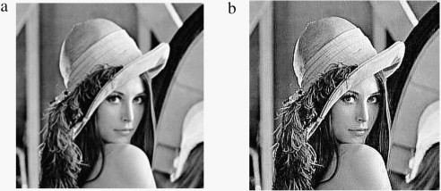

# 10.6 – Color Image Smoothing & Sharpening


## 🔍 Overview
Color image smoothing reduces noise, while sharpening enhances edges. These techniques are applied separately to each color channel or to the intensity component.

---

## 📐 Mathematical Formulation

### Smoothing (Mean Filter)
Let c(x,y) = [R(x,y), G(x,y), B(x,y)] be the color vector at pixel (x,y):

```
c_smooth(x, y) = (1/N) * Σ c(x+i, y+j) for i, j in neighborhood
```

### Sharpening (Laplacian Filter)
Apply Laplacian operator to enhance edges:
```
g(x, y) = f(x, y) - ∇²f(x, y)
```

---

## 🧪 OpenCV (Python) Example

```python
import cv2
import matplotlib.pyplot as plt

# Read the image
img = cv2.imread('color_sample.png')

# Apply Gaussian Blur to smooth the image
blurred = cv2.GaussianBlur(img, (5, 5), 0)

# Apply Laplacian to detect edges (just for illustration)
laplacian = cv2.Laplacian(img, cv2.CV_64F)

# Sharpen the image by combining the original image with the blurred image
sharpened = cv2.addWeighted(img, 1.5, blurred, -0.5, 0)

# Save the smoothed (blurred) image
cv2.imwrite('smoothed.png', blurred)

# Save the sharpened image
cv2.imwrite('sharpened.png', sharpened)

# Optionally, you can display the Laplacian (edges) image
laplacian = cv2.convertScaleAbs(laplacian)  # Convert the float64 result to uint8
cv2.imwrite('laplacian_edges.png', laplacian)

# Display the original and processed images using Matplotlib
plt.subplot(1, 3, 1), plt.imshow(cv2.cvtColor(img, cv2.COLOR_BGR2RGB)), plt.title('Original Image')
plt.subplot(1, 3, 2), plt.imshow(cv2.cvtColor(blurred, cv2.COLOR_BGR2RGB)), plt.title('Blurred Image')
plt.subplot(1, 3, 3), plt.imshow(cv2.cvtColor(sharpened, cv2.COLOR_BGR2RGB)), plt.title('Sharpened Image')
plt.show()

```

---

## 🧪 MATLAB Example

```matlab
% Read the input image
img = imread('color_sample.png');

% Apply Gaussian filter for smoothing
smoothed = imgaussfilt(img, 1);  % Standard deviation of 1 for smoothing

% Create the Laplacian filter
laplacian = fspecial('laplacian');  % Default Laplacian filter

% Perform image sharpening by subtracting the Laplacian filtered image from the original
sharpened = imsubtract(im2double(img), imfilter(im2double(img), laplacian));

% Display the smoothed and sharpened images side by side using montage
imshowpair(smoothed, sharpened, 'montage');

```

---

## 🖼️ Sample Images

- Smoothed Image  


---

- Sharpened Image  



