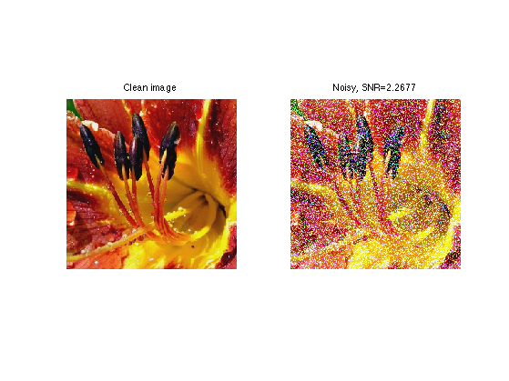
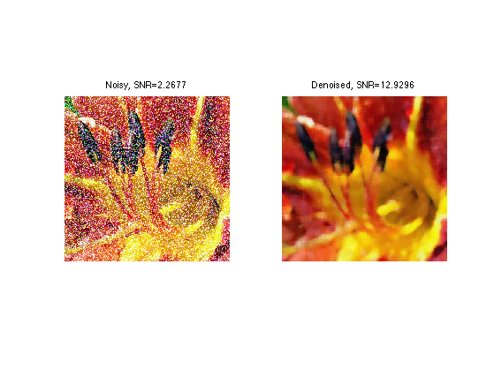

# 10.7 – Noise in Color Images

<video src="photo/Noisyimage.mp4" width="800" height="410" controls>
  </video>


## 🔍 Overview
Noise in color images may affect all channels equally or differently. Denoising must often be applied separately on each channel.

---

## 📐 Noise Removal (Smoothing)

Use filters such as:
- Average
- Median
- Gaussian

---

## 🧪 OpenCV (Python) Example

```python
import cv2
import numpy as np
import matplotlib.pyplot as plt

# Read the noisy image
img = cv2.imread('noisy_color.png')

# Check if the image is loaded correctly
if img is None:
    print("Error: Image not found.")
else:
    # Apply Median filter to remove noise
    denoised = cv2.medianBlur(img, 5)

    # Save the denoised image
    cv2.imwrite('denoised.png', denoised)

    # Display the original and denoised images side by side
    plt.subplot(1, 2, 1), plt.imshow(cv2.cvtColor(img, cv2.COLOR_BGR2RGB)), plt.title('Original Image')
    plt.subplot(1, 2, 2), plt.imshow(cv2.cvtColor(denoised, cv2.COLOR_BGR2RGB)), plt.title('Denoised Image')
    plt.show()

```

---

## 🧪 MATLAB Example

```matlab
% Read the noisy color image
img = imread('noisy_color.png');

% Apply Median filter to each channel separately
R = medfilt2(img(:,:,1), [3 3]);
G = medfilt2(img(:,:,2), [3 3]);
B = medfilt2(img(:,:,3), [3 3]);

% Reconstruct the denoised image by combining the filtered channels
denoised = cat(3, R, G, B);

% Display the denoised image
imshow(denoised);
title('Denoised Image');

% Optionally, display the original and denoised images side by side
subplot(1, 2, 1);
imshow(img);
title('Original Image');

subplot(1, 2, 2);
imshow(denoised);
title('Denoised Image');

```

---

## 🖼️ Sample Image

  - Original Noisy  



- Denoised 
 


---

