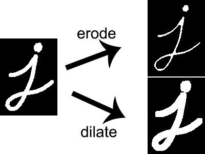

# 10.0 intro Image Morphological

<video width="800" height="410" controls>
    <source src="photows/ImageSegmentation.mp4" type="video/mp4">
    Your browser does not support the video tag.
  </video>

---

## 10.1 Dilation & Erosion

###  Overview

- Morphological operations that modify the structure of objects in binary and grayscale images.

- Dilation : Expands the white regions (foreground).
- Erosion : Shrinks the white regions.

These operations depend on a small probe called a  structuring element.


###  Mathematical Definitions

- Dilation:  
  \( A \oplus B = \{ z \mid (B)_z \cap A \neq \emptyset \} \)

- Erosion:  
  \( A \ominus B = \{ z \mid (B)_z \subseteq A \} \)

Where:
- \( A \): image set
- \( B \): structuring element
- \( (B)_z \): translation of B to position z


###  OpenCV Code

```python
import cv2
import matplotlib.pyplot as plt

# Specify the image file path (make sure the image is in the same directory or provide full path)
path = 'sample.jpg'  # Replace with your image filename

# Read the color image
img_color = cv2.imread(path)

# Check if image loaded successfully
if img_color is None:
    print("Error: Unable to load image at", path)
else:
    # Convert the color image to grayscale
    img_gray = cv2.cvtColor(img_color, cv2.COLOR_BGR2GRAY)

    # Define a 5x5 rectangular structuring element (kernel) for morphological operations
    kernel = cv2.getStructuringElement(cv2.MORPH_RECT, (5, 5))

    # Apply erosion to the grayscale image
    erosion = cv2.erode(img_gray, kernel, iterations=1)

    # Apply dilation to the grayscale image
    dilation = cv2.dilate(img_gray, kernel, iterations=1)

    # Plot the original image, eroded image, and dilated image side by side
    plt.figure(figsize=(18, 6))

    plt.subplot(1, 3, 1)
    plt.imshow(cv2.cvtColor(img_color, cv2.COLOR_BGR2RGB))  # Convert BGR to RGB for correct display
    plt.title('Original Image')
    plt.axis('off')

    plt.subplot(1, 3, 2)
    plt.imshow(erosion, cmap='gray')
    plt.title('Erosion')
    plt.axis('off')

    plt.subplot(1, 3, 3)
    plt.imshow(dilation, cmap='gray')
    plt.title('Dilation')
    plt.axis('off')

    plt.tight_layout()
    plt.show()

```

###  MATLAB Code

```matlab
% Read image, apply morphological erosion and dilation, and display results

% Specify image filename (ensure the file is in MATLAB path or provide full path)
path = 'sample.jpg'; % Replace with your image filename

% Read the image
img_color = imread(path);

% Convert to grayscale if the image is RGB
if size(img_color, 3) == 3
    img_gray = rgb2gray(img_color);
else
    img_gray = img_color;
end

% Create a 5x5 rectangular structuring element
se = strel('rectangle', [5 5]);

% Apply erosion
erosion = imerode(img_gray, se);

% Apply dilation
dilation = imdilate(img_gray, se);

% Display images
figure;

subplot(1,3,1);
imshow(img_color);
title('Original Image');

subplot(1,3,2);
imshow(erosion);
title('Erosion');

subplot(1,3,3);
imshow(dilation);
title('Dilation');

```


