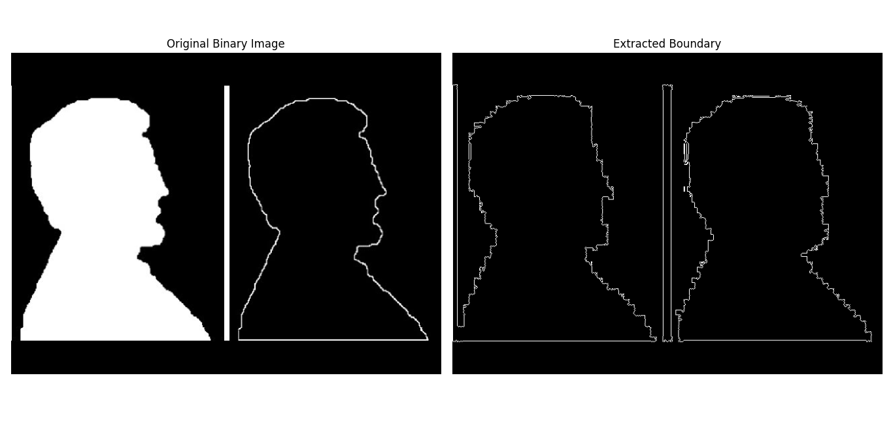

# 10.3 Hit-or-Miss & Boundary Extraction


##  Overview

- Hit-or-Miss : Used for shape detection in binary images.
- Boundary Extraction: Highlights edges of shapes by subtracting eroded image from the original.


###  Mathematical Definitions

- Hit-or-Miss:  
- 
  \( A \otimes B = (A \ominus B_1) \cap (A^c \ominus B_2) \)


- Boundary:  
  \( \text{Boundary}(A) = A - (A \ominus B) \)


### Boundary Extraction

###  Python Code

```python
import cv2  
import numpy as np  
import matplotlib.pyplot as plt  

def extract_boundary(binary_image):
    """
    Extracts the boundary of objects in a binary image.

    Parameters:
    - binary_image: np.ndarray, binary image (0 background, 255 foreground)

    Returns:
    - boundary_image: np.ndarray, image showing only the boundaries
    """
    # Ensure the image is binary (0 or 255)
    binary_image = (binary_image > 0).astype('uint8') * 255

    # Find contours (boundaries) in the binary image
    contours, _ = cv2.findContours(binary_image, cv2.RETR_EXTERNAL, cv2.CHAIN_APPROX_SIMPLE)

    # Create an empty image to draw boundaries on
    boundary_image = np.zeros_like(binary_image)

    # Draw contours with thickness 1 pixel
    cv2.drawContours(boundary_image, contours, -1, color=255, thickness=1)

    return boundary_image

# Image path
path = 'sample.jpg'

# Read the grayscale image
img = cv2.imread(path, cv2.IMREAD_GRAYSCALE)

# Convert grayscale to binary using threshold
_, binary_img = cv2.threshold(img, 127, 255, cv2.THRESH_BINARY)

# Extract boundaries
boundary_img = extract_boundary(binary_img)

# Display the binary image and its boundaries
plt.figure(figsize=(12, 6))

plt.subplot(1, 2, 1)
plt.imshow(binary_img, cmap='gray')
plt.title('Original Binary Image')
plt.axis('off')

plt.subplot(1, 2, 2)
plt.imshow(boundary_img, cmap='gray')
plt.title('Extracted Boundary')
plt.axis('off')

plt.tight_layout()
plt.show()

```


###  MATLAB Code

```matlab
% Read the grayscale image
img = imread('sample.jpg');

% Convert the grayscale image to binary using a threshold of 127 (scaled to [0,1])
binary_img = imbinarize(img, 127/255);

% Find boundaries of objects in the binary image
boundaries = bwboundaries(binary_img);

% Create an empty black image to draw boundaries
boundary_img = false(size(binary_img));

% Draw each boundary with thickness of 1 pixel
for k = 1:length(boundaries)
    boundary = boundaries{k};
    for p = 1:size(boundary, 1)
        boundary_img(boundary(p,1), boundary(p,2)) = true;
    end
end

% Display the original binary image
figure;

subplot(1, 2, 1);
imshow(binary_img);
title('Original Binary Image');

% Display the extracted boundaries
subplot(1, 2, 2);
imshow(boundary_img);
title('Extracted Boundary');

```


