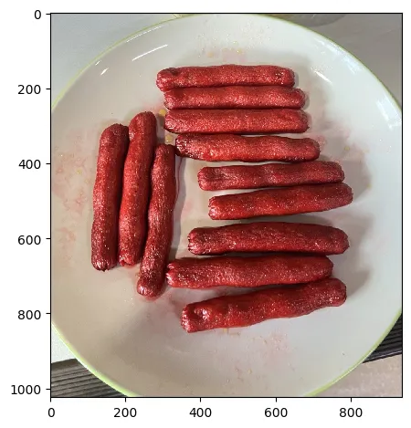
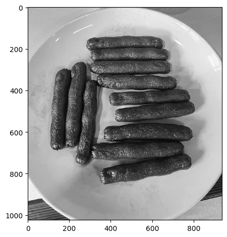

# 11.2 – Blob Detection

<video src="photo/BlobDetection.mp4" type="video/mp4" width="800" height="410" controls>
  Your browser does not support the video tag.
</video>

---
## 🔍 Overview
Blobs are regions in an image that differ in properties like brightness or color. Blob detection is used in applications such as motion tracking, object detection, and region labeling.

---

## 📐 Techniques and Math

Blob detection commonly uses:
- **Laplacian of Gaussian (LoG)**
- **Difference of Gaussian (DoG)**
- **Determinant of Hessian matrix**

### Laplacian of Gaussian (LoG)
```
LoG(x, y) = ∇²G(x, y) * I(x, y)
```
Where:
- `G(x, y)` is a Gaussian function
- `∇²` is the Laplacian operator
- `I(x, y)` is the image

---





## 🧪 Python(OpenCV) Example

```python
import cv2
import numpy as np

# Read the image
img = cv2.imread("image.jpg", cv2.IMREAD_GRAYSCALE)

# Apply a binary threshold to get a binary image
_, thresh = cv2.threshold(img, 127, 255, cv2.THRESH_BINARY_INV)

# Find contours from the binary image
contours, _ = cv2.findContours(thresh, cv2.RETR_EXTERNAL, cv2.CHAIN_APPROX_SIMPLE)

# Draw contours on the original image (convert to color first)
img_color = cv2.cvtColor(img, cv2.COLOR_GRAY2BGR)
cv2.drawContours(img_color, contours, -1, (0, 255, 0), 2)

# Save result
cv2.imwrite("output.jpg", img_color)


```

---

## 🧪 MATLAB Example

```matlab
% Read the image
img = imread('blobs.png');

% Convert the image to grayscale
gray = rgb2gray(img);

% Detect MSER (Maximally Stable Extremal Regions) features
points = detectMSERFeatures(gray);

% Display the original image
imshow(img);
hold on;

% Plot the MSER features
plot(points);

```

---

## 🖼️ Sample Image

- Blob Detection Result  


---

