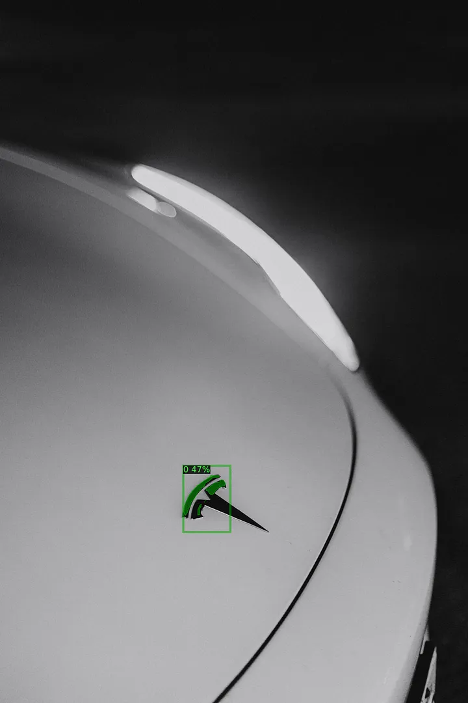

# 11.4 – Template Matching


<video src="photo/templatematching.mp4" width="800" height="410" controls>
  </video>

---
## 🔍 Overview

Template Matching is a technique for finding parts of an image that match a template image.

---

## 📐 Mathematical Expression

Match score using correlation:
```
R(x, y) = sum( T(x', y') * I(x+x', y+y') )
```

Where:
- `T` is the template
- `I` is the source image

---

## 🧪 Python(OpenCV) Example

```python
import cv2
import numpy as np

# Read the input image and template in grayscale
img = cv2.imread('scene.png', 0)  # 0 flag reads the image as grayscale
template = cv2.imread('template.png', 0)

# Perform template matching using the normalized cross-correlation method
res = cv2.matchTemplate(img, template, cv2.TM_CCOEFF_NORMED)

# Find the location of the highest match value
_, _, _, max_loc = cv2.minMaxLoc(res)  # max_loc gives the position of the best match

# Get the dimensions of the template image (height and width)
h, w = template.shape

# Draw a rectangle around the matched region on the original image
cv2.rectangle(img, max_loc, (max_loc[0] + w, max_loc[1] + h), 255, 2)  # 255 for white color, 2 for thickness

# Save the result image with the rectangle drawn around the matched region
cv2.imwrite('template_match_result.png', img)

```

---

## 🧪 MATLAB Example

```matlab
% Read the scene and template images
mscene = imread('scene.png');
template = imread('template.png');

% Perform normalized cross-correlation between the template and scene image
% We use only the first channel (grayscale) for the comparison
c = normxcorr2(template(:,:,1), mscene(:,:,1));

% Find the maximum correlation value and its index
[max_c, imax] = max(abs(c(:)));

% Convert the index of the maximum value to row and column coordinates
[ypeak, xpeak] = ind2sub(size(c), imax(1));

% Display the scene image
figure, imshow(mscene);

% Draw a rectangle around the matched area in the scene
% The position of the rectangle is based on the coordinates (xpeak, ypeak) 
% and the size of the template
rectangle('Position', [xpeak, ypeak, size(template, 2), size(template, 1)], 'EdgeColor','r');

```

---

## 🖼️ Sample Output





---
