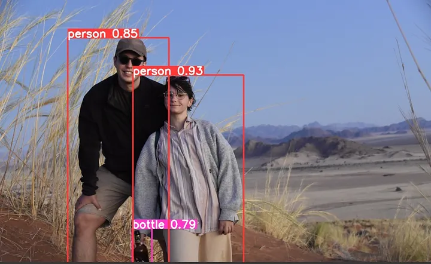

# 11.5 – Intro to Deep Learning-Based Object Detection


## 🔍 Overview
Deep learning-based object detection uses neural networks to detect and classify multiple objects in images. Modern techniques outperform classical methods in both accuracy and speed.

---

## 📐 Key Concepts

### CNN Architecture
Object detectors use convolutional neural networks (CNNs) to extract features and regress bounding boxes.

### Common Models
- **YOLO (You Only Look Once)**
- **SSD (Single Shot Multibox Detector)**
- **Faster R-CNN**

---

## 🔧 Detection Pipeline

1. **Input Image**
2. **Feature Extraction using CNN**
3. **Region Proposals / Grid Prediction**
4. **Object Classification & Bounding Box Regression**

---

## 🧪 Python (OpenCV) Example – Using YOLOv4

```python
import cv2
import numpy as np

# Load YOLO network with weights and configuration file
net = cv2.dnn.readNet("yolov4.weights", "yolov4.cfg")

# Get the layer names and output layers
layer_names = net.getLayerNames()
output_layers = [layer_names[i - 1] for i in net.getUnconnectedOutLayers().flatten()]

# Read the input image
img = cv2.imread("street.jpg")
height, width = img.shape[:2]

# Prepare the image for YOLO by converting it to a blob
# 1/255.0 scales the pixel values to [0, 1]
blob = cv2.dnn.blobFromImage(img, 1/255.0, (416, 416), swapRB=True, crop=False)

# Set the input for the network
net.setInput(blob)

# Perform forward pass to get the output from the YOLO network
outs = net.forward(output_layers)

# Iterate over the network's outputs
for out in outs:
    for detection in out:
        # Extract class scores and find the class with the highest score
        scores = detection[5:]
        class_id = np.argmax(scores)
        confidence = scores[class_id]

        # If the confidence is above 50%, draw a bounding box
        if confidence > 0.5:
            cx, cy, w, h = detection[0:4] * np.array([width, height, width, height])
            x = int(cx - w/2)
            y = int(cy - h/2)
            
            # Draw a bounding box around the detected object
            cv2.rectangle(img, (x, y), (x + int(w), y + int(h)), (0, 255, 0), 2)

# Save the result image with detections
cv2.imwrite("yolo_detection_result.png", img)

```

---

## 🧪 MATLAB Example – Using Pretrained YOLOv4

```matlab
% Load the YOLOv4 object detector pre-trained on COCO dataset
net = yolov4ObjectDetector("csp-darknet53-coco");

% Read the input image
img = imread('street.jpg');

% Detect objects in the image using the YOLOv4 model
[bboxes, scores, labels] = detect(net, img);

% Annotate the detected objects with bounding boxes and labels
detected = insertObjectAnnotation(img, 'rectangle', bboxes, labels);

% Display the image with the annotated bounding boxes and labels
imshow(detected);

```


---

###   Thanks For You To complete this Course Waiting For Intro to Deep Learning ❤️🔜