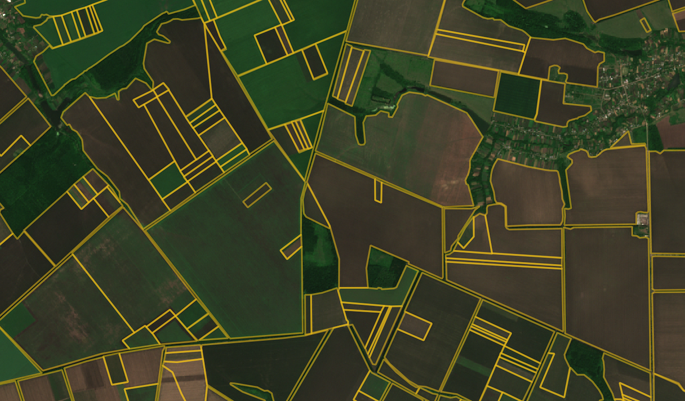

# 1.Introduction to Image Segmentation
 
<video width="800" height="410" controls>
    <source src="photows/ImageSegmentation11.mp4" type="video/mp4">
    Your browser does not support the video tag.
  </video

---

##  Overview
 - Image segmentation is a fundamental step in many image processing, computer vision, and machine learning applications. It involves dividing an image into meaningful regions that share similar characteristics, such as color, intensity, or texture.

 - The goal is to simplify or change the representation of an image into something more meaningful and easier to analyze.

 - For example, in medical imaging, segmentation can be used to locate tumors, measure tissue volumes, or follow disease progression. In self-driving cars, it helps identify roads, pedestrians, and obstacles.

 - Segmentation is often a preprocessing step for tasks like object detection, recognition, and tracking.


## 2. Applications of Image Segmentation

### 2.1 Object Recognition 

 - Helps detect and classify specific objects (e.g., faces, cars, animals) in an image.


---

### 2.2 Compression

  - By segmenting areas with similar features, image data can be compressed more efficiently.


---

### 2.3 Image Editing  

- Enables selective editing (e.g., changing the color of only the background).


---

### 2.4 Occlusion Boundary Estimation  

- Determines boundaries between overlapping objects, useful in 3D modeling or tracking.




## K-Means Objective Function:

\[
J = \sum_{i=1}^{k} \sum_{x \in C_i} \| x - \mu_i \|^2
\]

Where:
- \( C_i \): Set of points in cluster \( i \)  
- \( \mu_i \): Centroid of cluster \( i \)


###  Python Code 

```python
# Import the OpenCV library for image processing
import cv2  
import numpy as np
# Import Matplotlib for plotting
import matplotlib.pyplot as plt  

# Fixed image filename
path = 'sample.jpg'

# Load the input image from the given path
img = cv2.imread(path)

# Check if the image was successfully loaded
if img is None:
    print(f"Error: Unable to load image at {path}")
else:
    # Convert BGR (OpenCV default) to RGB for correct color display in matplotlib
    img_rgb = cv2.cvtColor(img, cv2.COLOR_BGR2RGB)

    # Reshape the image into a 2D array of pixels and convert to float32 for k-means
    Z = img.reshape((-1, 3)).astype(np.float32)

    # Define the criteria for K-means clustering:
    # Stop either after 10 iterations or if the accuracy is less than 1.0
    criteria = (cv2.TERM_CRITERIA_EPS + cv2.TERM_CRITERIA_MAX_ITER, 10, 1.0)

    K = 3  # Number of clusters (segments)

    # Apply K-means clustering
    # Returns compactness, labels (which cluster each pixel belongs to), and centers (cluster centers)
    _, label, center = cv2.kmeans(Z, K, None, criteria, 10, cv2.KMEANS_RANDOM_CENTERS)

    # Convert cluster centers to uint8 (pixel values)
    center = np.uint8(center)

    # Replace each pixel with its corresponding center value to create segmented image
    segmented = center[label.flatten()].reshape(img.shape)

    # Convert segmented image to RGB for matplotlib display
    segmented_rgb = cv2.cvtColor(segmented, cv2.COLOR_BGR2RGB)

    # Plot original and segmented images side by side using subplots
    plt.figure(figsize=(10, 5))

    # Original image subplot
    plt.subplot(1, 2, 1)
    plt.imshow(img_rgb)
    plt.title('Original Image')
    plt.axis('off')

    # Segmented image subplot
    plt.subplot(1, 2, 2)
    plt.imshow(segmented_rgb)
    plt.title(f'Segmented Image (K={K})')
    plt.axis('off')

    plt.tight_layout()
    plt.show()

```

###  MATLAB Code

```MATLAB
% Read the image
img = imread('sample.jpg');

% Check if image is loaded
if isempty(img)
    error('Error: Unable to load image at sample.jpg');
end

% Convert image to double for processing
img_double = im2double(img);

% Reshape image into 2D array where each row is a pixel, and columns are RGB
Z = reshape(img_double, [], 3);

% Number of clusters
K = 3;

% Options for kmeans (max 10 iterations)
opts = statset('MaxIter', 10);

% Perform k-means clustering on pixel data
% idx: cluster indices for each pixel
% C: cluster centers (RGB)
[idx, C] = kmeans(Z, K, 'Options', opts, 'Replicates', 3);

% Create segmented image by replacing each pixel with its cluster center
segmented = reshape(C(idx, :), size(img_double));

% Show original and segmented images
figure;

subplot(1,2,1);
imshow(img);
title('Original Image');

subplot(1,2,2);
imshow(segmented);
title(['Segmented Image (K=', num2str(K), ')']);


```
