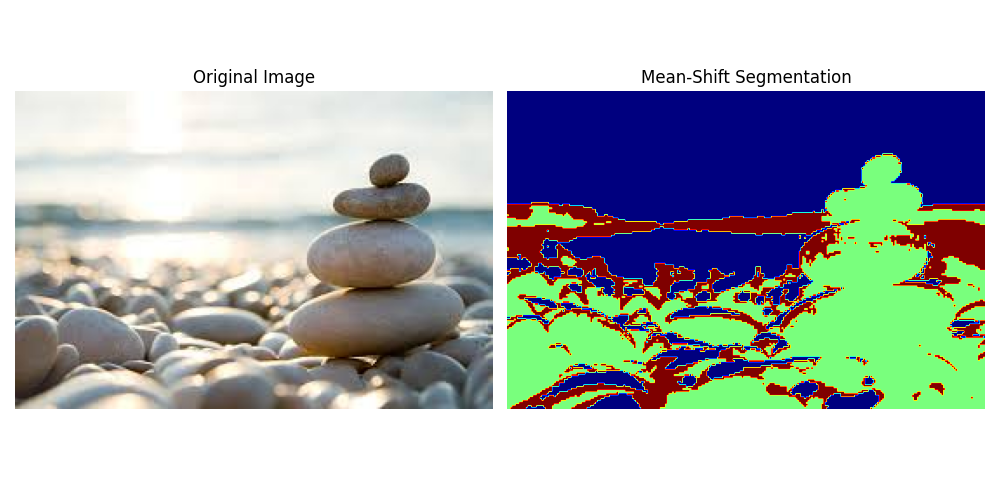

# 11.2 Mean-Shift Segmentation

##  Concept  

- Mean-Shift is a non-parametric clustering method based on kernel density estimation. It iteratively moves data points towards the mode (densest region) of the feature space, making it ideal for segmenting images without needing the number of clusters in advance.


## Equation:

$$
m(x) = \frac{\sum_{i} x_i \cdot K\left(\frac{x - x_i}{h}\right)}{\sum_{i} K\left(\frac{x - x_i}{h}\right)} - x
$$

**Where**:  
- $x$: current location  
- $x_i$: neighbor points  
- $h$: bandwidth  
- $K$: kernel function (e.g., Gaussian)


## Python Code

```python

 # Import OpenCV for image reading and processing
import cv2  
# Import NumPy for numerical operations                       
import numpy as np    
 # Import MeanShift clustering from scikit-learn             
from sklearn.cluster import MeanShift
  # Import Matplotlib for image visualization 
import matplotlib.pyplot as plt  

img = cv2.imread('sample.jpg')  # Read the image directly using file name

if img is None:
    print("Error: Unable to load image 'sample.jpg'")  # Print error if image can't be loaded
else:
    # Resize image to 40% of original size to speed up MeanShift processing
    scale_percent = 40
    width = int(img.shape[1] * scale_percent / 100)  # Compute new width
    height = int(img.shape[0] * scale_percent / 100)  # Compute new height
    dim = (width, height)  # Combine dimensions into tuple
    img_small = cv2.resize(img, dim, interpolation=cv2.INTER_AREA)  # Resize image using area interpolation

    img_rgb = cv2.cvtColor(img_small, cv2.COLOR_BGR2RGB)  # Convert BGR to RGB for displaying with Matplotlib

    Z = img_small.reshape((-1, 3))  # Flatten image into a 2D array of pixels (N x 3)

    ms = MeanShift()  # Create MeanShift clustering object
    ms.fit(Z)         # Fit the model to the image data

    labels = ms.labels_  # Get cluster labels for each pixel
    segmented = np.reshape(labels, (img_small.shape[0], img_small.shape[1]))  # Reshape labels back to image shape

    segmented_display = (segmented.astype(np.float32) / segmented.max()) * 255  # Normalize to 0-255 range
    segmented_display = segmented_display.astype(np.uint8)  # Convert to unsigned 8-bit integer for display

    plt.figure(figsize=(10, 5))  # Create a figure with custom size

    plt.subplot(1, 2, 1)  # First subplot (original image)
    plt.imshow(img_rgb)  # Show original RGB image
    plt.title('Original Image (Resized)')  # Set title
    plt.axis('off')  # Hide axes

    plt.subplot(1, 2, 2)  # Second subplot (segmented image)
    plt.imshow(segmented_display, cmap='jet')  # Show segmented image with colormap
    plt.title('Mean-Shift Segmentation')  # Set title
    plt.axis('off')  # Hide axes

    plt.tight_layout()  # Adjust subplot spacing
    plt.show()  # Display the plots

```

## MATLAB code:

```MATLAB

% Read the image
img = imread('sample.jpg');

if isempty(img)
    disp("Error: Unable to load image 'sample.jpg'");
else
    % Resize the image to 40% of its original size
    scale_percent = 0.4;
    img_small = imresize(img, scale_percent);

    % Convert image to L*a*b color space for better clustering (optional but improves segmentation)
    cform = makecform('srgb2lab');
    lab_img = applycform(img_small, cform);

    % Reshape the image into 2D: each row is a pixel, columns are color channels
    Z = double(reshape(lab_img, [], 3));

    % Perform Mean-Shift-like segmentation using k-means (as MATLAB lacks built-in MeanShift)
    % Choose number of clusters based on trial (e.g., 5)
    nColors = 5;
    [L, ~] = imsegkmeans(Z, nColors);

    % Reshape labels back to image shape
    segmented = reshape(L, size(img_small,1), size(img_small,2));

    % Normalize and convert to uint8 image for display
    segmented_display = uint8(255 * mat2gray(segmented));

    % Display original and segmented images
    figure;
    subplot(1,2,1);
    imshow(img_small);
    title('Original Image (Resized)');

    subplot(1,2,2);
    imshow(segmented_display, []);
    colormap(jet); colorbar;
    title('Segmented Image (K-means Approximation)');
end

```



