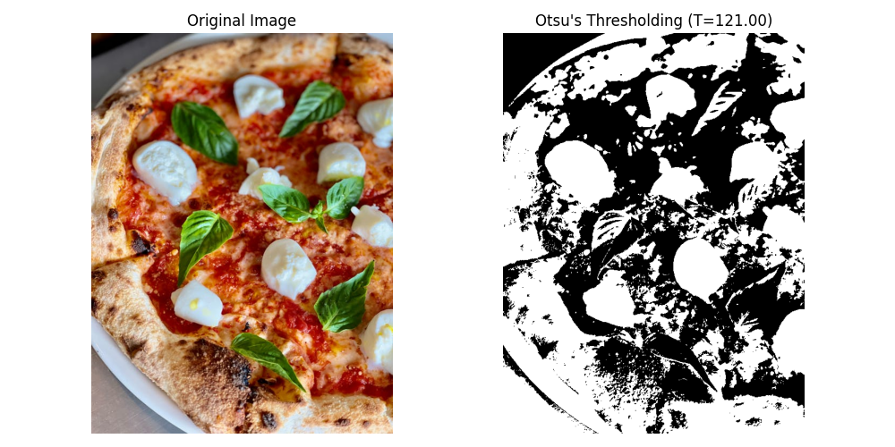

# 11.4 Thresholding Methods

<video width="800" height="410" controls>
    <source src="photows/thresholdingtechniques.mp4" type="video/mp4">
    Your browser does not support the video tag.
  </video>


---

## 1-Global Thresholding 

###  Concept

- In Global Thresholding, a single threshold value is applied across the entire image to separate the foreground from the background. It works well for images with uniform lighting.

###  Mathematical Equation
\[
f(x, y) = 
\begin{cases} 
1 & \text{if } g(x, y) \geq T \\
0 & \text{if } g(x, y) < T 
\end{cases}
\]

Where:

- \( f(x, y) \) is the resulting binary image.
- \( g(x, y) \) is the pixel intensity of the original grayscale image.
- \( T \) is the threshold value.

###  Python Code 

```python

# Import the OpenCV library for image processing
import cv2
import numpy as np
# Import Matplotlib for plotting
import matplotlib.pyplot as plt
# Get the image path 
path = 'sample.jpg'
# Load the input image
img = cv2.imread(path)

# Convert to grayscale for thresholding
gray = cv2.cvtColor(img, cv2.COLOR_BGR2GRAY)

# Apply global thresholding using Otsu's method
# retval is the threshold value found by Otsu (not used here explicitly)
retval, binary = cv2.threshold(gray, 0, 255, cv2.THRESH_BINARY + cv2.THRESH_OTSU)

# Convert BGR to RGB for correct color display
img_rgb = cv2.cvtColor(img, cv2.COLOR_BGR2RGB)

# Plot original and thresholded images side by side
plt.figure(figsize=(10, 5))

plt.subplot(1, 2, 1)
plt.imshow(img_rgb)
plt.title('Original Image')
plt.axis('off')

plt.subplot(1, 2, 2)
plt.imshow(binary, cmap='gray')
plt.title('Global Thresholding Segmentation')
plt.axis('off')

plt.tight_layout()
plt.show()

```

### MATLAB Code

```Matlab

% Read the image
img = imread('template.png');

% Convert to grayscale
gray = rgb2gray(img);

% Apply Otsu's thresholding
level = graythresh(gray); % Returns normalized threshold [0,1]
binary = imbinarize(gray, level);

% Display original and thresholded images side by side
figure('Position', [100, 100, 1000, 500]);

subplot(1,2,1);
imshow(img);
title('Original Image');
axis off;

subplot(1,2,2);
imshow(binary);
title('Global Thresholding Segmentation');
axis off;

```


---

## 2-Adaptive Thresholding 

###  Concept
- Adaptive Thresholding calculates the threshold for smaller regions of the image, making it effective for images with varying lighting conditions.

###  Mathematical Equation
\[
T(x, y) = \text{mean}(g(x, y)) - C
\]
Where:
- \( T(x, y) \) is the threshold value at pixel \( (x, y) \).
- \( g(x, y) \) is the pixel intensity at position \( (x, y) \).
- \( C \) is a constant that adjusts the threshold based on local conditions.

### Python Code 

```python

# Import the OpenCV library for image processing
import cv2
# Import Matplotlib for plotting
import matplotlib.pyplot as plt
# Custom function to get image path
from file_handler import get_image_path

# Get the image path using the provided function
path = get_image_path()

# Load the input image
img = cv2.imread(path)

# Convert to grayscale for thresholding
gray = cv2.cvtColor(img, cv2.COLOR_BGR2GRAY)

# Apply adaptive thresholding
# cv2.ADAPTIVE_THRESH_MEAN_C uses the mean of the neighborhood
# You can also use cv2.ADAPTIVE_THRESH_GAUSSIAN_C for weighted mean
adaptive_thresh = cv2.adaptiveThreshold(
    gray, 255, cv2.ADAPTIVE_THRESH_MEAN_C, cv2.THRESH_BINARY, 11, 2
)

# Convert BGR to RGB for correct color display
img_rgb = cv2.cvtColor(img, cv2.COLOR_BGR2RGB)

# Plot original and adaptively thresholded images side by side
plt.figure(figsize=(10, 5))

plt.subplot(1, 2, 1)
plt.imshow(img_rgb)
plt.title('Original Image')
plt.axis('off')

plt.subplot(1, 2, 2)
plt.imshow(adaptive_thresh, cmap='gray')
plt.title('Adaptive Thresholding Segmentation')
plt.axis('off')

plt.tight_layout()
plt.show()

```

###  MATLAB Code

```Matlab

% Read the input image
img = imread('your_image_path.jpg'); % Replace with your image path

% Convert to grayscale (adaptive thresholding works on intensity)
gray_img = rgb2gray(img);

% Apply adaptive thresholding using local mean (similar to cv2.ADAPTIVE_THRESH_MEAN_C)
% 'adaptthresh' computes locally adaptive threshold
T = adaptthresh(gray_img, 0.5, 'NeighborhoodSize', 11, 'Statistic', 'mean');

% Binarize image using the adaptive threshold
binary_img = imbinarize(gray_img, T);

% Display original and segmented images side by side
figure;

subplot(1,2,1);
imshow(img);
title('Original Image');

subplot(1,2,2);
imshow(binary_img);
title('Adaptive Thresholding Segmentation');

```


---

## 3-Otsu's Thresholding 

### Concept

- Otsu's Thresholding computes the optimal threshold that minimizes the variance within the foreground and background. This method is automatic and does not require the user to set the threshold.

###  Mathematical Equation
\[
\sigma_B^2(T) = \left( m_1(T) - m_2 \right)^2 \frac{\sigma_1^2(T) + \sigma_2^2(T)}{}
\]
- Where:
- \( m_1(T) \) and \( m_2 \) are the means of the two classes (foreground and background).
- \( \sigma_1^2(T) \) and \( \sigma_2^2(T) \) are the variances for each class.

###  Python Code 

```python

# Import the OpenCV library for image processing
import cv2
# Import Matplotlib for plotting
import matplotlib.pyplot as plt
# Custom function to get image path
from file_handler import get_image_path

# Get the image path using the provided function
path = get_image_path()

# Load the input image
img = cv2.imread(path)

# Convert to grayscale for thresholding
gray = cv2.cvtColor(img, cv2.COLOR_BGR2GRAY)

# Apply Otsu's global thresholding
retval, otsu_thresh = cv2.threshold(gray, 0, 255, cv2.THRESH_BINARY + cv2.THRESH_OTSU)

# Convert BGR to RGB for correct color display
img_rgb = cv2.cvtColor(img, cv2.COLOR_BGR2RGB)

# Plot original and Otsu thresholded images side by side
plt.figure(figsize=(10, 5))

plt.subplot(1, 2, 1)
plt.imshow(img_rgb)
plt.title('Original Image')
plt.axis('off')

plt.subplot(1, 2, 2)
plt.imshow(otsu_thresh, cmap='gray')
plt.title(f"Otsu's Thresholding (T={retval:.2f})")
plt.axis('off')

plt.tight_layout()
plt.show()

```
### MATLAB Code 
```Matlab 

% Read the input image
img = imread('your_image_path.jpg'); % Replace with your image path

% Convert to grayscale
gray_img = rgb2gray(img);

% Compute global threshold using Otsu's method
threshold = graythresh(gray_img);

% Apply threshold to binarize image
binary_img = imbinarize(gray_img, threshold);

% Display original and Otsu thresholded images side by side
figure;

subplot(1,2,1);
imshow(img);
title('Original Image');

subplot(1,2,2);
imshow(binary_img);
title(sprintf('Otsu''s Thresholding (T=%.3f)', threshold));

```

