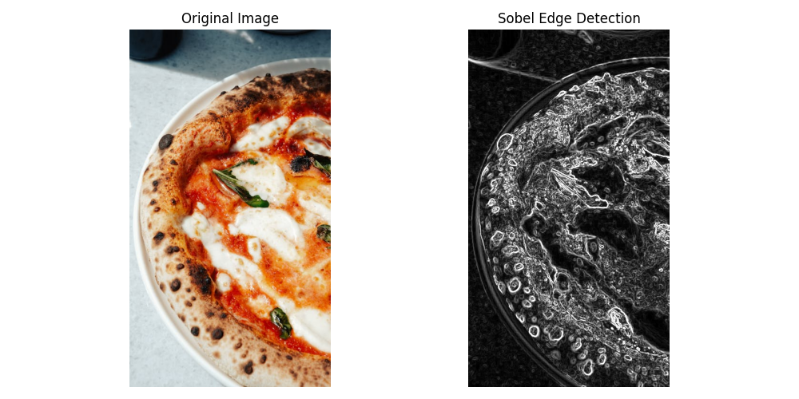
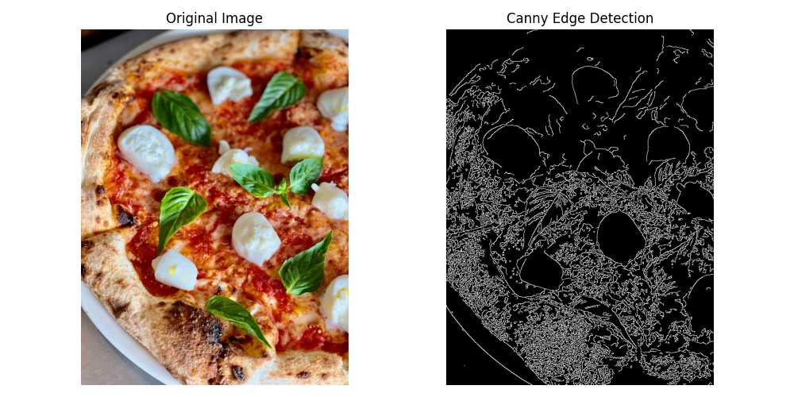

# 6.Edge-Based Segmentation


## 1-Sobel Edge Detection 

 ### Concept:

- Sobel Edge Detection detects edges in an image by calculating the gradient at each pixel using convolution with Sobel filters in both horizontal and vertical directions.

###  Mathematical Equation:
\[
G_x = 
\begin{bmatrix}
-1 & 0 & 1 \\
-2 & 0 & 2 \\
-1 & 0 & 1
\end{bmatrix} * I(x, y)
\]
Where:
- \( G_x \) is the gradient in the x-direction.
- \( I(x, y) \) is the image intensity at pixel \( (x, y) \).

###  Python Code

```python
import cv2
import matplotlib.pyplot as plt

path = 'sample.jpg'  # Change to your image path

# Load image
img = cv2.imread(path)

# Convert to grayscale
gray = cv2.cvtColor(img, cv2.COLOR_BGR2GRAY)

# Sobel filters in X and Y directions
sobel_x = cv2.Sobel(gray, cv2.CV_64F, 1, 0, ksize=3)
sobel_y = cv2.Sobel(gray, cv2.CV_64F, 0, 1, ksize=3)

# Calculate gradient magnitude
sobel_magnitude = cv2.magnitude(sobel_x, sobel_y)

# Convert to 8-bit image for display
sobel_display = cv2.convertScaleAbs(sobel_magnitude)

# Convert original image to RGB for matplotlib
img_rgb = cv2.cvtColor(img, cv2.COLOR_BGR2RGB)

# Plot images
plt.figure(figsize=(10,5))

plt.subplot(1,2,1)
plt.imshow(img_rgb)
plt.title('Original Image')
plt.axis('off')

plt.subplot(1,2,2)
plt.imshow(sobel_display, cmap='gray')
plt.title('Sobel Edge Detection')
plt.axis('off')

plt.tight_layout()
plt.show()


```
###  MATLAB Code

 ```Matlab
 % Set the image path
path = 'sample.jpg'; % Change to your image location

% Read the image
img = imread(path);

% Convert to grayscale if it's a color image
if size(img,3) == 3
    gray = rgb2gray(img);
else
    gray = img;
end

% Apply Sobel filter in X and Y directions
sobel_x = imfilter(double(gray), fspecial('sobel')');
sobel_y = imfilter(double(gray), fspecial('sobel'));

% Compute the gradient magnitude
sobel_magnitude = sqrt(sobel_x.^2 + sobel_y.^2);

% Scale to 8-bit for display
sobel_display = uint8(255 * mat2gray(sobel_magnitude));

% Display original image and Sobel edge detection side by side
figure;

subplot(1,2,1);
imshow(img);
title('Original Image');

subplot(1,2,2);
imshow(sobel_display);
title('Sobel Edge Detection');

 ```

  

---
## 2-Canny Edge Detection 

###  Concept

- Canny Edge Detection is a multi-step image processing technique designed to detect edges in an image by identifying areas with rapid intensity changes. The process includes:


###  Mathematical Equation:

#### 1. Gaussian Smoothing
To reduce noise, apply a Gaussian filter:

\[
G(x, y) = \frac{1}{2\pi\sigma^2} \exp\left( -\frac{x^2 + y^2}{2\sigma^2} \right)
\]

#### 2. Gradient Calculation
Compute gradients in the x and y directions:

\[
G_x = \frac{\partial I}{\partial x}, \quad G_y = \frac{\partial I}{\partial y}
\]

The gradient magnitude:

\[
G = \sqrt{G_x^2 + G_y^2}
\]


### Python Code

```python

import cv2
import matplotlib.pyplot as plt

# Set the path to your image
path = 'sample.jpg'  # Change this to your image path

# Load the image
img = cv2.imread(path)

# Convert the image to grayscale
gray = cv2.cvtColor(img, cv2.COLOR_BGR2GRAY)

# Apply Canny edge detection
edges = cv2.Canny(gray, 100, 200)  # You can adjust the thresholds if needed

# Convert the original image from BGR to RGB for correct display
img_rgb = cv2.cvtColor(img, cv2.COLOR_BGR2RGB)

# Display the original image and the edge-detected image side by side
plt.figure(figsize=(10, 5))

plt.subplot(1, 2, 1)
plt.imshow(img_rgb)
plt.title('Original Image')
plt.axis('off')

plt.subplot(1, 2, 2)
plt.imshow(edges, cmap='gray')
plt.title('Canny Edge Detection')
plt.axis('off')

plt.tight_layout()
plt.show()

```


### MATLAB Code

```matlab
import cv2
import matplotlib.pyplot as plt

path = 'sample.jpg'  

img = cv2.imread(path)

gray = cv2.cvtColor(img, cv2.COLOR_BGR2GRAY)

edges = cv2.Canny(gray, 100, 200)  # ممكن تعدل thresholds حسب الصورة

img_rgb = cv2.cvtColor(img, cv2.COLOR_BGR2RGB)

plt.figure(figsize=(10,5))

plt.subplot(1,2,1)
plt.imshow(img_rgb)
plt.title('Original Image')
plt.axis('off')

plt.subplot(1,2,2)
plt.imshow(edges, cmap='gray')
plt.title('Canny Edge Detection')
plt.axis('off')

plt.tight_layout()
plt.show()

```

