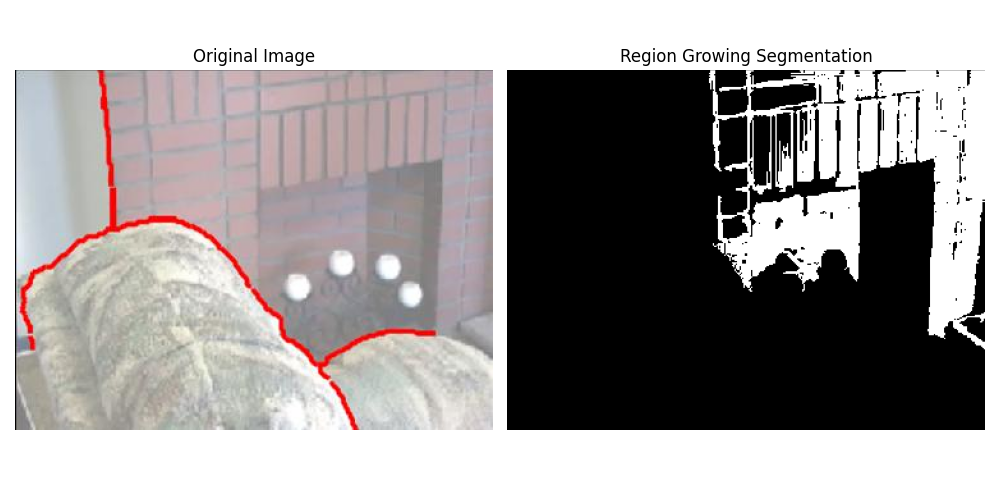
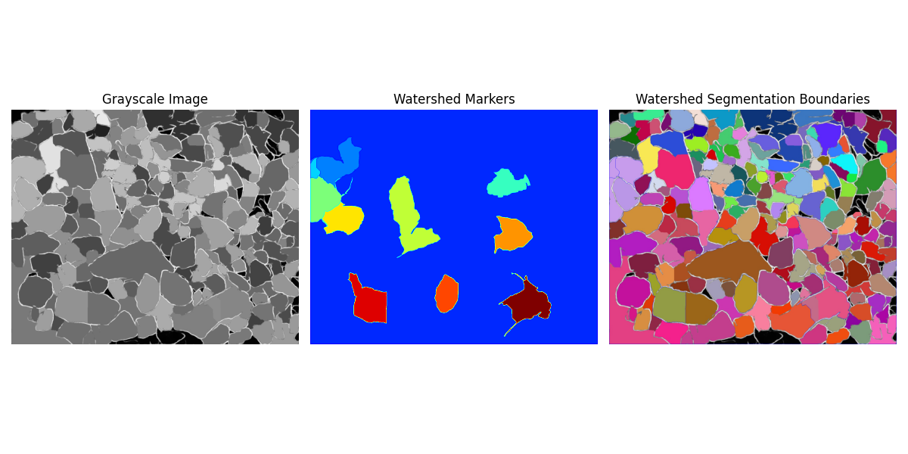

# 7-Region-Based Segmentation 


<video width="800" height="410" controls>
    <source src="photows/Regionbased.mp4" type="video/mp4">
    Your browser does not support the video tag.
  </video>


---
## Overview

- Region-based segmentation is a technique that groups pixels or subregions into larger regions based on predefined criteria. It is particularly effective when neighboring pixels share similar properties. The main types include:

1. Region Growing
2. Watershed Segmentation


## 1. Region Growing 

- This method starts with a set of seed points and grows regions by appending neighboring pixels that satisfy a similarity criterion (e.g., intensity difference within a threshold \( T \)).

### Mathematical Equation

\[
|I(x, y) - I(s_x, s_y)| < T
\]

- Where \( (s_x, s_y) \) is a seed point and \( I(x, y) \) is the intensity of a neighboring pixel.


---


### Python Code

```python
import cv2
import numpy as np
import matplotlib.pyplot as plt

def region_growing(img, seeds, threshold):
    height, width = img.shape
    segmented = np.zeros_like(img, dtype=np.uint8)
    region_mean = float(img[seeds[0][1], seeds[0][0]])
    region_size = 1
    segmented[seeds[0][1], seeds[0][0]] = 255

    stack = [seeds[0]]

    while stack:
        x, y = stack.pop()
        for nx in range(max(0, x-1), min(width, x+2)):
            for ny in range(max(0, y-1), min(height, y+2)):
                if segmented[ny, nx] == 0:
                    diff = abs(float(img[ny, nx]) - region_mean)
                    if diff <= threshold:
                        segmented[ny, nx] = 255
                        stack.append((nx, ny))
                        region_mean = (region_mean * region_size + img[ny, nx]) / (region_size + 1)
                        region_size += 1
    return segmented

# Load image and convert to grayscale
path = 'sample.jpg' 

img = cv2.imread(path)
gray = cv2.cvtColor(img, cv2.COLOR_BGR2GRAY)

# Define seed point (center of image)
seed_points = [(int(gray.shape[1]/2), int(gray.shape[0]/2))]

# Similarity threshold
threshold_val = 10

# Perform region growing segmentation
segmented_img = region_growing(gray, seed_points, threshold_val)

# Convert for display
img_rgb = cv2.cvtColor(img, cv2.COLOR_BGR2RGB)

# Plot results
plt.figure(figsize=(10,5))

plt.subplot(1, 2, 1)
plt.imshow(img_rgb)
plt.title('Original Image')
plt.axis('off')

plt.subplot(1, 2, 2)
plt.imshow(segmented_img, cmap='gray')
plt.title('Region Growing Segmentation')
plt.axis('off')

plt.tight_layout()
plt.show()

```

###  MATLAB code 

```matlab

% Read image and convert to grayscale
img = imread('your_image_path.jpg'); % Replace with your image path
gray_img = rgb2gray(img);

% Initialize variables
[height, width] = size(gray_img);
segmented = false(height, width);

% Seed point (manually chosen, e.g., center)
seed = [round(width/2), round(height/2)];

% Similarity threshold
T = 10;

% Initialize region properties
region_mean = double(gray_img(seed(2), seed(1)));
region_size = 1;

% Queue for pixels to process
queue = seed;
segmented(seed(2), seed(1)) = true;

% 8-connected neighbors offsets
neighbors = [ -1 -1; -1 0; -1 1; 0 -1; 0 1; 1 -1; 1 0; 1 1 ];

while ~isempty(queue)
    % Pop first pixel
    pixel = queue(1,:);
    queue(1,:) = [];
    
    for k = 1:size(neighbors,1)
        nx = pixel(1) + neighbors(k,1);
        ny = pixel(2) + neighbors(k,2);
        if nx > 0 && nx <= width && ny > 0 && ny <= height && ~segmented(ny, nx)
            diff = abs(double(gray_img(ny, nx)) - region_mean);
            if diff <= T
                segmented(ny, nx) = true;
                queue(end+1,:) = [nx, ny]; %#ok<AGROW>
                % Update region mean
                region_mean = (region_mean * region_size + double(gray_img(ny, nx))) / (region_size + 1);
                region_size = region_size + 1;
            end
        end
    end
end

% Display results
figure;
subplot(1,2,1);
imshow(img);
title('Original Image');

subplot(1,2,2);
imshow(segmented);
title('Region Growing Segmentation');

```



---

## 2. Watershed Segmentation

- Watershed treats the image as a topographic surface where pixel values represent elevation. Flooding begins from regional minima and builds catchment basins.

### Mathematical Equation

\[
G(x, y) = \sqrt{G_x^2 + G_y^2}
\]

- Where \( G_x \) and \( G_y \) are the gradients in the x and y directions respectively.

- Flooding stops when basins meet, forming watershed lines (segmentation boundaries).

---

### Python Code

```python

# Import the OpenCV library for image processing
import cv2
import numpy as np
# Import Matplotlib for plotting
import matplotlib.pyplot as plt
# Custom function to get image path
from file_handler import get_image_path

# Load image and convert to grayscale
path = get_image_path()
img = cv2.imread(path)
gray = cv2.cvtColor(img, cv2.COLOR_BGR2GRAY)

# 1. Noise removal using Gaussian blur (similar to Canny preprocessing)
blur = cv2.GaussianBlur(gray, (5,5), 0)

# 2. Otsu's thresholding to get binary image (foreground/background)
_, thresh = cv2.threshold(blur, 0, 255, cv2.THRESH_BINARY + cv2.THRESH_OTSU)

# 3. Morphological opening to remove small noise (clean up)
kernel = np.ones((3,3), np.uint8)
opening = cv2.morphologyEx(thresh, cv2.MORPH_OPEN, kernel, iterations=2)

# 4. Sure background area (dilation)
sure_bg = cv2.dilate(opening, kernel, iterations=3)

# 5. Distance transform to find sure foreground area (like region growing seeds)
dist_transform = cv2.distanceTransform(opening, cv2.DIST_L2, 5)
_, sure_fg = cv2.threshold(dist_transform, 0.7*dist_transform.max(), 255, 0)

# 6. Convert sure foreground to uint8 and find unknown region
sure_fg = np.uint8(sure_fg)
unknown = cv2.subtract(sure_bg, sure_fg)

# 7. Marker labelling for watershed seeds
_, markers = cv2.connectedComponents(sure_fg)

# 8. Add one to all labels so background is not zero
markers = markers + 1

# 9. Mark unknown region as zero
markers[unknown==255] = 0

# 10. Apply watershed
markers = cv2.watershed(img, markers)

# 11. Outline boundaries in red on original image
img[markers == -1] = [255, 0, 0]

# Convert BGR to RGB for display
img_rgb = cv2.cvtColor(img, cv2.COLOR_BGR2RGB)

# Plot results
plt.figure(figsize=(12,6))

plt.subplot(1,3,1)
plt.imshow(gray, cmap='gray')
plt.title('Grayscale Image')
plt.axis('off')

plt.subplot(1,3,2)
plt.imshow(markers, cmap='jet')
plt.title('Watershed Markers')
plt.axis('off')

plt.subplot(1,3,3)
plt.imshow(img_rgb)
plt.title('Watershed Segmentation Boundaries')
plt.axis('off')

plt.tight_layout()
plt.show()

```


###  MATLAB Code 

```matlab

% Read input image
img = imread('your_image_path.jpg'); % Replace with your image path

% Convert to grayscale (like in Python)
gray_img = rgb2gray(img);

% 1. Noise removal using Gaussian smoothing (similar to cv2.GaussianBlur)
smoothed_img = imgaussfilt(gray_img, 2);

% 2. Otsu's thresholding to get binary image (foreground/background)
threshold = graythresh(smoothed_img);
binary_img = imbinarize(smoothed_img, threshold);

% 3. Morphological opening to remove small noise (clean up)
se = strel('square', 3);
opened_img = imopen(binary_img, se);

% 4. Sure background area (dilation)
sure_bg = imdilate(opened_img, se);

% 5. Distance transform to find sure foreground area (like seeds)
dist_transform = bwdist(~opened_img);

% 6. Threshold distance transform to get sure foreground
dist_thresh = 0.7 * max(dist_transform(:));
sure_fg = dist_transform > dist_thresh;

% 7. Find unknown region
unknown = sure_bg & ~sure_fg;

% 8. Label markers for watershed seeds
markers = bwlabel(sure_fg);

% 9. Add 1 to markers so background is not zero
markers = markers + 1;

% 10. Mark unknown region as 0
markers(unknown) = 0;

% 11. Compute gradient magnitude (Sobel) for watershed input
[Gx, Gy] = imgradientxy(smoothed_img, 'sobel');
gradmag = sqrt(Gx.^2 + Gy.^2);

% 12. Apply watershed transform
ws_labels = watershed(gradmag);

% To combine watershed with markers, impose markers on gradient:
% Set watershed ridge lines where markers == 0
ws_labels(markers == 0) = 0;

% 13. Overlay watershed boundaries on original image
boundaries = ws_labels == 0;
img_overlay = img;
img_overlay(repmat(boundaries, [1 1 3])) = 255; % mark boundaries in white

% Display the results
figure;

subplot(1,3,1);
imshow(gray_img);
title('Grayscale Image');

subplot(1,3,2);
imagesc(ws_labels);
axis image off;
title('Watershed Markers');
colormap(jet);

subplot(1,3,3);
imshow(img_overlay);
title('Watershed Segmentation Boundaries');

```


