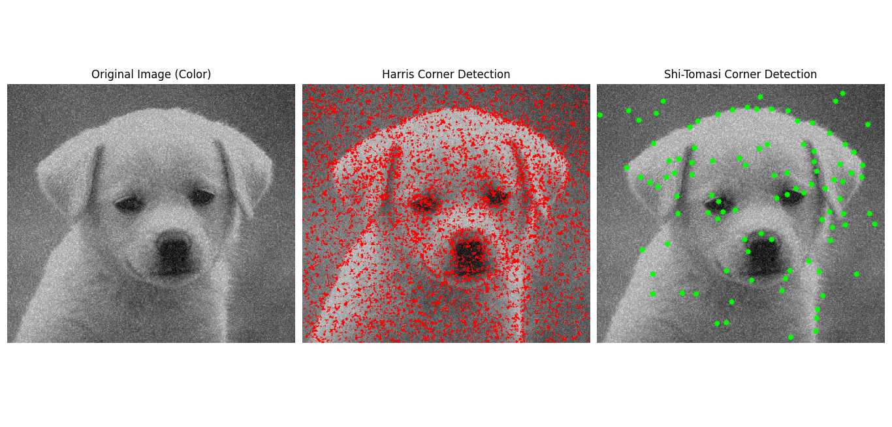

# 12.1 – Harris and Shi-Tomasi Corner Detection

<video width="800" height="410" controls>
    <source src="photows/ShiTomasiCorner.mp4" type="video/mp4">
    Your browser does not support the video tag.
  </video>

---

##  Overview

- Corner detection is a foundational step in many vision tasks like motion tracking, object detection, and recognition. Two widely used algorithms are:
  - Harris Corner Detector
  - Shi-Tomasi Corner Detector (Good Features to Track)


## Harris Corner Detection

- The Harris corner measure is based on the eigenvalues of the structure tensor matrix `M` of the image gradients:
\[
M = [Ix^2   IxIy]
    [IxIy   Iy^2]
\]

- Corner response:

\[
R = det(M) - k * (trace(M))^2
\]
- `det(M) = λ1 * λ2`
- `trace(M) = λ1 + λ2`
- `k` is typically 0.04 to 0.06

## Shi-Tomasi Corner Detection

- Instead of using the determinant and trace, Shi-Tomasi uses:
\[
R = min(λ1, λ2)
\]
- A good corner has both eigenvalues large, hence `min(λ1, λ2)` is a strong indicator.

---

###  Python Code 

```python
# Import the OpenCV library for image processing
import cv2  # → MATLAB: (built-in image processing functions, no import needed)

# Import NumPy for numerical operations
import numpy as np  # → MATLAB: (built-in array and matrix support)

# Import Matplotlib for plotting
import matplotlib.pyplot as plt  # → MATLAB: uses built-in plotting (imshow, subplot, etc.)

# Read the image and convert it to grayscale
img = cv2.imread('sample.jpg')  # Load the image with new name
# → MATLAB: img = imread('sample.jpg');

if img is None:
    raise ValueError("Image 'sample.jpg' not found. Please check the path.")
# → MATLAB:
% if isempty(img)
%     error('Image ''sample.jpg'' not found. Please check the path.');
% end

gray = cv2.cvtColor(img, cv2.COLOR_BGR2GRAY)  # Convert to grayscale for corner detection
# → MATLAB: gray = rgb2gray(img);

# Harris Corner Detection
gray_float = np.float32(gray)  # Convert grayscale to float32
# → MATLAB: gray_float = im2single(gray);

harris_corners = cv2.cornerHarris(gray_float, 2, 3, 0.04)  # Apply Harris corner detection
# → MATLAB: harris_corners = cornermetric(gray_float, 'Harris', 'FilterCoefficients', fspecial('gaussian', 3, 1));

img_harris = img.copy()  # Copy original image to draw Harris corners
# → MATLAB: img_harris = img;

# Mark detected corners in red on the copy of the original image
img_harris[harris_corners > 0.01 * harris_corners.max()] = [0, 0, 255]
# → MATLAB:
% mask = harris_corners > 0.01 * max(harris_corners(:));
% red_channel = img_harris(:,:,1);
% green_channel = img_harris(:,:,2);
% blue_channel = img_harris(:,:,3);
% red_channel(mask) = 255;
% green_channel(mask) = 0;
% blue_channel(mask) = 0;
% img_harris = cat(3, red_channel, green_channel, blue_channel);

# Shi-Tomasi Corner Detection
shi_corners = cv2.goodFeaturesToTrack(gray, 100, 0.01, 10)
# → MATLAB:
% corners = detectMinEigenFeatures(gray);
% corners = selectStrongest(corners, 100);

img_shi = img.copy()  # Copy image for drawing Shi-Tomasi corners
# → MATLAB: img_shi = img;

for i in shi_corners:
    x, y = i.ravel()  # Extract coordinates
    cv2.circle(img_shi, (int(x), int(y)), 3, (0, 255, 0), -1)  # Draw green circles
# → MATLAB:
% for i = 1:length(corners)
%     position = round(corners(i).Location);
%     img_shi = insertShape(img_shi, 'FilledCircle', [position 3], 'Color', 'green');
% end

# Convert images from BGR to RGB for plotting
img_rgb = cv2.cvtColor(img, cv2.COLOR_BGR2RGB)
img_harris_rgb = cv2.cvtColor(img_harris, cv2.COLOR_BGR2RGB)
img_shi_rgb = cv2.cvtColor(img_shi, cv2.COLOR_BGR2RGB)
# → MATLAB: not needed, images are already RGB

# Plot original and results
plt.figure(figsize=(18, 6))  # Prepare wide figure
# → MATLAB: figure;

plt.subplot(1, 3, 1)
plt.imshow(img_rgb)
plt.title('Original Image (Color)')
plt.axis('off')
# → MATLAB:
% subplot(1,3,1), imshow(img), title('Original Image (Color)');

plt.subplot(1, 3, 2)
plt.imshow(img_harris_rgb)
plt.title('Harris Corner Detection')
plt.axis('off')
# → MATLAB:
% subplot(1,3,2), imshow(img_harris), title('Harris Corner Detection');

plt.subplot(1, 3, 3)
plt.imshow(img_shi_rgb)
plt.title('Shi-Tomasi Corner Detection')
plt.axis('off')
# → MATLAB:
% subplot(1,3,3), imshow(img_shi), title('Shi-Tomasi Corner Detection');

plt.tight_layout()
plt.show()
# → MATLAB: no need for tight_layout; use `sgtitle` or manually adjust layout


```


###  MATLAB code

```matlab
% Read the image
img = imread('sample.jpg');

% Error check if image not found
if isempty(img)
    error('Image ''sample.jpg'' not found. Please check the path.');
end

% Convert to grayscale
gray = rgb2gray(img);

% Harris Corner Detection
gray_float = im2single(gray);  % Convert to single precision
harris_corners = cornermetric(gray_float, 'Harris');

% Create a red mask for Harris corners
mask_harris = harris_corners > 0.01 * max(harris_corners(:));
img_harris = img;
red = img_harris(:,:,1);
green = img_harris(:,:,2);
blue = img_harris(:,:,3);
red(mask_harris) = 255;
green(mask_harris) = 0;
blue(mask_harris) = 0;
img_harris = cat(3, red, green, blue);

% Shi-Tomasi Corner Detection (MinEigen)
corners = detectMinEigenFeatures(gray);
strongest_corners = selectStrongest(corners, 100);

% Draw Shi-Tomasi corners as green circles
img_shi = insertShape(img, 'FilledCircle', ...
    [strongest_corners.Location repmat(3, strongest_corners.Count, 1)], ...
    'Color', 'green', 'Opacity', 1);

% Display results
figure;

subplot(1, 3, 1);
imshow(img);
title('Original Image (Color)');

subplot(1, 3, 2);
imshow(img_harris);
title('Harris Corner Detection');

subplot(1, 3, 3);
imshow(img_shi);
title('Shi-Tomasi Corner Detection');

```


### Images




