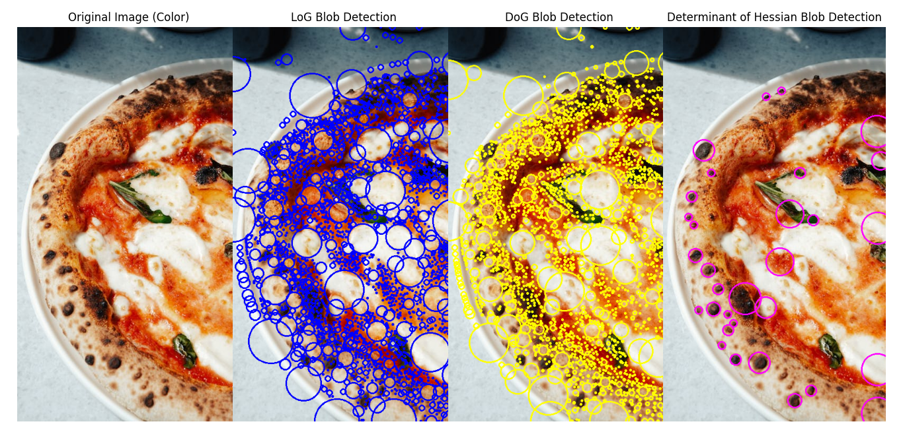

# 11.2 – Blob Detection

<video width="800" height="410" controls>
    <source src="photows/BlobDetection.mp4" type="video/mp4">
    Your browser does not support the video tag.
  </video>

---
## Overview
- Blobs are regions in an image that differ in properties like brightness or color. Blob detection is used in applications such as motion tracking, object detection, and region labeling.

---

## Techniques 

- Blob detection commonly uses:
  - Laplacian of Gaussian (LoG)
  - Difference of Gaussian (DoG)
  - Determinant of Hessian matrix

## Laplacian of Gaussian (LoG)

\[
LoG(x, y) = ∇²G(x, y) * I(x, y)
\]

- Where:
  - `G(x, y)` is a Gaussian function
  - `∇²` is the Laplacian operator
  - `I(x, y)` is the image

---

##  Python Code

```python

# Import the OpenCV library for image processing
import cv2
# Import blob detection methods from skimage
from skimage.feature import blob_log, blob_dog, blob_doh
# Import NumPy for numerical operations
import numpy as np
# Import Matplotlib for plotting
import matplotlib.pyplot as plt

# Load the color image
img = cv2.imread('sample.jpg')
if img is None:
    raise ValueError("Image 'sample.jpg' not found. Please check the path.")

# Convert image to RGB for displaying with matplotlib
img_rgb = cv2.cvtColor(img, cv2.COLOR_BGR2RGB)
# Convert image to grayscale for blob detection
gray = cv2.cvtColor(img, cv2.COLOR_BGR2GRAY)

# 1. Laplacian of Gaussian (LoG) blob detection
blobs_log = blob_log(gray, max_sigma=30, num_sigma=10, threshold=0.03)
blobs_log[:, 2] = blobs_log[:, 2] * np.sqrt(2)  # Adjust radii

# 2. Difference of Gaussian (DoG) blob detection
blobs_dog = blob_dog(gray, max_sigma=30, threshold=0.03)
blobs_dog[:, 2] = blobs_dog[:, 2] * np.sqrt(2)

# 3. Determinant of Hessian (DoH) blob detection
blobs_doh = blob_doh(gray, max_sigma=30, threshold=0.01)

# Function to draw circles around detected blobs
def draw_blobs(image, blobs, color):
    img_with_blobs = image.copy()
    for blob in blobs:
        y, x, r = blob  # center coordinates and radius
        center = (int(x), int(y))
        radius = int(r)
        cv2.circle(img_with_blobs, center, radius, color, 2)
    return img_with_blobs

# Apply drawing function for each blob detection result
img_log = draw_blobs(img_rgb, blobs_log, (0, 0, 255))      # Red for LoG
img_dog = draw_blobs(img_rgb, blobs_dog, (255, 255, 0))    # Cyan for DoG
img_doh = draw_blobs(img_rgb, blobs_doh, (255, 0, 255))    # Magenta for DoH

# Plot all results side by side
fig, axs = plt.subplots(1, 4, figsize=(20, 6))

axs[0].imshow(img_rgb)
axs[0].set_title('Original Image (Color)')
axs[0].axis('off')

axs[1].imshow(img_log)
axs[1].set_title('LoG Blob Detection')
axs[1].axis('off')

axs[2].imshow(img_dog)
axs[2].set_title('DoG Blob Detection')
axs[2].axis('off')

axs[3].imshow(img_doh)
axs[3].set_title('Determinant of Hessian Blob Detection')
axs[3].axis('off')

plt.tight_layout()
plt.show()

```

## MATLAB Code

```matlab

img = imread('sample.png');
if isempty(img)
    error('Image "sample.png" not found. Please check the path.');
end

% Convert to grayscale
if size(img, 3) == 3
    gray = rgb2gray(img);
else
    gray = img;
end

% 1. MSER Blob Detection
mserRegions = detectMSERFeatures(gray);

% 2. SURF Blob Detection
surfPoints = detectSURFFeatures(gray);

% 3. Harris Blob Detection
harrisPoints = detectHarrisFeatures(gray);

% Display results
figure;
subplot(1,4,1);
imshow(img);
title('Original Image (Color)');

subplot(1,4,2);
imshow(img); hold on;
plot(mserRegions, 'showPixelList', false, 'showEllipses', true);
title('LoG Blob Detection');

subplot(1,4,3);
imshow(img); hold on;
plot(surfPoints.selectStrongest(50));
title('DoG Blob Detection');

subplot(1,4,4);
imshow(img); hold on;
plot(harrisPoints.selectStrongest(50));
title('Determinant of Hessian Blob Detection');

```


## Image
 



