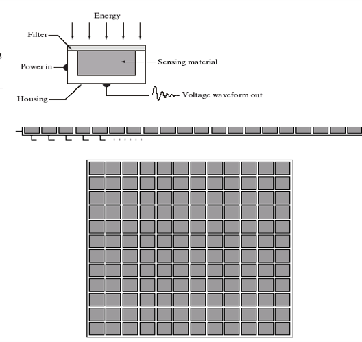
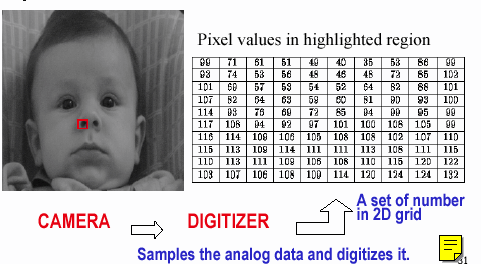
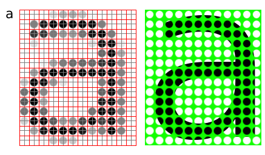

## Chapter 2: Digital Image Processing Fundamentals


---


## 📌 Overview

This chapter introduces the **fundamental concepts** of digital image processing. It includes the system components, basic image acquisition, sampling, quantization, and representation techniques.


## 📸 1. Image Acquisition

- Physical devices like cameras capture electromagnetic energy and convert it to an electrical signal.
- Digitizers convert the electrical signals to digital form.
  



### 🐍 OpenCV (Python)

```python
import cv2
img = cv2.imread('image.jpg')
cv2.imshow('Original Image', img)
cv2.waitKey(0)
cv2.destroyAllWindows()
```
### 🔬 MATLAB Code

```matlab

I = imread('image.jpg');
imshow(I);
title('Original Image');

```
---
## 🧮 2. Image Formation Model

An image is defined as:

\[
f(x, y) = i(x, y) \cdot r(x, y)
\]

Where:
- \(i(x, y)\): Illumination
- \(r(x, y)\): Reflectance

### 🐍 OpenCV (Python)

```python
import numpy as np
import matplotlib.pyplot as plt

height, width = 100, 100
image = np.zeros((height, width))

for i in range(height):
    for j in range(width):
        image[i, j] = (i + j) / (height + width)

# Display the image
plt.imshow(image, cmap='gray')
plt.title("Image Formation Model (Python)")
plt.axis('off')
plt.show()
```


### 🔬 MATLAB Code

```matlab
% Create a simple image (a gradient)
height = 100;
width = 100;
image = zeros(height, width);

for i = 1:height
    for j = 1:width
        image(i, j) = (i + j) / (height + width);
    end
end

% Display the image
imshow(image, []);
title('Image Formation Model (MATLAB)');

```
#### 📸 Suggested Image


---

## 📐 4. Digital Image Representation

- Digital image = Matrix of intensity values.
- Resolution = Sampling density + gray-level depth.


---

### 🐍 OpenCV (Python)
```python

PIL
(Pillow) library to work with images, and NumPy to represent them as arrays:

from PIL import Image
import numpy as np
import matplotlib.pyplot as plt

# Load an image
image_path = 'path_to_your_image.jpg'  # Replace with your image path
image = Image.open(image_path)

# Convert the image to a NumPy array
image_array = np.array(image)

# Display the image and its array representation
plt.figure(figsize=(10, 5))

# Display the image
plt.subplot(1, 2, 1)
plt.imshow(image)
plt.title("Original Image")
plt.axis('off')

# Display the array
plt.subplot(1, 2, 2)
plt.imshow(image_array)
plt.title("Image Array Representation")
plt.axis('off')

plt.show()
```

### 🔬 MATLAB Code
```matlab

% Load an image
image_path = 'path_to_your_image.jpg';  % Replace with your image path
image = imread(image_path);

% Display the image and its matrix representation
figure;

% Display the image
subplot(1, 2, 1);
imshow(image);
title('Original Image');

% Display the array
subplot(1, 2, 2);
imagesc(image);
title('Image Matrix Representation');
axis off; % Turn off axis
```

---

## 🗂️ 5. Storage and Display

- **Storage Types**:
  - Short-term
  - On-line
  - Archival
- **Display** is vital for observing results.
- **Communication** includes local (LAN) and remote methods.

---
### 💡 Note
Higher resolution means better approximation of the original image.

