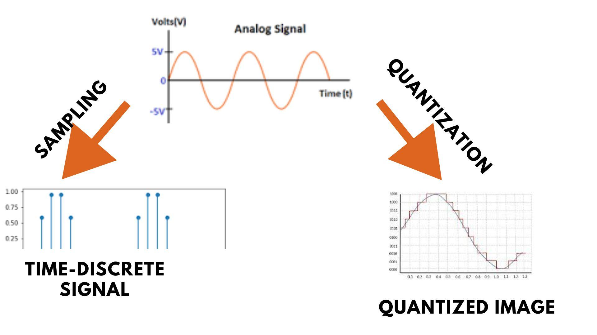
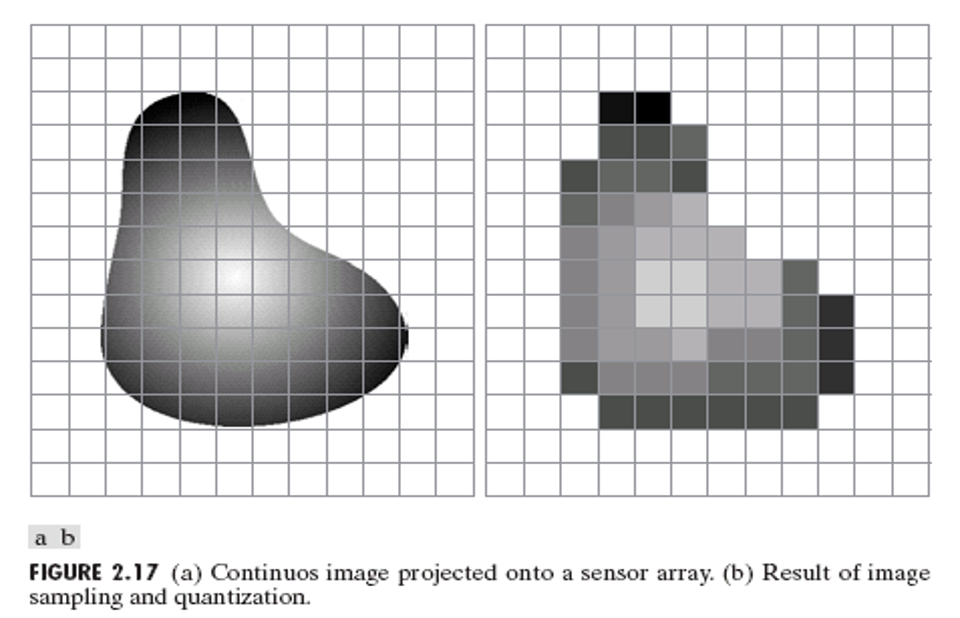
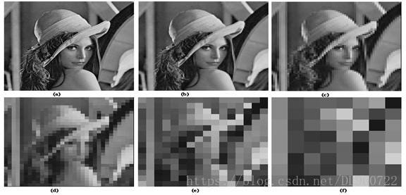

## 3. Image Sampling and Quantization

- **Sampling**: Converting continuous coordinates to discrete.
- **Quantization**: Converting continuous amplitude to discrete levels.
---




---


---
### 📊 MATLAB Example
```matlab
I = imread('image.jpg');
I_resized = imresize(I, 0.5);
imshow(I_resized);
title('Sampled Image');
```

### 🧑‍💻 OpenCV Code
```python
import cv2
img = cv2.imread('image.jpg')
resized = cv2.resize(img, (img.shape[1]//2, img.shape[0]//2))
cv2.imshow('Sampled Image', resized)
cv2.waitKey(0)
cv2.destroyAllWindows()
```



---
