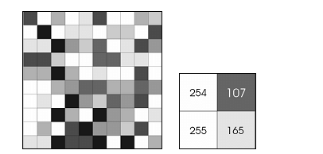
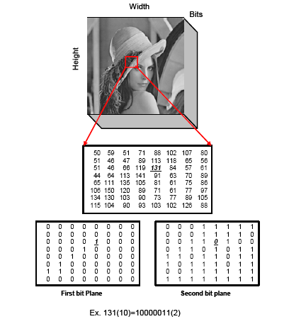
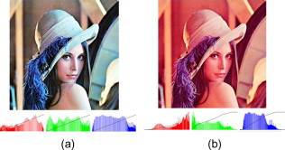
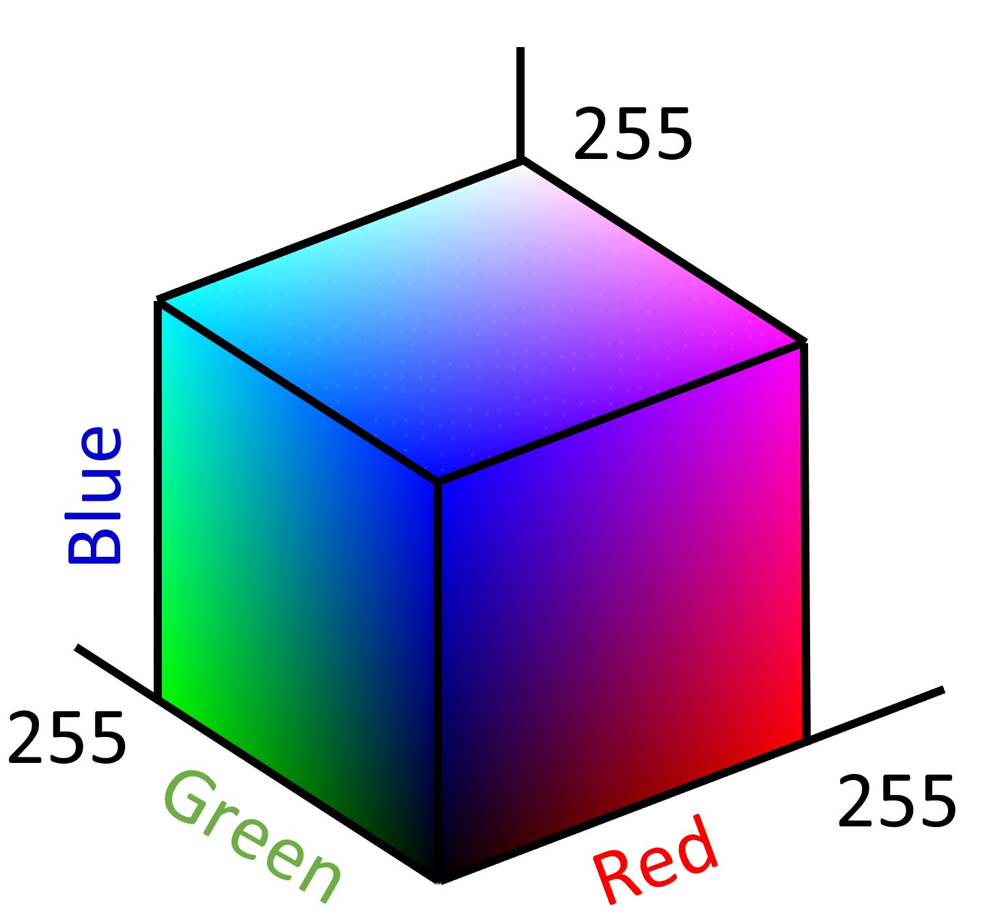

## Chapter 2: Image Representation


  <video width="800" height="410" controls>
    <source src="phOotos/imagerepresentation.mp4" type="video/mp4">
    Your browser does not support the video tag.
  </video>


---
## 📌 Overview

This chapter introduces the fundamentals of digital image representation, including the electromagnetic spectrum, image resolution, bit-plane slicing, the human visual system (HVS), color models, and core applications in image processing.

---

## 1. 📡 Scales of Imaging

Digital imaging spans a huge range of physical scales, from astronomical to microscopic.


---

## 2. 🖼 Digital Image Formation

### ➕ Matrix Representation

Digital images are matrices of pixel values.

##### python (OpenCV) example

```python

import cv2
import matplotlib.pyplot as plt

img = cv2.imread('cameraman.tif', cv2.IMREAD_GRAYSCALE)
plt.imshow(img, cmap='gray')
plt.axis('off')
plt.show()
```

##### MATLAB example

```matlab


img = imread('cameraman.tif');
imshow(img);

```


---

### ➗ Block-wise Representation (e.g., 8x8 blocks)

Often used in compression like JPEG.
##### MATLAB example
```matlab
block = img(1:8, 1:8)

```

##### python (OpenCV) example
```python
block = img[:8, :8]
print(block)

```



---

## 3. 🔢 Bit-Plane Slicing

Decomposes an 8-bit image into binary slices (planes).

##### python (OpenCV) example
```python
fig, axes = plt.subplots(2, 4, figsize=(10,5))
for i in range(8):
    plane = (img >> i) & 1
    ax = axes[i//4, i%4]
    ax.imshow(plane, cmap='gray')
    ax.set_title(f'Bitplane {i}')
    ax.axis('off')
plt.tight_layout()
plt.show()

```

##### MATLAB example

```matlab
for k = 1:8
    bitplane = bitget(img, k);
    subplot(2,4,k), imshow(logical(bitplane)), title(['Bitplane ' num2str(k)]);
end

```

---

## 4. 🌈 Color Representation

### RGB Cube and Channels

##### python (OpenCV) example

```python
img_color = cv2.imread('peppers.png')
b, g, r = cv2.split(img_color)

```


##### MATLAB example

```matlab
img_color = imread('peppers.png');
red = img_color(:,:,1);
green = img_color(:,:,2);
blue = img_color(:,:,3);

```


### RGB Cube Illustration:




---

