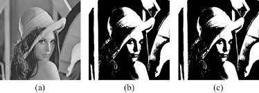
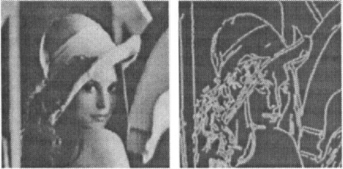
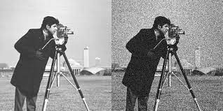

## Image Matching, Compression (JPEG, JPEG2000)

- Compression Ratio (CR) = Original Size / Compressed Size


#### 🐍 Python (OpenCV)

```python

import cv2  # Import the OpenCV library for image processing

# Read the input image
img = cv2.imread('image.jpg')  # Load the image from file

# Save the image as a compressed JPEG file
# The third argument specifies the JPEG quality (1-100)
# Lower values result in higher compression (lower quality)
cv2.imwrite('compressed.jpg', img, [int(cv2.IMWRITE_JPEG_QUALITY), 50]

```

#### 🧠 MATLAB

```matlab

% Read the input image
img = imread('image.jpg');  % Load the image from file

% Save the image as a JPEG file with compression
% The 'Quality' parameter specifies the compression level (1-100)
% Lower values result in higher compression (lower quality)
imwrite(img, 'compressed.jpg', 'jpg', 'Quality', 50)

```




---

## 7. 📏 Quality Metrics

- **MAE**: Mean Absolute Error
- **MSE**: Mean Squared Error
- **PSNR**: Peak Signal-to-Noise Ratio

$$ MAE = \frac{1}{mn} \sum_{i,j} |I(i,j) - K(i,j)| $$

$$ MSE = \frac{1}{mn} \sum_{i,j} (I(i,j) - K(i,j))^2 $$

$$ PSNR = 10 \cdot \log_{10}\left(\frac{L^2}{MSE}\right) $$
- PSNR



---