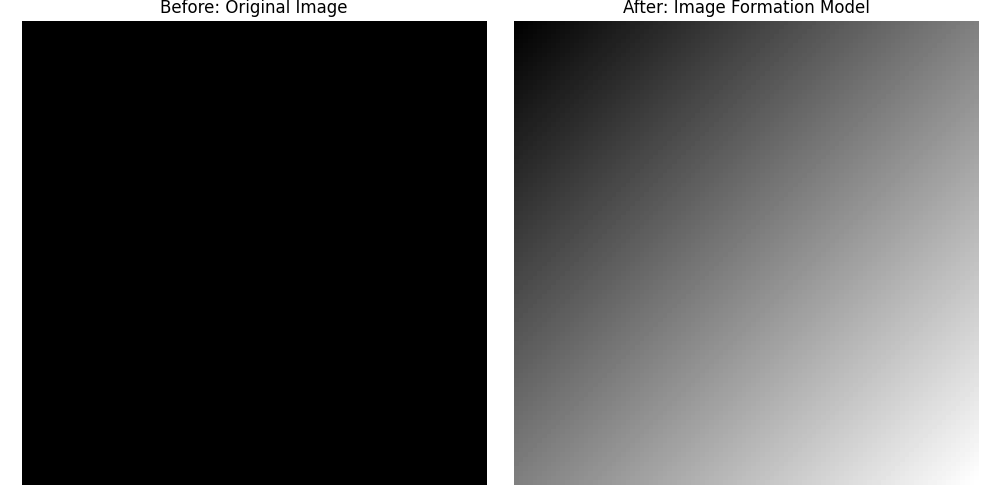

# Chapter 2:Digital Image Processing Fundamentals


## Overview

- This chapter introduces the fundamental concepts of digital image processing. It includes the system components, basic image acquisition, sampling, quantization, and representation techniques.


## 1.Image Acquisition

- Physical devices like cameras capture electromagnetic energy and convert it to an electrical signal.
- Digitizers convert the electrical signals to digital form.
  


### Python (OpenCV)

```python

import cv2
import matplotlib.pyplot as plt

# Read the image in color mode (BGR format)
img = cv2.imread('sample2.jpg', cv2.IMREAD_COLOR)

# Check if the image was loaded successfully
if img is None:
    print("Error: Image not found.")  # Print error if image path is wrong or file missing
    exit()

# Convert the image from BGR (OpenCV default) to RGB for correct color display with matplotlib
img_rgb = cv2.cvtColor(img, cv2.COLOR_BGR2RGB)

# Create a figure with 2 subplots to show image before and after color correction
plt.figure(figsize=(12, 5))  # Set figure size for better visualization

# Show the original image in BGR format (colors will appear incorrect in matplotlib)
plt.subplot(1, 2, 1)
plt.imshow(img)  
plt.title('Before (BGR - Wrong Colors)')
plt.axis('off')  # Hide axis ticks and labels

# Show the image after converting to RGB (correct colors)
plt.subplot(1, 2, 2)
plt.imshow(img_rgb)
plt.title('After (RGB - Correct Colors)')
plt.axis('off')  # Hide axis ticks and labels

# Adjust spacing between subplots and display the figure
plt.tight_layout()
plt.show()

```

### MATLAB Code

```matlab

% Read the image in color mode (MATLAB reads images in RGB format by default)
img = imread('sample2.jpg');

% Check if the image was loaded successfully
if isempty(img)
    error('Error: Image not found.'); % Display error if file is missing
end

% MATLAB images are in RGB format by default, no need for color conversion

% Create a figure with 2 subplots to show original and grayscale images
figure;

% Show the original image (RGB format, colors are correct)
subplot(1,2,1);
imshow(img);
title('Before (BGR - Wrong Colors)');

% Convert the RGB image to grayscale
gray_img = rgb2gray(img);

% Show the grayscale image
subplot(1,2,2);
imshow(gray_img);
title('After (RGB - Correct Colors)');

% Adjust layout - MATLAB automatically adjusts subplot spacing

```


---

## 2.Image Formation Model

- An image is defined as:

$$
f(x, y) = i(x, y) \cdot r(x, y)
$$

Where:
- $i(x, y)$: Illumination
- $r(x, y)$: Reflectance

### Python(OpenCV)

```python

# Import NumPy for numerical operations
import numpy as np
# Import Matplotlib for plotting images
import matplotlib.pyplot as plt

# Define the height and width of the image
height, width = 100, 100

# Create an initial 2D array of zeros (black image)
original_image = np.zeros((height, width))

# Create a second array to represent the "formed" image
formed_image = np.zeros((height, width))

# Apply a simple image formation model: each pixel is the normalized sum of its coordinates
for i in range(height):
    for j in range(width):
        formed_image[i, j] = (i + j) / (height + width)  # Normalized value between 0 and 1

# Display both images side by side
plt.figure(figsize=(10, 5))

# Show the original zero-initialized image
plt.subplot(1, 2, 1)
plt.imshow(original_image, cmap='gray')
plt.title("Before: Original Image")
plt.axis('off')  # Hide axis ticks

# Show the formed image based on the image formation model
plt.subplot(1, 2, 2)
plt.imshow(formed_image, cmap='gray')
plt.title("After: Image Formation Model")
plt.axis('off')  # Hide axis ticks

# Automatically adjust spacing and show the images
plt.tight_layout()
plt.show()

```

### MATLAB Code

```matlab

% Define the height and width of the image
height = 100;
width = 100;

% Create an initial 2D matrix of zeros (black image)
original_image = zeros(height, width);

% Create another matrix for the "formed" image
formed_image = zeros(height, width);

% Fill the image using the image formation model:
% Each pixel is the normalized sum of its row and column indices
for i = 1:height
    for j = 1:width
        formed_image(i, j) = (i + j) / (height + width);  % Normalize to [0,1]
    end
end

% Display both images side by side
figure;

% Show the original image (black)
subplot(1, 2, 1);
imshow(original_image, []);
title('Before: Original Image');

% Show the formed image using the formula
subplot(1, 2, 2);
imshow(formed_image, []);
title('After: Image Formation Model');

```





## 3.Digital Image Representation

- Digital image = Matrix of intensity values.
- Resolution = Sampling density + gray-level depth.


---

### Python Code

```python
# Import the OpenCV library for image processing tasks
import cv2

# Import the Matplotlib library for visualizing images
import matplotlib.pyplot as plt

# Read the image from disk in color mode (BGR format by default)
img = cv2.imread('sample.jpg', cv2.IMREAD_COLOR)

# Convert the BGR image to a single-channel grayscale image
gray_img = cv2.cvtColor(img, cv2.COLOR_BGR2GRAY)

# Create a figure with 1 row and 2 columns to display original and grayscale images side by side
fig, axes = plt.subplots(1, 2, figsize=(12, 6))

# Automatically adjust spacing between subplots to prevent overlap
fig.tight_layout()

# Display the original image (converted from BGR to RGB for accurate colors in Matplotlib)
axes[0].imshow(cv2.cvtColor(img, cv2.COLOR_BGR2RGB))
axes[0].set_title('Original Image')       # Set the title for the original image subplot
axes[0].axis('off')                        # Hide axis ticks and labels

# Display the grayscale version of the image using a gray colormap
axes[1].imshow(gray_img, cmap='gray')
axes[1].set_title('Image Array Representation')      # Set the title for the grayscale image subplot
axes[1].axis('off')                        # Hide axis ticks and labels

# Render and display both images in the output window
plt.show()

```

### MATLAB Code

```matlab
% Import the color image from file (automatically in RGB format)
img = imread('sample.jpg');

% Convert the RGB image to grayscale (single channel)
gray_img = rgb2gray(img);

% Create a figure with 1 row and 2 columns to show both images side by side
figure;
subplot(1, 2, 1);

% Display the original RGB image
imshow(img);
title('Original Image');  % Set the title for the original image subplot

% Move to the second subplot for the grayscale image
subplot(1, 2, 2);

% Display the grayscale image
imshow(gray_img);
title('Image Array Representation');  % Set the title for the grayscale image subplot

```


---

## 4.Storage and Display

- Storage Types:
  - Short-term
  - On-line
  - Archival
  - Display is vital for observing results.
  - Communication includes local (LAN) and remote methods.

