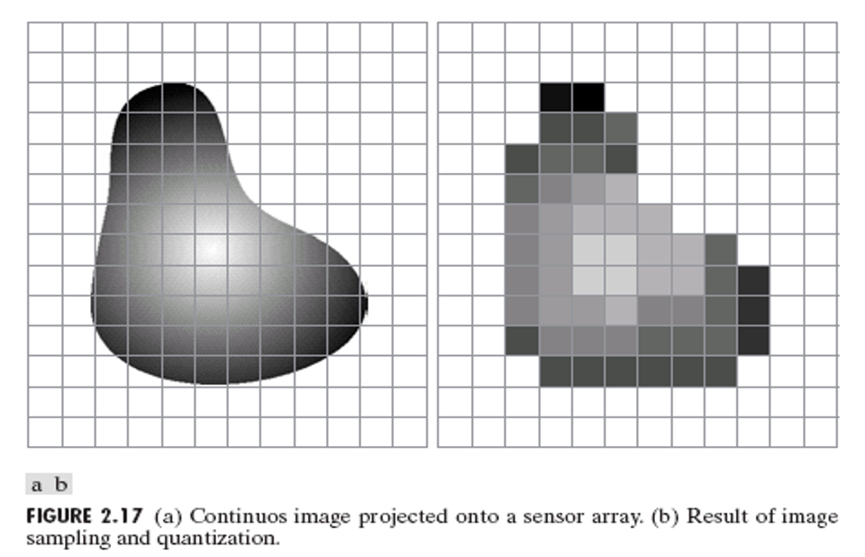
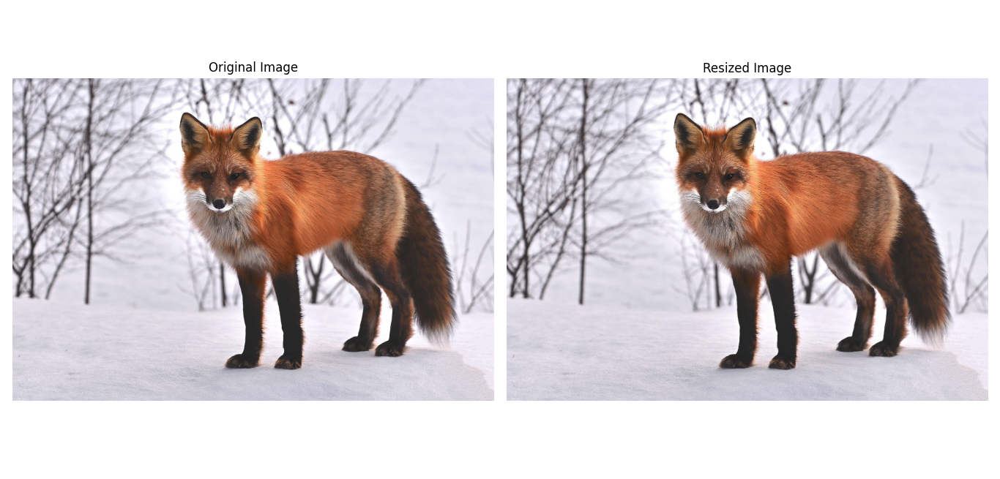

# 3.Image Sampling and Quantization

- Sampling: Converting continuous coordinates to discrete.
- Quantization: Converting continuous amplitude to discrete levels.




## python Code 

```python
import cv2  # Import OpenCV for image processing
import numpy as np  # Import NumPy for array manipulations (not directly used here but commonly imported)
import matplotlib.pyplot as plt  # Import Matplotlib for displaying images

# Load the image from file
img = cv2.imread('sample.jpg')  # Read the image in BGR color format

# Resize the image to half its original width and height
resized = cv2.resize(img, (img.shape[1] // 2, img.shape[0] // 2))

# Convert original image from BGR to RGB color space for correct display in Matplotlib
img_rgb = cv2.cvtColor(img, cv2.COLOR_BGR2RGB)

# Convert resized image from BGR to RGB color space for correct display
resized_rgb = cv2.cvtColor(resized, cv2.COLOR_BGR2RGB)

# Create a figure with 1 row and 2 columns to display both images side by side
fig, axes = plt.subplots(1, 2, figsize=(12, 6))
fig.tight_layout()  # Automatically adjust subplot params for a nicer layout

# Display the original RGB image
axes[0].imshow(img_rgb)
axes[0].set_title('Original Image')
axes[0].axis('off')  # Hide axes for clean visualization

# Display the resized RGB image
axes[1].imshow(resized_rgb)
axes[1].set_title('Resized Image')
axes[1].axis('off')  # Hide axes for clean visualization

# Show the figure with the images
plt.show()

```
---

## MATLAB Code

```matlab
% Read the image from file
img = imread('sample.jpg');  % Load the image (in RGB by default)

% Resize the image to half its original size
resized = imresize(img, 0.5);  % Resize to 50% scale

% Create a figure for displaying images
figure;

% Display the original image on the left subplot
subplot(1, 2, 1);
imshow(img);  % Show original image
title('Original Image');  % Set the title
axis off;  % Hide the axes for cleaner look

% Display the resized image on the right subplot
subplot(1, 2, 2);
imshow(resized);  % Show resized image
title('Resized Image');  % Set the title
axis off;  % Hide the axes

% MATLAB automatically handles layout for subplots


```




