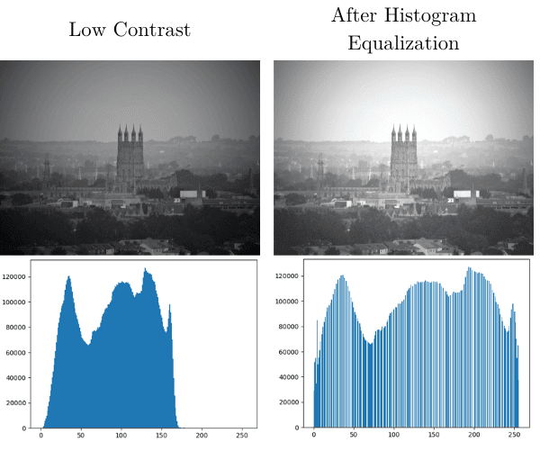
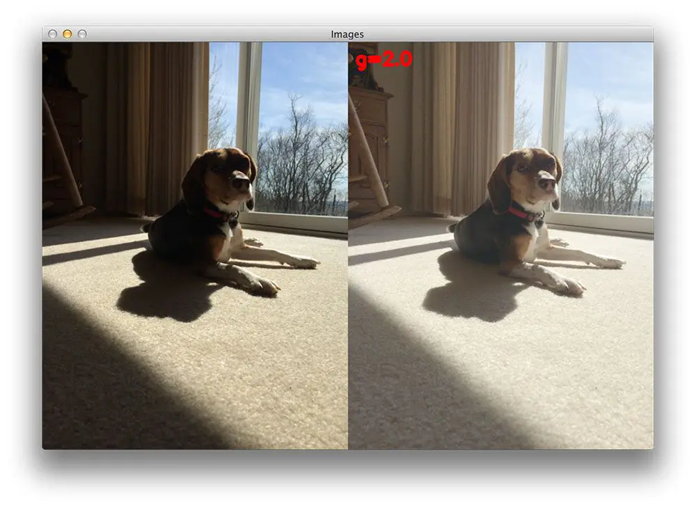

## Chapter 3: Image Enhancement Using Intensity Histogram

---

## 🔸1.Intensity Histogram

**📖 Description:**

- Histogram: A plot of the number of pixels for each intensity value.
- Used to understand image contrast and brightness.


**📊 Histogram Visualization Code (OpenCV):**
```python
# Import the OpenCV library for image processing
import cv2  
# Import Matplotlib for plotting
import matplotlib.pyplot as plt  

# Read the input image in grayscale mode
img = cv2.imread('image.jpg', cv2.IMREAD_GRAYSCALE)

# Create a histogram of the pixel intensities
# img.ravel() flattens the image array into a 1D array
# 256 is the number of bins, and [0, 256] is the range of pixel intensity values
plt.hist(img.ravel(), 256, [0, 256])

# Add a title and labels to the histogram
plt.title('Histogram')
plt.xlabel('Pixel Intensity')
plt.ylabel('Frequency')

# Display the histogram
plt.show()
```

**📊 MATLAB Code:**
```matlab

% Read the input image
img = imread('image.jpg');  % Load the image from file

% Convert the image to grayscale
gray = rgb2gray(img);  % Convert RGB image to grayscale

% Display the histogram of the grayscale image
imhist(gray);  % Create and display the histogram
title('Histogram');  % Add a title to the histogram

```


---

## 🔸: Fixed Intensity Transformations

### 📘 Types:

- **Negative Transformation**:
  \[ s = L - 1 - r \]

- **Log Transformation**:
  \[ s = c \cdot \log(1 + r) \]

- **Power-Law (Gamma) Transformation**:
  \[ s = c \cdot r^\gamma \]

- **Thresholding**:
  \[ s =
  \begin{cases}
  0 & r < m \\
  c & r \geq m
  \end{cases}
  \]

#### 🐍 Python OpenCV Example (Gamma Correction)

```python

import cv2  # Import the OpenCV library for image processing
import numpy as np  # Import NumPy for numerical operations

# Read the input image in grayscale mode
img = cv2.imread('image.jpg', cv2.IMREAD_GRAYSCALE)  # Read the image as grayscale

# Define the gamma value for correction
gamma = 2.0  # You can adjust this value to change the correction effect

# Apply gamma correction
# The formula used is:
# corrected_value = 255 * (pixel_value / 255) ** gamma
# This scales the pixel values based on the gamma value
gamma_corrected = np.array(255 * (img / 255) ** gamma, dtype='uint8')

# Save the gamma-corrected image to a file
cv2.imwrite('gamma_corrected.jpg', gamma_corrected)

```
---
#### 🧠 MATLAB Example
```matlab

% Read the input image
img = imread('image.jpg');  % Load the image from the file
gray = rgb2gray(img);  % Convert the image to grayscale if it's a color image

% Define the gamma value for correction
gamma = 2.0;  % You can adjust this value to change the correction effect

% Apply gamma correction
% The formula used is:
% corrected_value = 255 * (pixel_value / 255) ^ gamma
% This scales the pixel values based on the gamma value
gamma_corrected = 255 * (double(gray) / 255) .^ gamma;

% Convert the result back to uint8 format for proper display
gamma_corrected = uint8(gamma_corrected);

% Display the gamma-corrected image
imshow(gamma_corrected);
title('Gamma Corrected Image');  % Add a title for clarity
```

---

## 🔸: Contrast Stretching

**🧮 Formula:**
\[ s = \left(\frac{r - r_{min}}{r_{max} - r_{min}}\right) \cdot (L - 1) \]

**📌 Purpose:** Enhance image contrast by stretching intensity values across the full dynamic range.

**🧪python(OpenCV):**
```python
import cv2  # Import the OpenCV library for image processing
import numpy as np  # Import NumPy for numerical operations

# Read the input image in grayscale mode
img = cv2.imread('image.jpg', 0)  # Read the image as grayscale

# Find the minimum and maximum pixel values in the image
min_val = np.min(img)  # Minimum pixel value
max_val = np.max(img)  # Maximum pixel value

# Perform contrast stretching
# The formula scales the pixel values to the range [0, 255]
stretched = ((img - min_val) / (max_val - min_val) * 255).astype('uint8')

# Save the contrast-stretched image to a file
cv2.imwrite('contrast_stretched.jpg', stretched)
```

**🧪 MATLAB:**
```matlab

% Read the input image and convert it to grayscale
gray = imread('image.jpg');
gray = rgb2gray(gray);  % Convert to grayscale if it's a color image

% Find the minimum and maximum pixel values in the grayscale image
min_val = double(min(gray(:)));  % Minimum pixel value
max_val = double(max(gray(:)));  % Maximum pixel value

% Perform contrast stretching
% The formula scales the pixel values to the range [0, 255]
stretched = (double(gray) - min_val) / (max_val - min_val) * 255;

% Convert the stretched image back to uint8 format for proper display
stretched = uint8(stretched);

% Display the contrast-stretched image
imshow(stretched);
title('Contrast Stretched Image');

```
