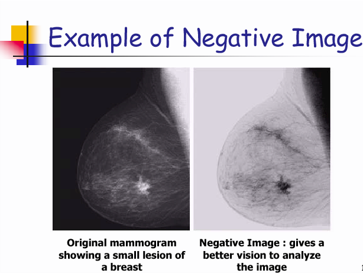
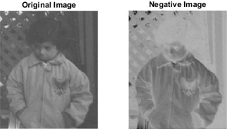
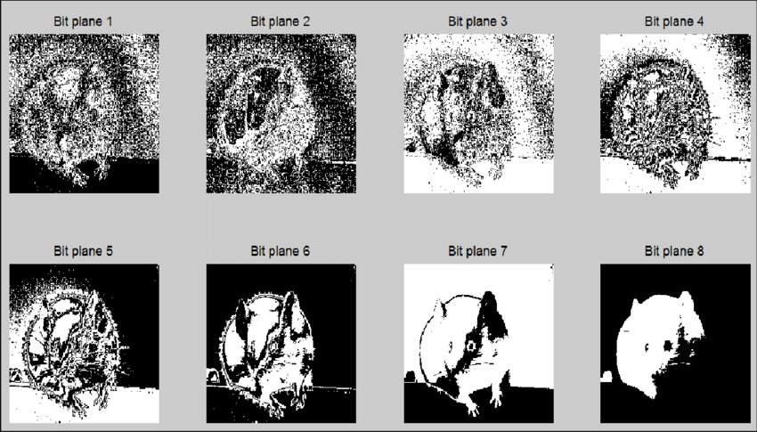

# Chapter 3: Image Enhancement Techniques

 - Image enhancement aims to improve the visibility and detectability of objects in an image, making important features easier to extract and analyze. In this chapter, we will explore spatial and frequency domain techniques that enhance contrast, sharpness, and details to improve image clarity.
---

 <video src="photo/lineartransformationfunction.mp4" width="800" height="410" controls>

  </video>


---


## 🧩1. Spatial Domain Enhancement


Enhancement in the spatial domain involves direct manipulation of pixel values to improve image features. By adjusting pixel intensities, contrast, and brightness, this method enhances specific details or objects in the image, making them more distinguishable.

---

### 🔷 A. Linear Transformation Functions

Linear transformation functions are used to modify the pixel values in a linear fashion, based on mathematical equations. These transformations involve scaling, shifting, or inverting pixel intensities to enhance image features like contrast or brightness. Common examples include contrast stretching and negative transformation.
#### 📘 Negative Image

A negative image is created by inverting the pixel values of an image. This transformation changes all pixel intensities to their complementary values, making light areas dark and dark areas light. It is commonly used for highlighting details in an image that may not be visible in the original form.




- **Formula**:  
  \[ S = L - 1 - r \]

### 📘Negative code 

#### 🐍 Python (OpenCV)
```python
# Import the OpenCV library for image processing
import cv2  
# Import NumPy for numerical operations
import numpy as np  

# Read the input image in grayscale mode (0 means read as grayscale)
img = cv2.imread('image.jpg', 0)

# Create a negative of the image by subtracting each pixel value from 255
# This inverts the colors of the image
negative = 255 - img

# Save the negative image to a new file called 'negative.jpg'
cv2.imwrite('negative.jpg', negative)
```
---
#### 🧠 MATLAB
```matlab
% Read the input image from the file
img = imread('image.jpg');

% Create a negative of the image by subtracting each pixel value from 255
% This operation inverts the colors of the image
neg = 255 - img;

% Display the negative image in a new window
imshow(neg);
```

🖼️ _Image_: `original vs. negative`




📹 _Video_: `negative_transformation_demo.mp4`

---

### 🔷 B. Logarithmic Transformation

Logarithmic transformation enhances dark regions while compressing bright areas by applying a logarithmic function to pixel values. It is useful for images with a wide dynamic range, such as medical or satellite images.


#### 📘 Formula:
\[ S = c \cdot \log(1 + r) \]

#### 🐍 Python
```python
# Import the OpenCV library for image processing
import cv2  
# Import NumPy for numerical operations
import numpy as np  

# Read the input image in grayscale mode (0 means read as grayscale)
img = cv2.imread('image.jpg', 0)

# Calculate the constant 'c' for the log transformation
# 'np.max(img)' gets the maximum pixel value in the image
# The formula c = 255 / log(1 + max_pixel_value) helps to scale the values
c = 255 / np.log(1 + np.max(img))

# Apply the log transformation to the image
# The log transformation enhances the brightness of dark regions in the image
log_image = c * np.log(1 + img)

# Convert the log-transformed image to an unsigned 8-bit integer format
# This ensures that the pixel values are in the correct range [0, 255]
log_image = np.array(log_image, dtype=np.uint8)
```

#### 🧠 MATLAB
```matlab
% Read the input image from the file
img = imread('image.jpg');

% Convert the image to double precision for accurate calculations
img = double(img);

% Calculate the constant 'c' for the log transformation
% 'max(img(:))' gets the maximum pixel value in the image
% The formula c = 255 / log(1 + max_pixel_value) helps to scale the values
c = 255 / log(1 + max(img(:)));

% Apply the log transformation to the image
% The log transformation enhances the brightness of dark regions in the image
log_img = uint8(c * log(1 + img));

% Display the log-transformed image in a new window
imshow(log_img);

```


---
### 🔷 C. Power-Law Transformation

Power-law transformation adjusts the brightness of an image by applying a power function to the pixel values. This technique can enhance either the dark or bright regions depending on the value of the exponent, making it useful for improving contrast in various types of images.


#### 📘 Formula:
\[ S = c \cdot r^\gamma \]

#### 🐍 Python
```python

import cv2  # Import the OpenCV library for image processing
import numpy as np  # Import NumPy for numerical operations

# Define the gamma value for gamma correction
gamma = 0.4

# Read the input image in grayscale mode (0 means read as grayscale)
img = cv2.imread('image.jpg', 0)

# Normalize the image by scaling pixel values to the range [0, 1]
img_norm = img / 255.0

# Apply gamma correction to the normalized image
# np.power raises each pixel value to the power of gamma
gamma_corrected = np.power(img_norm, gamma)

# Convert the gamma-corrected image back to the uint8 format
# Scale the values back to the range [0, 255] and convert to unsigned 8-bit integers
gamma_corrected = np.uint8(gamma_corrected * 255)

```


#### 🧠 MATLAB
```matlab

% Read the input image from the file
img = imread('image.jpg');

% Convert the image to double precision for accurate calculations
% This scales the pixel values to the range [0, 1]
img = im2double(img);

% Define the gamma value for gamma correction
gamma = 0.4;

% Apply gamma correction to the image
% The expression img.^gamma raises each pixel value to the power of gamma
% Convert the gamma-corrected image back to uint8 format for proper display
gamma_img = im2uint8(img.^gamma);

% Display the gamma-corrected image in a new window
imshow(gamma_img);

```


---

### 🔷 D. Piece-wise Linear Transformations

Piece-wise linear transformations involve applying different linear operations to different regions of an image. Common techniques include:

- **Contrast Stretching**: Expands the range of pixel values to enhance contrast.
- **Gray Level Slicing**: Focuses on specific gray levels to highlight particular features.
- **Bit-plane Slicing**: Separates the image into its bit planes to emphasize certain details or reduce noise.


🖼️ _Image_: `Bit-plane Slicing.png`



---