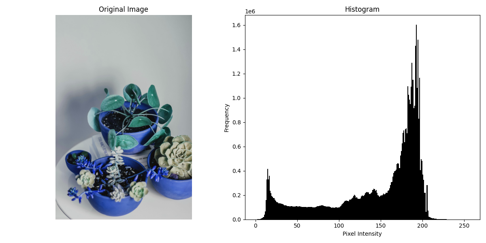

# Chapter 3:Image Enhancement Using Intensity Histogram

## 1.Intensity Histogram

- Histogram: A plot of the number of pixels for each intensity value.
- Used to understand image contrast and brightness.


### python Code

```python

# Import the OpenCV library for image processing
import cv2  
# Import Matplotlib for plotting
import matplotlib.pyplot as plt  

# Load the image in grayscale mode using a unified image name
img = cv2.imread('sample2.jpg', cv2.IMREAD_GRAYSCALE)  # Read the image as a grayscale image

# Check if the image was loaded successfully
if img is None:
    print("Error: Image not found.")  # Print error message if image not found
    exit()  # Exit the program

# Create a new figure for the original image and its histogram
fig, axes = plt.subplots(1, 2, figsize=(12, 6))  # Create a 1x2 subplot figure
fig.tight_layout()  # Adjust layout to prevent overlap

# Display the original image
axes[0].imshow(img, cmap='gray')  # Show the grayscale image
axes[0].set_title('Original Image')  # Set title for the image plot
axes[0].axis('off')  # Hide axis ticks and labels

# Create a histogram of the pixel intensities
axes[1].hist(img.ravel(), bins=256, range=[0, 256], color='black')  # Plot histogram of pixel intensities
axes[1].set_title('Histogram')  # Set title for the histogram plot
axes[1].set_xlabel('Pixel Intensity')  # Label x-axis
axes[1].set_ylabel('Frequency')  # Label y-axis

# Show the figure
plt.show()  # Display the plots

```

### MATLAB Code:

```matlab

% Read the image in grayscale mode using a unified image name
img = imread('sample2.jpg'); % Read the image

% Check if the image is RGB, convert to grayscale if needed
if size(img, 3) == 3
    img = rgb2gray(img); % Convert RGB to grayscale
end

% Display the original image
figure;
subplot(1, 2, 1); % Create a 1x2 subplot, first plot
imshow(img); % Show grayscale image
title('Original Image'); % Set title for the image

% Calculate histogram of the grayscale image
subplot(1, 2, 2); % Second plot in the 1x2 subplot
imhist(img); % Display histogram of the image
title('Histogram'); % Set title for the histogram
xlabel('Pixel Intensity'); % Label x-axis
ylabel('Frequency'); % Label y-axis

```



---

## 2:Contrast Stretching

Formula:

\[ s = \left(\frac{r - r_{min}}{r_{max} - r_{min}}\right) \cdot (L - 1) \]

- Purpose:Enhance image contrast by stretching intensity values across the full dynamic range.

### Python Code

```python

# Import the OpenCV library for image processing
import cv2  
# Import NumPy for numerical operations
import numpy as np  
# Import Matplotlib for plotting
import matplotlib.pyplot as plt  

# Read the input image in color mode
img = cv2.imread('sample2.jpg')  # Use your image file name here

# Check if the image was loaded successfully
if img is None:
    print("Error: Image not found.")  # Print error if image not found
    exit()  # Exit the program

# Split the image into its color channels
b, g, r = cv2.split(img)  # Split into Blue, Green, Red channels

# Function to perform contrast stretching
def contrast_stretch(channel):
    min_val = np.min(channel)  # Minimum pixel value in the channel
    max_val = np.max(channel)  # Maximum pixel value in the channel
    # Perform contrast stretching formula
    stretched = ((channel - min_val) / (max_val - min_val) * 255).astype('uint8')  
    return stretched

# Apply contrast stretching to each channel
stretched_r = contrast_stretch(r)  # Stretch Red channel
stretched_g = contrast_stretch(g)  # Stretch Green channel
stretched_b = contrast_stretch(b)  # Stretch Blue channel

# Merge the stretched channels back into a color image
stretched_img = cv2.merge((stretched_b, stretched_g, stretched_r))  # Merge channels

# Create a figure to display the original and contrast-stretched images
fig, axes = plt.subplots(1, 2, figsize=(12, 6))  # Create subplots for display
fig.tight_layout()  # Adjust layout

# Display the original image
axes[0].imshow(cv2.cvtColor(img, cv2.COLOR_BGR2RGB))  # Convert BGR to RGB for display
axes[0].set_title('Original Image')  # Title for original image
axes[0].axis('off')  # Hide axes

# Display the contrast-stretched image
axes[1].imshow(cv2.cvtColor(stretched_img, cv2.COLOR_BGR2RGB))  # Convert BGR to RGB
axes[1].set_title('Contrast-Stretched Image')  # Title for processed image
axes[1].axis('off')  # Hide axes

# Show the combined figure
plt.show()  # Display the figure

```

### MATLAB Code:

```matlab

% Read the input image in color mode
img = imread('sample2.jpg'); % Read the image file

% Check if the image is RGB, convert if needed (usually true)
if size(img, 3) == 3
    % Split the image into its color channels
    r = img(:, :, 1); % Red channel
    g = img(:, :, 2); % Green channel
    b = img(:, :, 3); % Blue channel
else
    error('Image is not in color format');
end

% Function to perform contrast stretching on a channel
contrast_stretch = @(channel) uint8( ...
    (double(channel) - double(min(channel(:)))) ./ ...
    (double(max(channel(:))) - double(min(channel(:)))) * 255);

% Apply contrast stretching to each channel
stretched_r = contrast_stretch(r); % Stretch Red channel
stretched_g = contrast_stretch(g); % Stretch Green channel
stretched_b = contrast_stretch(b); % Stretch Blue channel

% Merge the stretched channels back into a color image
stretched_img = cat(3, stretched_r, stretched_g, stretched_b); % Combine channels

% Display original and contrast-stretched images side by side
figure;
subplot(1, 2, 1); % First subplot
imshow(img); % Show original image
title('Original Image'); % Title

subplot(1, 2, 2); % Second subplot
imshow(stretched_img); % Show contrast-stretched image
title('Contrast-Stretched Image'); % Title

```

