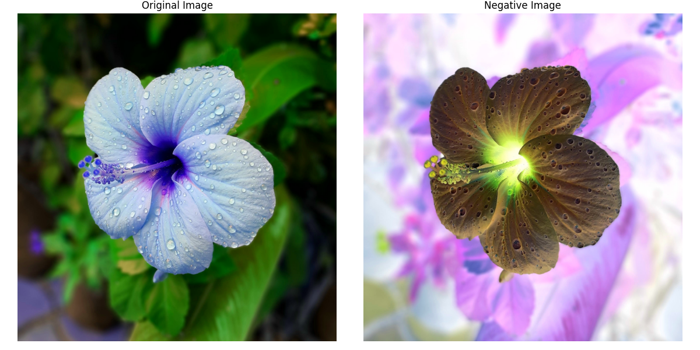
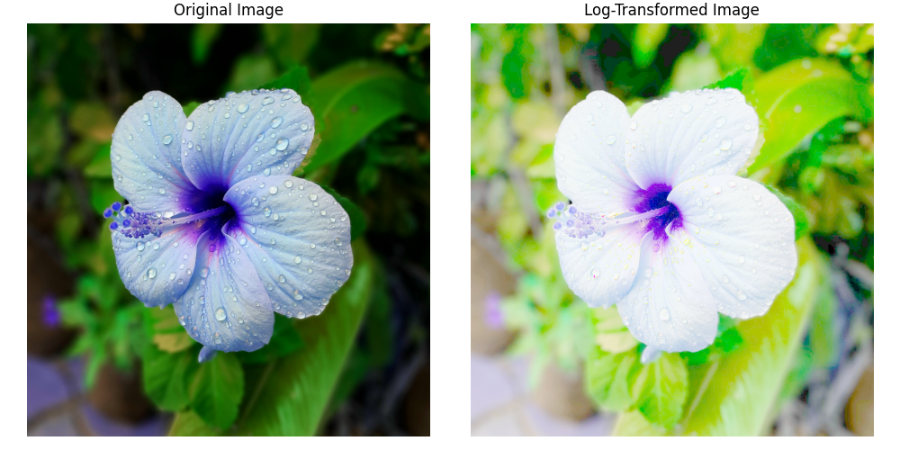
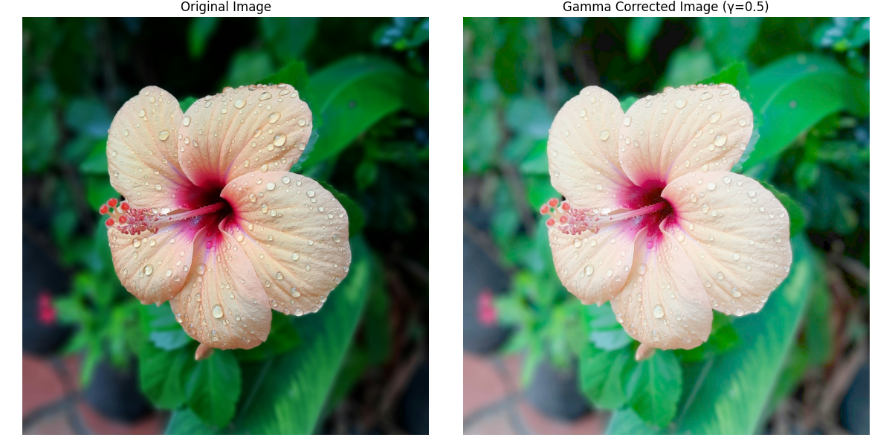

# Chapter 3:Image Enhancement Techniques


 - Image enhancement aims to improve the visibility and detectability of objects in an image, making important features easier to extract and analyze. In this chapter, we will explore spatial and frequency domain techniques that enhance contrast, sharpness, and details to improve image clarity.

 <video width="800" height="410" controls>
    <source src="photows/lineartransformationfunction.mp4" type="video/mp4">
    Your browser does not support the video tag.
  </video>


---


## 1.Spatial Domain Enhancement


- Enhancement in the spatial domain involves direct manipulation of pixel values to improve image features. By adjusting pixel intensities, contrast, and brightness, this method enhances specific details or objects in the image, making them more distinguishable.


## A.Linear Transformation Functions

- Linear transformation functions are used to modify the pixel values in a linear fashion, based on mathematical equations. These transformations involve scaling, shifting, or inverting pixel intensities to enhance image features like contrast or brightness. Common examples include contrast stretching and negative transformation.

## :Fixed Intensity Transformations

## Types:

- Negative Transformation:
  \[ s = L - 1 - r \]

- Logarithmic Transformation:
  \[ s = c \cdot \log(1 + r) \]

- Power-Law (Gamma) Transformation:
  \[ s = c \cdot r^\gamma \]

- Thresholding:
  \[ s =
  \begin{cases}
  0 & r < m \\
  c & r \geq m
  \end{cases}
  \]


##  A:Negative Image

- A negative image is created by inverting the pixel values of an image. This transformation changes all pixel intensities to their complementary values, making light areas dark and dark areas light. It is commonly used for highlighting details in an image that may not be visible in the original form.


  ### Formula: 
  \[ S = L - 1 - r \]


### Python Code 

```python

# Import the OpenCV library for image processing
import cv2  
# Import NumPy for numerical operations
import numpy as np  
# Import Matplotlib for plotting
import matplotlib.pyplot as plt  

# Load the image in color mode using a unified image name
img = cv2.imread('sample.jpg', cv2.IMREAD_COLOR)

# Create a negative of the image by subtracting each pixel value from 255
negative = 255 - img  # Invert the colors of the image

# Create a figure to display the original and negative images
fig, axes = plt.subplots(1, 2, figsize=(12, 6))
fig.tight_layout()

# Display the original image (convert BGR to RGB for correct display)
axes[0].imshow(cv2.cvtColor(img, cv2.COLOR_BGR2RGB))
axes[0].set_title('Original Image')
axes[0].axis('off')

# Display the negative image (convert BGR to RGB for correct display)
axes[1].imshow(cv2.cvtColor(negative, cv2.COLOR_BGR2RGB))
axes[1].set_title('Negative Image')
axes[1].axis('off')

# Show the combined figure
plt.show()

```
---

### MATLAB Code 

```matlab

% Read the image in color mode
img = imread('sample.jpg'); % Load the image file

% Create a negative of the image by subtracting each pixel from 255
negative = 255 - img; % Invert the colors

% Display the original and negative images side by side
figure;
subplot(1, 2, 1); % First subplot
imshow(img); % Show original image
title('Original Image'); % Title for original image

subplot(1, 2, 2); % Second subplot
imshow(negative); % Show negative image
title('Negative Image'); % Title for negative image

```





---

## B.Logarithmic Transformation

- Logarithmic transformation enhances dark regions while compressing bright areas by applying a logarithmic function to pixel values. It is useful for images with a wide dynamic range, such as medical or satellite images.


### Formula:
\[ S = c \cdot \log(1 + r) \]

### Python Code 

```python

# Import the OpenCV library for image processing
import cv2  
# Import NumPy for numerical operations
import numpy as np  
# Import Matplotlib for plotting
import matplotlib.pyplot as plt  

# Load the image in color mode using a unified image name
img = cv2.imread('sample.jpg', cv2.IMREAD_COLOR)

# Calculate the constant 'c' for the log transformation
c = 255 / np.log(1 + np.max(img))  # Scaling constant

# Apply the log transformation to the image
log_image = c * np.log(1 + img)  # Log transformation

# Convert the log-transformed image to an unsigned 8-bit integer format
log_image = np.array(log_image, dtype=np.uint8)  

# Create a figure to display the original and log-transformed images
fig, axes = plt.subplots(1, 2, figsize=(10, 5))
fig.tight_layout()

# Display the original image (convert BGR to RGB for correct display)
axes[0].imshow(cv2.cvtColor(img, cv2.COLOR_BGR2RGB))
axes[0].set_title('Original Image')
axes[0].axis('off')

# Display the log-transformed image (convert BGR to RGB for correct display)
axes[1].imshow(cv2.cvtColor(log_image, cv2.COLOR_BGR2RGB))
axes[1].set_title('Log-Transformed Image')
axes[1].axis('off')

# Show the combined figure
plt.show()

```

### MATLAB Code 

```matlab

% Read the image in color mode
img = imread('sample.jpg'); % Load the image

% Calculate the constant 'c' for log transformation
c = 255 / log(1 + double(max(img(:)))); % Scaling constant

% Apply the log transformation to the image
log_image = c * log(1 + double(img)); % Log transform

% Convert the image back to uint8
log_image = uint8(log_image);

% Display the original and log-transformed images side by side
figure;
subplot(1, 2, 1);
imshow(img);
title('Original Image');

subplot(1, 2, 2);
imshow(log_image);
title('Log-Transformed Image');

```


---

## C.Power-Law (Gamma)Transformation

- Power-law transformation adjusts the brightness of an image by applying a power function to the pixel values. This technique can enhance either the dark or bright regions depending on the value of the exponent, making it useful for improving contrast in various types of images.


###  Formula:

\[ S = c \cdot r^\gamma \]

### Python Code 

```python

# Import the OpenCV library for image processing
import cv2  
# Import NumPy for numerical operations
import numpy as np  
# Import Matplotlib for plotting
import matplotlib.pyplot as plt  

# Load the image in color mode using a unified image name
img = cv2.imread('sample.jpg', cv2.IMREAD_COLOR)

# Define gamma value for transformation
gamma = 0.5  # Example value; adjust as needed

# Create a lookup table for the gamma correction
c = 1  # Constant multiplier
lookup_table = np.array([c * (i / 255) ** gamma * 255 for i in range(256)], dtype='uint8')

# Apply the gamma transformation using the lookup table
gamma_corrected = cv2.LUT(img, lookup_table)

# Create a figure to display the original and gamma-transformed images
fig, axes = plt.subplots(1, 2, figsize=(12, 6))
fig.tight_layout()

# Display the original image (convert BGR to RGB for correct display)
axes[0].imshow(cv2.cvtColor(img, cv2.COLOR_BGR2RGB))
axes[0].set_title('Original Image')
axes[0].axis('off')

# Display the gamma-transformed image (convert BGR to RGB for correct display)
axes[1].imshow(cv2.cvtColor(gamma_corrected, cv2.COLOR_BGR2RGB))
axes[1].set_title(f'Gamma Corrected Image (γ={gamma})')
axes[1].axis('off')

# Show the combined figure
plt.show()

```


### MATLAB Code

```matlab
% Read the image in color mode
img = imread('sample.jpg'); % Load image

% Define gamma value
gamma = 0.5; % Example value; adjust as needed

% Normalize image to range [0, 1]
img_normalized = double(img) / 255;

% Apply gamma correction
gamma_corrected = 1 * (img_normalized .^ gamma);

% Scale back to [0, 255] and convert to uint8
gamma_corrected = uint8(gamma_corrected * 255);

% Display original and gamma corrected images side by side
figure;
subplot(1,2,1);
imshow(img);
title('Original Image');

subplot(1,2,2);
imshow(gamma_corrected);
title(['Gamma Corrected Image (\gamma = ' num2str(gamma) ')']);

```


---

## D.Piece-wise Linear Transformations

- Piece-wise linear transformations involve applying different linear operations to different regions of an image. Common techniques include:

- Contrast Stretching: Expands the range of pixel values to enhance contrast.
- Gray Level Slicing: Focuses on specific gray levels to highlight particular features.
- Bit-plane Slicing: Separates the image into its bit planes to emphasize certain details or reduce noise.

### Contrast Stretching Example 

### Python Code

```python
# Import the OpenCV library for image processing
import cv2  
# Import NumPy for numerical operations
import numpy as np  
# Import Matplotlib for plotting
import matplotlib.pyplot as plt  

# Load the image in color mode using a unified image name
img = cv2.imread('sample.jpg', cv2.IMREAD_COLOR)  

# Split the image into its color channels
b, g, r = cv2.split(img)  

# Function to perform contrast stretching on a channel
def contrast_stretch(channel):
    min_val = np.min(channel)  # Minimum pixel value in channel
    max_val = np.max(channel)  # Maximum pixel value in channel
    # Stretch the contrast to full 0-255 range
    stretched = ((channel - min_val) / (max_val - min_val) * 255).astype('uint8')
    return stretched

# Apply contrast stretching to each channel
stretched_r = contrast_stretch(r)  
stretched_g = contrast_stretch(g)  
stretched_b = contrast_stretch(b)  

# Merge the stretched channels back into a color image
stretched_img = cv2.merge((stretched_b, stretched_g, stretched_r))  

# Create a figure to display the original and contrast-stretched images
plt.figure(figsize=(12, 6))  

# Display the original image (convert BGR to RGB for correct colors)
plt.subplot(1, 2, 1)  
plt.imshow(cv2.cvtColor(img, cv2.COLOR_BGR2RGB))  
plt.title('Original Image')  
plt.axis('off')  

# Display the contrast-stretched image (convert BGR to RGB)
plt.subplot(1, 2, 2)  
plt.imshow(cv2.cvtColor(stretched_img, cv2.COLOR_BGR2RGB))  
plt.title('Contrast-Stretched Image')  
plt.axis('off')  

# Adjust layout and show plot
plt.tight_layout()  
plt.show()  

```

### MATLAB Code:

```matlab

% Read the input image in color
img = imread('sample.jpg');  % Read the image file

% Split the image into red, green, and blue channels
r = img(:,:,1);  
g = img(:,:,2);  
b = img(:,:,3);  

% Define a function handle for contrast stretching
contrast_stretch = @(channel) uint8( ...
    (double(channel) - double(min(channel(:)))) ...
    / (double(max(channel(:))) - double(min(channel(:)))) * 255 );

% Apply contrast stretching on each color channel
stretched_r = contrast_stretch(r);  
stretched_g = contrast_stretch(g);  
stretched_b = contrast_stretch(b);  

% Combine the stretched channels into one RGB image
stretched_img = cat(3, stretched_r, stretched_g, stretched_b);  

% Display the original and contrast-stretched images side by side
figure;
subplot(1,2,1);  
imshow(img);  
title('Original Image');  

subplot(1,2,2);  
imshow(stretched_img);  
title('Contrast-Stretched Image');  


```


---

##  E:Thresholding

- Thresholding is a fundamental image processing technique used to segment an image into distinct regions by converting grayscale images into binary images. By setting a specific threshold value, pixels above this value are converted to one color (usually white), while those below are converted to another (usually black). This method is particularly useful for feature extraction, object detection, and simplifying image data for analysis.

### Python Code 

```python

# Import the OpenCV library for image processing
import cv2  
# Import Matplotlib for plotting
import matplotlib.pyplot as plt  

# Load the image in grayscale mode using a unified image name
img = cv2.imread('sample.jpg', cv2.IMREAD_GRAYSCALE)  # Read the image as a grayscale image

# Define the threshold value
threshold_value = 128  # You can adjust this value depending on your needs

# Apply binary thresholding to the grayscale image
_, thresholded_image = cv2.threshold(img, threshold_value, 255, cv2.THRESH_BINARY)

# Create a figure with 1 row and 2 columns for showing images side by side
fig, axes = plt.subplots(1, 2, figsize=(12, 6))
fig.tight_layout()

# Display the original grayscale image on the left
axes[0].imshow(img, cmap='gray')
axes[0].set_title('Original Image')
axes[0].axis('off')  # Hide axes for better visualization

# Display the thresholded binary image on the right
axes[1].imshow(thresholded_image, cmap='gray')
axes[1].set_title('Thresholded Image')
axes[1].axis('off')  # Hide axes

# Show the plot with both images
plt.show()

```
### MATLAB Code

```matlab

% Read the image in grayscale
img = imread('sample.jpg');
if size(img,3) == 3
    img = rgb2gray(img); % Convert to grayscale if the image is RGB
end

% Define the threshold value
threshold_value = 128;

% Apply binary thresholding
thresholded_image = img > threshold_value;
thresholded_image = uint8(thresholded_image) * 255; % Convert logical to uint8 image (0 or 255)

% Display original and thresholded images side by side
figure;

subplot(1,2,1);
imshow(img);
title('Original Image');

subplot(1,2,2);
imshow(thresholded_image);
title('Thresholded Image');

```
