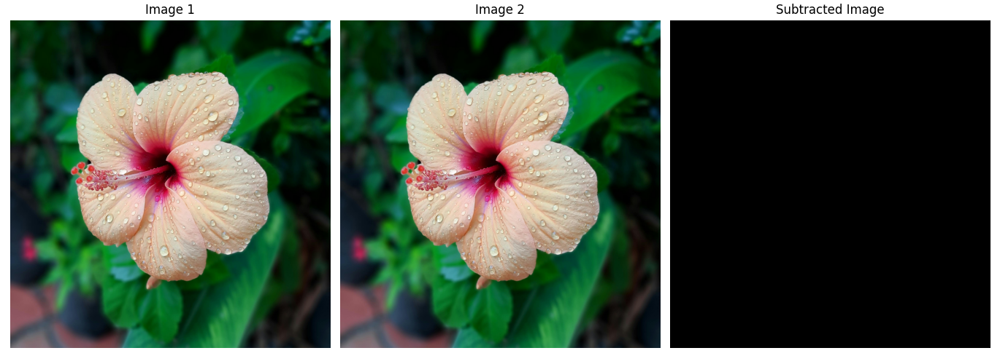

# 3.Arithmetic and Logical Operations


## 1.Image Subtraction
Image subtraction involves subtracting one image from another, often used for detecting changes between two images or for highlighting specific features. The operation is performed by subtracting pixel values of one image from the corresponding pixel values of another image.

$$
g(x,y) = f(x,y) - h(x,y)
$$

---

### Python Code Image Subtraction

```python

# Import the OpenCV library for image processing
import cv2  
# Import NumPy for numerical operations
import numpy as np  
# Import Matplotlib for plotting
import matplotlib.pyplot as plt  

# Read the input images in color mode
img1 = cv2.imread('sample.jpg', cv2.IMREAD_COLOR)  # Load the first image
img2 = cv2.imread('sample.jpg', cv2.IMREAD_COLOR)  # Load the second image

# Ensure both images are the same size
if img1.shape != img2.shape:
    raise ValueError("Images must be the same size for subtraction.")

# Perform image subtraction (absolute difference)
subtracted_image = cv2.absdiff(img1, img2)  # Highlights pixel-wise differences

# Create a figure with 3 subplots to display the images
fig, axes = plt.subplots(1, 3, figsize=(15, 5))  # 1 row, 3 columns
fig.tight_layout()

# Display the first image (converted from BGR to RGB)
axes[0].imshow(cv2.cvtColor(img1, cv2.COLOR_BGR2RGB))
axes[0].set_title('Image 1')
axes[0].axis('off')

# Display the second image
axes[1].imshow(cv2.cvtColor(img2, cv2.COLOR_BGR2RGB))
axes[1].set_title('Image 2')
axes[1].axis('off')

# Display the subtracted image
axes[2].imshow(cv2.cvtColor(subtracted_image, cv2.COLOR_BGR2RGB))
axes[2].set_title('Subtracted Image')
axes[2].axis('off')

# Show all the images
plt.show()

```

### Matlab code Image Subtraction

```matlab

% Read the input images
img1 = imread('sample.jpg');     % Load the first image
img2 = imread('sample.jpg');    % Load the second image

% Check if the images are the same size
if ~isequal(size(img1), size(img2))
    error('Images must be the same size for subtraction.');
end

% Perform image subtraction (absolute difference)
subtracted_image = imabsdiff(img1, img2);  % Pixel-wise absolute difference

% Display the original images and the subtracted image
figure;

subplot(1, 3, 1);
imshow(img1);
title('Image 1');

subplot(1, 3, 2);
imshow(img2);
title('Image 2');

subplot(1, 3, 3);
imshow(subtracted_image);
title('Subtracted Image');

```




---

## 2.Image Averaging

- Image averaging is a method of reducing noise by averaging multiple images. The resulting image is smoother, as random noise is canceled out by the averaging process.

$$
g(x,y) = \frac{1}{n} \sum_{i=1}^n g_i(x,y)
$$


### Python Code Image Averaging

```python

import cv2  # Import the OpenCV library for image processing
import numpy as np  # Import NumPy for numerical operations
import matplotlib.pyplot as plt  # Import Matplotlib for plotting

# Read the two input images in grayscale mode using unified names
img1 = cv2.imread('sample.jpg', cv2.IMREAD_GRAYSCALE)  # First image
img2 = cv2.imread('sample.jpg', cv2.IMREAD_GRAYSCALE)  # Second image

# Ensure the images are of the same size
if img1.shape != img2.shape:
    raise ValueError("Images must be the same size for averaging.")

# Perform image averaging
averaged_image = (img1.astype(np.float32) + img2.astype(np.float32)) / 2.0

# Convert back to uint8 format
averaged_image = np.uint8(averaged_image)

# Create a figure to display the original images and the averaged image
fig, axes = plt.subplots(1, 3, figsize=(15, 5))
fig.tight_layout()

# Display the first image
axes[0].imshow(img1, cmap='gray')
axes[0].set_title('Image 1')
axes[0].axis('off')

# Display the second image
axes[1].imshow(img2, cmap='gray')
axes[1].set_title('Image 2')
axes[1].axis('off')

# Display the averaged image
axes[2].imshow(averaged_image, cmap='gray')
axes[2].set_title('Averaged Image')
axes[2].axis('off')

# Show the combined figure
plt.show()

# Close all OpenCV windows (in case any were opened elsewhere)
cv2.destroyAllWindows()

```

### Matlab code Image Averaging

```matlab
% Read the two grayscale images
img1 = imread('sample.jpg');
img2 = imread('sample.jpg');

% Convert to grayscale if not already
if size(img1, 3) == 3
    img1 = rgb2gray(img1);
end
if size(img2, 3) == 3
    img2 = rgb2gray(img2);
end

% Ensure the images are the same size
if ~isequal(size(img1), size(img2))
    error('Images must be the same size for averaging.');
end

% Convert images to double for averaging
img1_double = double(img1);
img2_double = double(img2);

% Perform averaging
averaged_image = (img1_double + img2_double) / 2;

% Convert back to uint8 for display
averaged_image = uint8(averaged_image);

% Display the images
figure;
subplot(1,3,1);
imshow(img1);
title('Image 1');

subplot(1,3,2);
imshow(img2);
title('Image 2');

subplot(1,3,3);
imshow(averaged_image);
title('Averaged Image');
 
```


