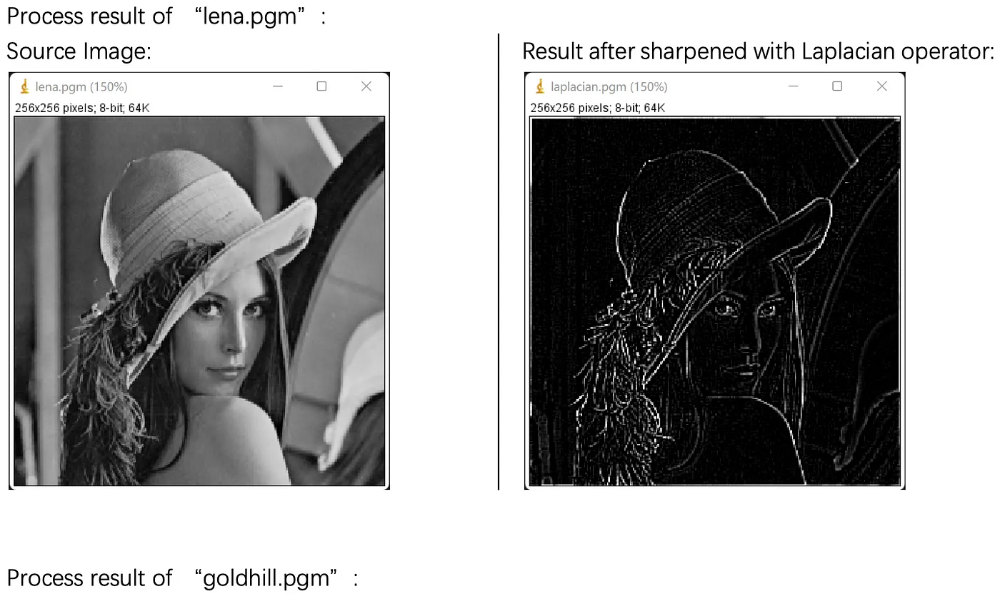

## 🧱  Spatial Filters


### ✨ B. Sharpening Filters

Sharpening filters are used to enhance the edges and fine details in an image by emphasizing the high-frequency components. These filters work by highlighting areas where there is a rapid change in intensity, making edges more distinct.

#### Laplacian (2nd Derivative)

The Laplacian filter is a second-order derivative filter that highlights regions of rapid intensity change, making it useful for edge detection. It calculates the second derivative of the image and emphasizes areas where the intensity changes most rapidly. This results in a sharpened image where edges are more prominent.

The Laplacian operator is often applied using a convolution kernel that detects the rate of change in pixel intensities. It is effective at detecting both horizontal and vertical edges in an image.

#### 🐍 Python

```python
import cv2  # Import the OpenCV library for image processing
import numpy as np  # Import NumPy for numerical operations

# Read the input image in grayscale mode
img = cv2.imread('image.jpg', 0)  # Read the image

# Apply the Laplacian filter to the image
# cv2.CV_64F specifies that the output image will be of type double (64-bit float)
laplacian = cv2.Laplacian(img, cv2.CV_64F)

# Convert the output image to uint8 format for proper display
laplacian_abs = np.uint8(np.absolute(laplacian))

# Display the original and Laplacian images
cv2.imshow('Original Image', img)
cv2.imshow('Laplacian Image', laplacian_abs)
cv2.waitKey(0)  # Wait for a key press to close the windows
cv2.destroyAllWindows()  # Close all OpenCV windows
```

#### 🧠 MATLAB

```matlab

% Read the input image
img = imread('image.jpg');

% Create a Laplacian filter using fspecial
% The second argument (0.2) specifies the scaling factor for the filter
h = fspecial('laplacian', 0.2);

% Apply the Laplacian filter to the image using imfilter
sharp = imfilter(img, h);

% Display the original and sharpened images
figure;
subplot(1, 2, 1);
imshow(img);
title('Original Image');

subplot(1, 2, 2);
imshow(sharp);
title('Sharpened Image');

```

#### 📸 Suggested Image

 
