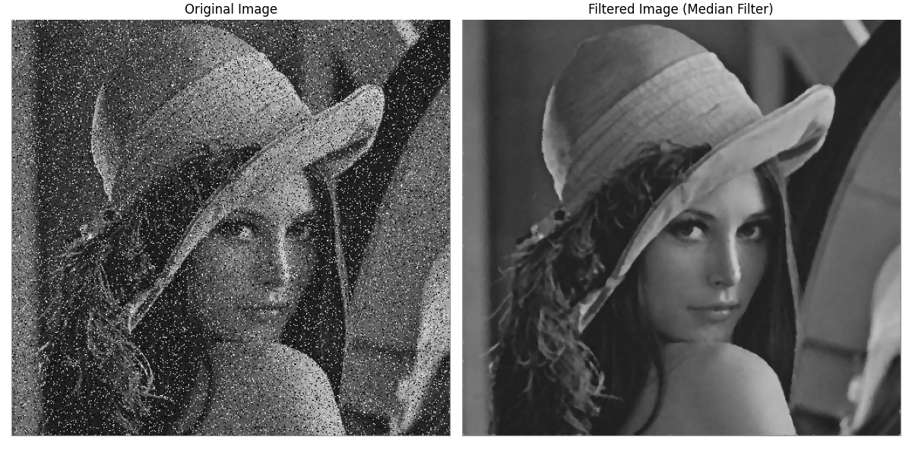

# 4.0 Introduction to Spatial Filtering


 <video width="800" height="410" controls>
    <source src="photows/ImageSmoothening,ImageSharpening.mp4" type="video/mp4">
    Your browser does not support the video tag.
  </video>


---

## 1.0 Smoothing Filters

- Smoothing filters are used to blur an image, reducing noise and detail. They work by averaging or smoothing the pixel values in a neighborhood of each pixel. Common types of smoothing filters include the median filter and the average filter.

---

## 1.1 Average Filter (Mean Filter)

- The average filter, also known as the mean filter, is a linear smoothing filter that replaces each pixel’s value with the average of its neighboring pixel values. This filter helps reduce noise by smoothing out sharp variations in pixel intensity. However, it can blur edges and fine details in the image.

### Python Code

```python
# Import the OpenCV library for image processing
import cv2  
# Import Matplotlib for plotting
import matplotlib.pyplot as plt  

# Read the input image in color mode using the unified image name
img = cv2.imread('sample.jpg')  # Read the image

# Apply an average filter (mean filter) using a 5x5 kernel
# You can change the kernel size as needed
filtered_image = cv2.blur(img, (5, 5))  # Apply mean filter

# Create a figure to display the original and filtered images
plt.figure(figsize=(12, 6))  # Set the figure size

# Display the original image
plt.subplot(1, 2, 1)  # 1 row, 2 columns, 1st subplot
plt.imshow(cv2.cvtColor(img, cv2.COLOR_BGR2RGB))  # Convert BGR to RGB and display
plt.title('Original Image')  # Title for the original image
plt.axis('off')  # Hide the axes

# Display the filtered image
plt.subplot(1, 2, 2)  # 1 row, 2 columns, 2nd subplot
plt.imshow(cv2.cvtColor(filtered_image, cv2.COLOR_BGR2RGB))  # Convert BGR to RGB and display
plt.title('Filtered Image (Mean Filter)')  # Title for the filtered image
plt.axis('off')  # Hide the axes

# Show the combined figure
plt.tight_layout()  # Adjust layout for better spacing
plt.show()  # Display the images

```

### MATLAB Code 

```matlab
% Read the input image in color
img = imread('sample.jpg');

% Apply mean filter using a 5x5 kernel
filtered_image = imfilter(img, fspecial('average', [5 5]));

% Create a figure for displaying original and filtered images
figure;

% Display the original image
subplot(1, 2, 1);  % 1 row, 2 columns, first subplot
imshow(img);
title('Original Image');

% Display the filtered image
subplot(1, 2, 2);  % 1 row, 2 columns, second subplot
imshow(filtered_image);
title('Filtered Image (Mean Filter)');

```


--- 

## 1.2 Median Filter

- The median filter is a non-linear filter that replaces each pixel’s value with the median value of its neighboring pixels. It is especially effective in removing salt-and-pepper noise from an image while preserving edges better than linear filters. This is because the median filter doesn’t average out the extreme values as much as the mean, thus maintaining sharper boundaries between different regions of an image.


### Python Code

```python
# Import the OpenCV library for image processing
import cv2  
# Import Matplotlib for plotting
import matplotlib.pyplot as plt  

# Read the input image in color mode using the unified image name
img = cv2.imread('sample.jpg')  # Read the image

# Apply a median filter using a kernel size of 5
# You can change the kernel size as needed
filtered_image = cv2.medianBlur(img, 5)  # Apply median filter

# Create a figure to display the original and filtered images
plt.figure(figsize=(12, 6))  # Set the figure size

# Display the original image
plt.subplot(1, 2, 1)  # 1 row, 2 columns, 1st subplot
plt.imshow(cv2.cvtColor(img, cv2.COLOR_BGR2RGB))  # Convert BGR to RGB for display
plt.title('Original Image')  # Title for the original image
plt.axis('off')  # Hide axes

# Display the filtered image
plt.subplot(1, 2, 2)  # 1 row, 2 columns, 2nd subplot
plt.imshow(cv2.cvtColor(filtered_image, cv2.COLOR_BGR2RGB))  # Convert BGR to RGB for display
plt.title('Filtered Image (Median Filter)')  # Title for the filtered image
plt.axis('off')  # Hide axes

# Show the combined figure
plt.tight_layout()  # Adjust layout for better spacing
plt.show()  # Display the images


```

### MATLAB Code 

```matlab
% Read the input image in color
img = imread('sample.jpg');

% Apply median filter using a 5x5 neighborhood
% In MATLAB, median filtering is usually applied on grayscale or each channel separately
% If the image is color, apply the filter to each channel
filtered_image = img;  % Initialize

for c = 1:size(img, 3)
    filtered_image(:, :, c) = medfilt2(img(:, :, c), [5 5]);  % Median filter per channel
end

% Create a figure for displaying original and filtered images
figure;

% Display the original image
subplot(1, 2, 1);
imshow(img);
title('Original Image');

% Display the filtered image
subplot(1, 2, 2);
imshow(filtered_image);
title('Filtered Image (Median Filter)');
  
```


---

## 1.3 Gaussian Filter
- Gaussian smoothing filters are effective for reducing noise in images while preserving edges better than other types of smoothing filters. They are widely used in various image processing applications, including preprocessing for edge detection and feature extraction

### Python Code 

```python
# Import the OpenCV library for image processing
import cv2  
# Import Matplotlib for plotting
import matplotlib.pyplot as plt  

# Read the input image in color mode using the unified image name
img = cv2.imread('sample.jpg')  # Read the image

# Apply Gaussian smoothing with a kernel size of 5x5 and standard deviation of 0
# You can change the kernel size as needed
smoothed_image = cv2.GaussianBlur(img, (5, 5), 0)  # Apply Gaussian filter

# Create a figure to display the original and smoothed images
plt.figure(figsize=(12, 6))  # Set the figure size

# Display the original image
plt.subplot(1, 2, 1)  # 1 row, 2 columns, 1st subplot
plt.imshow(cv2.cvtColor(img, cv2.COLOR_BGR2RGB))  # Convert BGR to RGB for display
plt.title('Original Image')  # Title for the original image
plt.axis('off')  # Hide axes

# Display the smoothed image
plt.subplot(1, 2, 2)  # 1 row, 2 columns, 2nd subplot
plt.imshow(cv2.cvtColor(smoothed_image, cv2.COLOR_BGR2RGB))  # Convert BGR to RGB
plt.title('Smoothed Image (Gaussian Filter)')  # Title for the smoothed image
plt.axis('off')  # Hide axes

# Show the combined figure
plt.tight_layout()  # Adjust layout for better spacing
plt.show()  # Display the images

```

### MATLAB Code 

```matlab
% Read the input image
img = imread('sample.jpg');

% Apply Gaussian smoothing using imgaussfilt to each channel separately
% This is useful for color images
smoothed_image = img;  % Initialize output

for c = 1:size(img, 3)
    smoothed_image(:, :, c) = imgaussfilt(img(:, :, c), 0.85);  % Standard deviation ~0.85 ≈ OpenCV's default
end

% Create a figure to display original and smoothed images
figure;

% Display the original image
subplot(1, 2, 1);
imshow(img);
title('Original Image');

% Display the smoothed image
subplot(1, 2, 2);
imshow(smoothed_image);
title('Smoothed Image (Gaussian Filter)');

```


