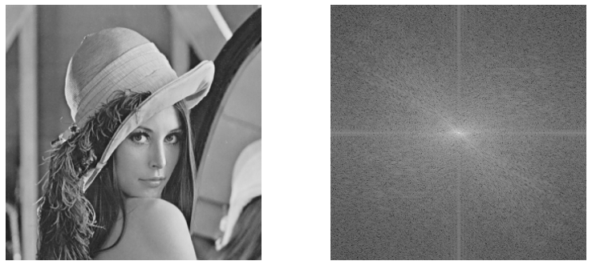

###  5.1: Fundamentals of Fourier Transform


<video src="photo/FourierTransform.mp4" width="800" height="410" controls>
  </video>

---

#### 🔍 Overview
* The Fourier transform converts a signal from the spatial (or time) domain to the frequency domain. It's based on the idea that any signal can be represented as a sum of sines and cosines.

#### 📐 - Fourier Series Equation

The Fourier series is a way to represent a function as a sum of sinusoids. The equation for the Fourier series of a periodic function \( f(t) \) is given by:

\[
f(t) = \sum_{n=-\infty}^{\infty} c_n e^{i n \omega t}
\]

Where:
- \( c_n \) are the Fourier coefficients.
- \( \omega \) is the angular frequency.

## 1-Fourier Transform (Continuous)

The continuous Fourier transform of a function \( f(t) \) is defined as:

\[
F(\omega) = \int_{-\infty}^{\infty} f(t) e^{-i \omega t} \, dt
\]

This transform converts the time-domain signal into its frequency-domain representation, allowing for analysis of frequency components.


#### 📘 Fourier Transform (Continuous)
.
\[
F(u) = \int_{-\infty}^{\infty} f(x) e^{-j2\pi ux} dx
\]


#### 🐍 Python

```python

import numpy as np  # Import NumPy for numerical operations
import matplotlib.pyplot as plt  # Import Matplotlib for plotting

# Define parameters for the continuous Fourier Transform
t = np.arange(-1, 1, 0.01)  # Time vector
f = 5 * np.sin(2 * np.pi * 5 * t)  # Example signal: a 5 Hz sine wave

# Compute the Fourier Transform
F = np.fft.fft(f)  # Compute the FFT
Fs = np.abs(F)  # Magnitude of the Fourier Transform
fshift = np.fft.fftshift(F)  # Shift zero frequency component to center

# Define frequency vector
n = len(f)
f_vec = np.fft.fftfreq(n, d=(t[1] - t[0]))  # Frequency vector

# Plot the results
plt.figure(figsize=(10, 8))
plt.subplot(2, 1, 1)
plt.plot(t, f)
plt.title('Original Signal')
plt.xlabel('Time (s)')
plt.ylabel('Amplitude')

plt.subplot(2, 1, 2)
plt.plot(np.fft.fftshift(f_vec), np.abs(fshift))
plt.title('Magnitude of Fourier Transform')
plt.xlabel('Frequency (Hz)')
plt.ylabel('Magnitude')

plt.tight_layout()
plt.show()
```
---
- Continuous Fourier Transform
  
#### 🧠 MATLAB

```MATLAB

% Define parameters for the continuous Fourier Transform
t = -1:0.01:1;  % Time vector
f = 5 * sin(2 * pi * 5 * t);  % Example signal: a 5 Hz sine wave

% Compute the Fourier Transform
F = fft(f);  % Compute the FFT
Fs = abs(F);  % Magnitude of the Fourier Transform
fshift = fftshift(F);  % Shift zero frequency component to center

% Define frequency vector
n = length(f);
f_vec = (-n/2:n/2-1) * (1/(t(2) - t(1))) / n;  % Frequency vector

% Plot the results
figure;
subplot(2, 1, 1);
plot(t, f);
title('Original Signal');
xlabel('Time (s)');
ylabel('Amplitude');

subplot(2, 1, 2);
plot(f_vec, abs(fshift));
title('Magnitude of Fourier Transform');
xlabel('Frequency (Hz)');
ylabel('Magnitude');

```

----
#### 📘 2-Inverse Fourier Transform

\[
f(x) = \int_{-\infty}^{\infty} F(u) e^{j2\pi ux} du
\]

#### 📌 Notes
- \( F(u) \) is complex: it has a **magnitude** and **phase**.
- Power Spectrum: \( |F(u)|^2 \)

---

#### 🐍 Python

```python

Python Code for Inverse Fourier Transform
Here’s the equivalent implementation in Python using NumPy and OpenCV:

import cv2  # Import OpenCV for image processing
import numpy as np  # Import NumPy for numerical operations
import matplotlib.pyplot as plt  # Import Matplotlib for plotting

# Read the input image
img = cv2.imread('image.jpg', cv2.IMREAD_GRAYSCALE)  # Load the image as grayscale

# Perform Fourier Transform
f = np.fft.fft2(img)  # Compute the FFT
fshift = np.fft.fftshift(f)  # Shift zero frequency component to center

# Create a Gaussian Lowpass Filter (for demonstration)
rows, cols = img.shape
crow, ccol = rows // 2, cols // 2  # Center of the image
cutoff_frequency = 30  # Cutoff frequency
x, y = np.meshgrid(np.arange(cols), np.arange(rows))
D = np.sqrt((x - ccol)**2 + (y - crow)**2)  # Distance from the center
H = np.exp(-(D**2) / (2 * (cutoff_frequency**2)))  # Gaussian filter

# Apply the filter
filtered_fshift = fshift * H

# Inverse Fourier Transform to reconstruct the image
f_ishift = np.fft.ifftshift(filtered_fshift)  # Shift back to original position
img_back = np.fft.ifft2(f_ishift)  # Inverse FFT
img_back = np.abs(img_back)  # Get the magnitude

# Display the results
plt.figure(figsize=(12, 6))
plt.subplot(1, 2, 1)
plt.imshow(img, cmap='gray')
plt.title('Original Image')
plt.axis('off')

plt.subplot(1, 2, 2)
plt.imshow(img_back, cmap='gray')
plt.title('Reconstructed Image after Inverse Fourier Transform')
plt.axis('off')

plt.show()
```
---

#### 🧠 MATLAB

```MATLAB

% Read the input image
img = imread('image.jpg');
gray = rgb2gray(img);  % Convert to grayscale if it's a color image

% Perform Fourier Transform
F = fft2(double(gray));  % Compute the FFT
Fshift = fftshift(F);  % Shift zero frequency component to center

% Create a Gaussian Lowpass Filter (for demonstration)
[rows, cols] = size(gray);
crow = rows / 2;
ccol = cols / 2;  % Center of the image
cutoff_frequency = 30;  % Cutoff frequency
[x, y] = meshgrid(1:cols, 1:rows);
D = sqrt((x - ccol).^2 + (y - crow).^2);  % Distance from the center
H = exp(-(D.^2) / (2 * (cutoff_frequency^2)));  % Gaussian filter

% Apply the filter
filtered_Fshift = Fshift .* H;

% Inverse Fourier Transform to reconstruct the image
F_ishift = ifftshift(filtered_Fshift);  % Shift back to original position
img_back = ifft2(F_ishift);  % Inverse FFT
img_back = abs(img_back);  % Get the magnitude

% Display the results
figure;
subplot(1, 2, 1);
imshow(gray);
title('Original Image');

subplot(1, 2, 2);
imshow(img_back, []);
title('Reconstructed Image after Inverse Fourier Transform');
```

---

###  3-Discrete Fourier Transform (DFT)

#### 📘 Equations

For \( u = 0, 1, ..., M-1 \):

\[
F(u) = \sum_{x=0}^{M-1} f(x) e^{-j2\pi ux/M}
\]

For \( x = 0, 1, ..., M-1 \):

\[
f(x) = \frac{1}{M} \sum_{u=0}^{M-1} F(u) e^{j2\pi ux/M}
\]

---
#### 🐍 Python

```python

import cv2  # Import OpenCV for image processing
import numpy as np  # Import NumPy for numerical operations
import matplotlib.pyplot as plt  # Import Matplotlib for plotting

# Read the input image
img = cv2.imread('image.jpg', cv2.IMREAD_GRAYSCALE)  # Load the image as grayscale

# Convert the image to float for accurate calculations
img_float = np.float32(img)

# Perform Discrete Fourier Transform
F = np.fft.fft2(img_float)  # Compute the DFT
Fshift = np.fft.fftshift(F)  # Shift zero frequency component to center

# Calculate the magnitude spectrum
magnitude = np.abs(Fshift)  # Magnitude of the DFT
magnitude_log = np.log(1 + magnitude)  # Log scale for better visibility

# Display the results
plt.figure(figsize=(12, 6))
plt.subplot(1, 2, 1)
plt.imshow(img, cmap='gray')
plt.title('Original Image')
plt.axis('off')

plt.subplot(1, 2, 2)
plt.imshow(magnitude_log, cmap='gray')
plt.title('Magnitude Spectrum of DFT')
plt.axis('off')

plt.show()
```

---
#### 🧠 MATLAB

```MATLAB

% Read the input image
img = imread('image.jpg');  % Load the image from file
gray = rgb2gray(img);  % Convert to grayscale if it's a color image

% Convert the image to double for accurate calculations
gray = double(gray);

% Perform Discrete Fourier Transform
F = fft2(gray);  % Compute the DFT
Fshift = fftshift(F);  % Shift zero frequency component to center

% Calculate the magnitude spectrum
magnitude = abs(Fshift);  % Magnitude of the DFT
magnitude_log = log(1 + magnitude);  % Log scale for better visibility

% Display the results
figure;
subplot(1, 2, 1);
imshow(gray, []);
title('Original Image');

subplot(1, 2, 2);
imshow(magnitude_log, []);
title('Magnitude Spectrum of DFT');

```
.jpg)
---