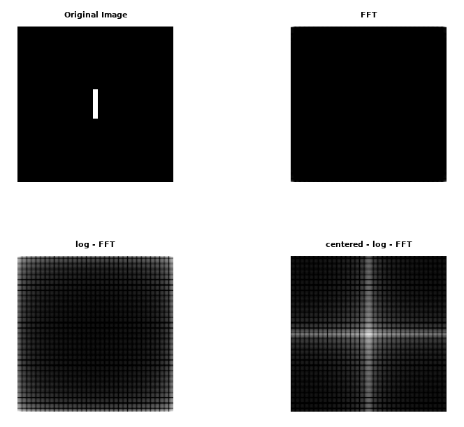
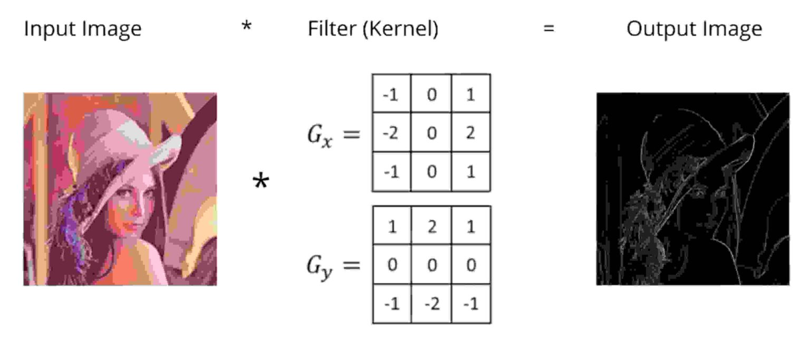

###  5.2: 2D Fourier Transform for Images


<video src="photo/2DFFTworks.mp4" width="800" height="410" controls>
  </video>

---

#### 📘 4_ 2D DFT
\[
F(u,v) = \sum_{x=0}^{M-1} \sum_{y=0}^{N-1} f(x,y) e^{-j2\pi(ux/M + vy/N)}
\]

#### 📘5_ Inverse 2D DFT

\[
f(x,y) = \frac{1}{MN} \sum_{u=0}^{M-1} \sum_{v=0}^{N-1} F(u,v) e^{j2\pi\left(\frac{ux}{M} + \frac{vy}{N}\right)}
\]

#### 📌 Notes
- \( |F(u,v)| \) is the **Fourier spectrum**
- \( \angle F(u,v) \) is the **phase**
  
---
##### 🐍 Python

```python

import cv2  # Import OpenCV for image processing
import numpy as np  # Import NumPy for numerical operations
import matplotlib.pyplot as plt  # Import Matplotlib for plotting

# Read the input image
img = cv2.imread('image.jpg', cv2.IMREAD_GRAYSCALE)  # Load the image as grayscale

# Perform 2D Discrete Fourier Transform
F = np.fft.fft2(img)  # Compute the 2D DFT
Fshift = np.fft.fftshift(F)  # Shift zero frequency component to center

# Calculate the magnitude spectrum
magnitude = np.abs(Fshift)  # Magnitude of the DFT
magnitude_log = np.log(1 + magnitude)  # Log scale for better visibility

# Inverse 2D Fourier Transform
F_ishift = np.fft.ifftshift(Fshift)  # Shift back to original position
img_back = np.fft.ifft2(F_ishift)  # Inverse FFT
img_back = np.abs(img_back)  # Get the magnitude

# Display the results
plt.figure(figsize=(12, 6))
plt.subplot(1, 3, 1)
plt.imshow(img, cmap='gray')
plt.title('Original Image')
plt.axis('off')

plt.subplot(1, 3, 2)
plt.imshow(magnitude_log, cmap='gray')
plt.title('Magnitude Spectrum of DFT')
plt.axis('off')

plt.subplot(1, 3, 3)
plt.imshow(img_back, cmap='gray')
plt.title('Reconstructed Image after Inverse DFT')
plt.axis('off')

plt.tight_layout()
plt.show()
```
---
##### 🧠 MATLAB

```matlab

% Read the input image
img = imread('image.jpg');  % Load the image from file
gray = rgb2gray(img);  % Convert to grayscale if it's a color image

% Perform 2D Discrete Fourier Transform
F = fft2(double(gray));  % Compute the 2D DFT
Fshift = fftshift(F);  % Shift zero frequency component to center

% Calculate the magnitude spectrum
magnitude = abs(Fshift);  % Magnitude of the DFT
magnitude_log = log(1 + magnitude);  % Log scale for better visibility

% Inverse 2D Fourier Transform
F_ishift = ifftshift(Fshift);  % Shift back to original position
img_back = ifft2(F_ishift);  % Inverse FFT
img_back = abs(img_back);  % Get the magnitude

% Display the results
figure;
subplot(1, 3, 1);
imshow(gray, []);
title('Original Image');

subplot(1, 3, 2);
imshow(magnitude_log, []);
title('Magnitude Spectrum of DFT');

subplot(1, 3, 3);
imshow(img_back, []);
title('Reconstructed Image after Inverse DFT');
```

---
###   Frequency Domain Filtering Steps

#### 🧭 Steps:
1. Apply Fourier Transform
2. Multiply by filter (in frequency domain)
3. Apply inverse Fourier Transform

#### 🧠 Important Concepts
- Low frequencies: represent smooth regions
- High frequencies: represent edges, noise

---

### 6.Convolution Theorem

#### 📘 Theorem
\[
f(x, y) * h(x, y) \leftrightarrow F(u, v) \cdot H(u, v)
\]

Convolution in spatial domain = multiplication in frequency domain

---

##### 🐍 Python

```python

import cv2  # Import OpenCV for image processing
import numpy as np  # Import NumPy for numerical operations
import matplotlib.pyplot as plt  # Import Matplotlib for plotting

# Read the input image
img = cv2.imread('image.jpg', cv2.IMREAD_GRAYSCALE)  # Load the image as grayscale

# Create a simple filter (e.g., a box filter for blurring)
h = np.ones((5, 5), np.float32) / 25  # 5x5 average filter

# Convolution in the spatial domain
convolved_img = cv2.filter2D(img, -1, h)  # Apply the filter

# Fourier Transform of the original image and filter
F_img = np.fft.fft2(img)  # Fourier Transform of the image
F_h = np.fft.fft2(h, s=img.shape)  # Fourier Transform of the filter

# Multiplication in the frequency domain
F_convolved = F_img * F_h

# Inverse Fourier Transform to reconstruct the image
img_back = np.fft.ifft2(F_convolved)
img_back = np.abs(img_back)  # Get the magnitude

# Display the results
plt.figure(figsize=(12, 6))
plt.subplot(1, 3, 1)
plt.imshow(img, cmap='gray')
plt.title('Original Image')
plt.axis('off')

plt.subplot(1, 3, 2)
plt.imshow(convolved_img, cmap='gray')
plt.title('Convolved Image (Spatial Domain)')
plt.axis('off')

plt.subplot(1, 3, 3)
plt.imshow(img_back, cmap='gray')
plt.title('Reconstructed Image (Frequency Domain)')
plt.axis('off')

plt.tight_layout()
plt.show()
```

---

##### 🧠 MATLAB

```matlab

% Read the input image
img = imread('image.jpg');
gray = rgb2gray(img);  % Convert to grayscale if it's a color image

% Create a simple filter (e.g., a box filter for blurring)
h = fspecial('average', [5 5]);  % 5x5 average filter

% Convolution in the spatial domain
convolved_img = imfilter(gray, h);  % Apply the filter

% Fourier Transform of the original image and filter
F_img = fft2(double(gray));  % Fourier Transform of the image
F_h = fft2(double(h), size(gray, 1), size(gray, 2));  % Fourier Transform of the filter

% Multiplication in the frequency domain
F_convolved = F_img .* F_h;

% Inverse Fourier Transform to reconstruct the image
img_back = ifft2(F_convolved);
img_back = abs(img_back);  % Get the magnitude

% Display the results
figure;
subplot(1, 3, 1);
imshow(gray, []);
title('Original Image');

subplot(1, 3, 2);
imshow(convolved_img, []);
title('Convolved Image (Spatial Domain)');

subplot(1, 3, 3);
imshow(img_back, []);
title('Reconstructed Image (Frequency Domain)');

```

---
