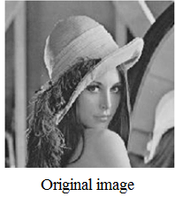
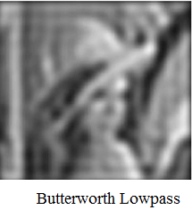
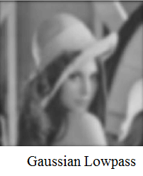

##  5. Frequency Domain Filters


### 📘 1-Ideal Lowpass Filter (ILPF)
\[
H(u,v) = \begin{cases}
1 & \text{if } D(u,v) \le D_0 \\
0 & \text{if } D(u,v) > D_0
\end{cases}
\]

---
#### 🐍 Python
```python
import cv2
import numpy as np
import matplotlib.pyplot as plt

# Read the input image
img = cv2.imread('image.jpg', 0)  # Read as grayscale

# Perform Fourier Transform
f = np.fft.fft2(img)
fshift = np.fft.fftshift(f)  # Shift zero frequency component to center

# Create an Ideal Lowpass Filter
rows, cols = img.shape
crow, ccol = rows // 2, cols // 2  # Center of the image
radius = 30  # Radius of the lowpass filter
mask = np.zeros((rows, cols), np.uint8)
cv2.circle(mask, (ccol, crow), radius, 1, thickness=-1)  # Create a circular mask

# Apply the filter
filtered_fshift = fshift * mask

# Inverse Fourier Transform to get the filtered image
f_ishift = np.fft.ifftshift(filtered_fshift)  # Shift back to original position
img_back = np.fft.ifft2(f_ishift)  # Inverse FFT
img_back = np.abs(img_back)  # Get the magnitude

# Display the results
plt.figure(figsize=(12, 6))
plt.subplot(1, 2, 1)
plt.imshow(img, cmap='gray')
plt.title('Original Image')
plt.axis('off')

plt.subplot(1, 2, 2)
plt.imshow(img_back, cmap='gray')
plt.title('Image after Ideal Lowpass Filter')
plt.axis('off')

plt.show()

```
---
#### 🧠 MATLAB
```matlab
% Read the input image
img = imread('image.jpg');
img = rgb2gray(img);  % Convert to grayscale if it's a color image

% Perform Fourier Transform
F = fft2(double(img));
Fshift = fftshift(F);  % Shift zero frequency component to center

% Create an Ideal Lowpass Filter
[rows, cols] = size(img);
crow = rows / 2;
ccol = cols / 2;  % Center of the image
radius = 30;  % Radius of the lowpass filter
mask = zeros(rows, cols);
[x, y] = meshgrid(1:cols, 1:rows);
mask(sqrt((x - ccol).^2 + (y - crow).^2) < radius) = 1;  % Create a circular mask

% Apply the filter
filtered_Fshift = Fshift .* mask;

% Inverse Fourier Transform to get the filtered image
F_ishift = ifftshift(filtered_Fshift);  % Shift back to original position
img_back = ifft2(F_ishift);  % Inverse FFT
img_back = abs(img_back);  % Get the magnitude

% Display the results
figure;
subplot(1, 2, 1);
imshow(img);
title('Original Image');

subplot(1, 2, 2);
imshow(img_back, []);
title('Image after Ideal Lowpass Filter');
```
.png)

---
### 📘 2-Butterworth Lowpass
\[
H(u,v) = \frac{1}{1 + \left(\frac{D(u,v)}{D_0}\right)^{2n}}
\]

---

#### 🐍 Python
```python
import cv2
import numpy as np
import matplotlib.pyplot as plt

def butterworth_lowpass_filter(shape, cutoff, order):
    rows, cols = shape
    crow, ccol = rows // 2, cols // 2  # Center of the image

    # Create a meshgrid
    x = np.arange(0, rows)
    y = np.arange(0, cols)
    X, Y = np.meshgrid(x, y)

    # Calculate the distance from the center
    D = np.sqrt((X - crow)**2 + (Y - ccol)**2)

    # Create the Butterworth filter
    H = 1 / (1 + (D / cutoff)**(2 * order))
    return H

# Read the input image
img = cv2.imread('image.jpg', 0)  # Read as grayscale

# Perform Fourier Transform
f = np.fft.fft2(img)
fshift = np.fft.fftshift(f)  # Shift zero frequency component to center

# Create a Butterworth Lowpass Filter
cutoff_frequency = 30  # Cutoff frequency
order = 2  # Order of the filter
butter_filter = butterworth_lowpass_filter(img.shape, cutoff_frequency, order)

# Apply the filter
filtered_fshift = fshift * butter_filter

# Inverse Fourier Transform to get the filtered image
f_ishift = np.fft.ifftshift(filtered_fshift)  # Shift back to original position
img_back = np.fft.ifft2(f_ishift)  # Inverse FFT
img_back = np.abs(img_back)  # Get the magnitude

# Display the results
plt.figure(figsize=(12, 6))
plt.subplot(1, 2, 1)
plt.imshow(img, cmap='gray')
plt.title('Original Image')
plt.axis('off')

plt.subplot(1, 2, 2)
plt.imshow(img_back, cmap='gray')
plt.title('Image after Butterworth Lowpass Filter')
plt.axis('off')

plt.show()
```
---
#### 🧠 MATLAB

```matlab
% Read the input image
img = imread('image.jpg');
img = rgb2gray(img);  % Convert to grayscale if it's a color image

% Perform Fourier Transform
F = fft2(double(img));
Fshift = fftshift(F);  % Shift zero frequency component to center

% Create a Butterworth Lowpass Filter
[rows, cols] = size(img);
crow = rows / 2;
ccol = cols / 2;  % Center of the image
cutoff_frequency = 30;  % Cutoff frequency
order = 2;  % Order of the filter
[x, y] = meshgrid(1:cols, 1:rows);
D = sqrt((x - ccol).^2 + (y - crow).^2);  % Distance from the center
H = 1 ./ (1 + (D / cutoff_frequency).^(2 * order));  % Butterworth filter

% Apply the filter
filtered_Fshift = Fshift .* H;

% Inverse Fourier Transform to get the filtered image
F_ishift = ifftshift(filtered_Fshift);  % Shift back to original position
img_back = ifft2(F_ishift);  % Inverse FFT
img_back = abs(img_back);  % Get the magnitude

% Display the results
figure;
subplot(1, 2, 1);
imshow(img);
title('Original Image');

subplot(1, 2, 2);
imshow(img_back, []);
title('Image after Butterworth Lowpass Filter');
Explanation of the Code

```


---

### 📘 3-Gaussian Lowpass
\[
H(u,v) = e^{-D^2(u,v)/2D_0^2}
\]

---
#### 🐍 Python

```python

import cv2
import numpy as np
import matplotlib.pyplot as plt

def gaussian_lowpass_filter(shape, cutoff):
    rows, cols = shape
    crow, ccol = rows // 2, cols // 2  # Center of the image

    # Create a meshgrid
    x = np.arange(0, rows)
    y = np.arange(0, cols)
    X, Y = np.meshgrid(x, y)

    # Calculate the distance from the center
    D = np.sqrt((X - crow)**2 + (Y - ccol)**2)

    # Create the Gaussian filter
    H = np.exp(-(D**2) / (2 * (cutoff**2)))
    return H

# Read the input image
img = cv2.imread('image.jpg', 0)  # Read as grayscale

# Perform Fourier Transform
f = np.fft.fft2(img)
fshift = np.fft.fftshift(f)  # Shift zero frequency component to center

# Create a Gaussian Lowpass Filter
cutoff_frequency = 30  # Cutoff frequency
gaussian_filter = gaussian_lowpass_filter(img.shape, cutoff_frequency)

# Apply the filter
filtered_fshift = fshift * gaussian_filter

# Inverse Fourier Transform to get the filtered image
f_ishift = np.fft.ifftshift(filtered_fshift)  # Shift back to original position
img_back = np.fft.ifft2(f_ishift)  # Inverse FFT
img_back = np.abs(img_back)  # Get the magnitude

# Display the results
plt.figure(figsize=(12, 6))
plt.subplot(1, 2, 1)
plt.imshow(img, cmap='gray')
plt.title('Original Image')
plt.axis('off')

plt.subplot(1, 2, 2)
plt.imshow(img_back, cmap='gray')
plt.title('Image after Gaussian Lowpass Filter')
plt.axis('off')

plt.show()
```
---
#### 🧠 MATLAB
```matlab
% Read the input image
img = imread('image.jpg');
img = rgb2gray(img);  % Convert to grayscale if it's a color image

% Perform Fourier Transform
F = fft2(double(img));
Fshift = fftshift(F);  % Shift zero frequency component to center

% Create a Gaussian Lowpass Filter
[rows, cols] = size(img);
crow = rows / 2;
ccol = cols / 2;  % Center of the image
cutoff_frequency = 30;  % Cutoff frequency
[x, y] = meshgrid(1:cols, 1:rows);
D = sqrt((x - ccol).^2 + (y - crow).^2);  % Distance from the center
H = exp(-(D.^2) / (2 * (cutoff_frequency^2)));  % Gaussian filter

% Apply the filter
filtered_Fshift = Fshift .* H;

% Inverse Fourier Transform to get the filtered image
F_ishift = ifftshift(filtered_Fshift);  % Shift back to original position
img_back = ifft2(F_ishift);  % Inverse FFT
img_back = abs(img_back);  % Get the magnitude

% Display the results
figure;
subplot(1, 2, 1);
imshow(img);
title('Original Image');

subplot(1, 2, 2);
imshow(img_back, []);
title('Image after Gaussian Lowpass Filter');

```


---

## ✅ Conclusion

Image enhancement is key for preprocessing in image analysis. Mastering both spatial and frequency domain methods gives flexibility in visual improvements.
