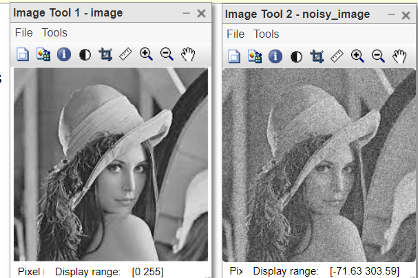
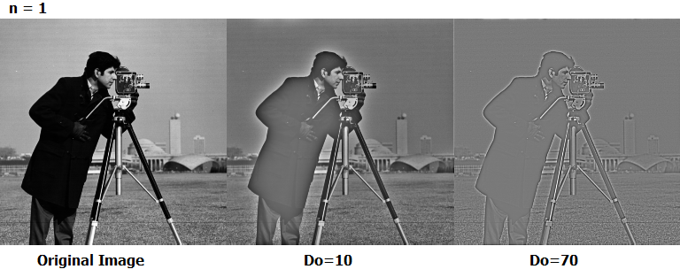

##  5. Frequency Domain Filters


### 🧨 Highpass Filters ( BHPF, GHPF)
Image sharpening is achieved by attenuating low frequencies.

---

### 📘Gaussian Highpass Filter (GHPF)
The Gaussian Highpass Filter is similar to the Butterworth filter but uses a Gaussian function for a smoother transition.


#### 🐍 Python

```python

def gaussian_highpass_filter(shape, cutoff):
    rows, cols = shape
    crow, ccol = rows // 2, cols // 2  # Center of the image

    # Create a meshgrid
    x = np.arange(0, rows)
    y = np.arange(0, cols)
    X, Y = np.meshgrid(x, y)

    # Calculate the distance from the center
    D = np.sqrt((X - crow)**2 + (Y - ccol)**2)

    # Create the Gaussian Highpass Filter
    H = 1 - np.exp(-(D**2) / (2 * (cutoff**2)))
    return H

# Read the input image
img = cv2.imread('image.jpg', 0)  # Read as grayscale

# Perform Fourier Transform
f = np.fft.fft2(img)
fshift = np.fft.fftshift(f)  # Shift zero frequency component to center

# Create a Gaussian Highpass Filter
cutoff_frequency = 30  # Cutoff frequency
ghpf = gaussian_highpass_filter(img.shape, cutoff_frequency)

# Apply the filter
filtered_fshift = fshift * ghpf

# Inverse Fourier Transform to get the filtered image
f_ishift = np.fft.ifftshift(filtered_fshift)  # Shift back to original position
img_back = np.fft.ifft2(f_ishift)  # Inverse FFT
img_back = np.abs(img_back)  # Get the magnitude

# Display the results
plt.figure(figsize=(12, 6))
plt.subplot(1, 2, 1)
plt.imshow(img, cmap='gray')
plt.title('Original Image')
plt.axis('off')

plt.subplot(1, 2, 2)
plt.imshow(img_back, cmap='gray')
plt.title('Image after Gaussian Highpass Filter')
plt.axis('off')

plt.show()

```
---
#### 🧠 MATLAB

```matlab
% Read the input image
img = imread('image.jpg');
img = rgb2gray(img);  % Convert to grayscale if it's a color image

% Perform Fourier Transform
F = fft2(double(img));
Fshift = fftshift(F);  % Shift zero frequency component to center

% Create a Gaussian Highpass Filter
[rows, cols] = size(img);
crow = rows / 2;
ccol = cols / 2;  % Center of the image
cutoff_frequency = 30;  % Cutoff frequency
[x, y] = meshgrid(1:cols, 1:rows);
D = sqrt((x - ccol).^2 + (y - crow).^2);  % Distance from the center

% Create the Gaussian Highpass Filter
H = 1 - exp(-(D.^2) / (2 * (cutoff_frequency^2)));  % GHPF formula

% Apply the filter
filtered_Fshift = Fshift .* H;

% Inverse Fourier Transform to get the filtered image
F_ishift = ifftshift(filtered_Fshift);  % Shift back to original position
img_back = ifft2(F_ishift);  % Inverse FFT
img_back = abs(img_back);  % Get the magnitude

% Display the results
figure;
subplot(1, 2, 1);
imshow(img);
title('Original Image');

subplot(1, 2, 2);
imshow(img_back, []);
title('Image after Gaussian Highpass Filter');

```


---
#### 🧨Butterworth Highpass Filter (BHPF)

##### 🐍 Python

```python

import cv2  # Import the OpenCV library for image processing
import numpy as np  # Import NumPy for numerical operations
import matplotlib.pyplot as plt  # Import Matplotlib for plotting

def butterworth_highpass_filter(shape, cutoff, order):
    rows, cols = shape
    crow, ccol = rows // 2, cols // 2  # Center of the image

    # Create a meshgrid
    x = np.arange(0, rows)
    y = np.arange(0, cols)
    X, Y = np.meshgrid(x, y)

    # Calculate the distance from the center
    D = np.sqrt((X - crow)**2 + (Y - ccol)**2)

    # Create the Butterworth Highpass Filter
    H = 1 / (1 + (cutoff / D)**(2 * order))
    H[D == 0] = 0  # Set the center value to 0
    return H

# Read the input image
img = cv2.imread('image.jpg', cv2.IMREAD_GRAYSCALE)  # Load the image as grayscale

# Perform Fourier Transform
f = np.fft.fft2(img)
fshift = np.fft.fftshift(f)  # Shift zero frequency component to center

# Create a Butterworth Highpass Filter
cutoff_frequency = 30  # Cutoff frequency
order = 2  # Order of the filter
bhpf = butterworth_highpass_filter(img.shape, cutoff_frequency, order)

# Apply the filter
filtered_fshift = fshift * bhpf

# Inverse Fourier Transform to get the filtered image
f_ishift = np.fft.ifftshift(filtered_fshift)  # Shift back to original position
img_back = np.fft.ifft2(f_ishift)  # Inverse FFT
img_back = np.abs(img_back)  # Get the magnitude

# Display the results
plt.figure(figsize=(12, 6))
plt.subplot(1, 2, 1)
plt.imshow(img, cmap='gray')
plt.title('Original Image')
plt.axis('off')

plt.subplot(1, 2, 2)
plt.imshow(img_back, cmap='gray')
plt.title('Image after Butterworth Highpass Filter')
plt.axis('off')

plt.show()
```

---

##### 🧠 MATLAB

```matlab

% Read the input image
img = imread('image.jpg'); % Load the image from file
gray = rgb2gray(img);  % Convert to grayscale if it's a color image

% Perform Fourier Transform
F = fft2(double(gray));
Fshift = fftshift(F);  % Shift zero frequency component to center

% Create a Butterworth Highpass Filter
[rows, cols] = size(gray);
crow = rows / 2;
ccol = cols / 2;  % Center of the image
cutoff_frequency = 30;  % Cutoff frequency
order = 2;  % Order of the filter
[x, y] = meshgrid(1:cols, 1:rows);
D = sqrt((x - ccol).^2 + (y - crow).^2);  % Distance from the center

% Create the Butterworth Highpass Filter
H = 1 ./ (1 + (cutoff_frequency ./ D).^(2 * order));
H(D == 0) = 0;  % Set the value at the center to 0

% Apply the filter
filtered_Fshift = Fshift .* H;

% Inverse Fourier Transform to get the filtered image
F_ishift = ifftshift(filtered_Fshift);  % Shift back to original position
img_back = ifft2(F_ishift);  % Inverse FFT
img_back = abs(img_back);  % Get the magnitude

% Display the results
figure;
subplot(1, 2, 1);
imshow(gray);
title('Original Image');

subplot(1, 2, 2);
imshow(img_back, []);
title('Image after Butterworth Highpass Filter');

```



---
## ✅ Conclusion

Image enhancement is key for preprocessing in image analysis. Mastering both spatial and frequency domain methods gives flexibility in visual improvements.
