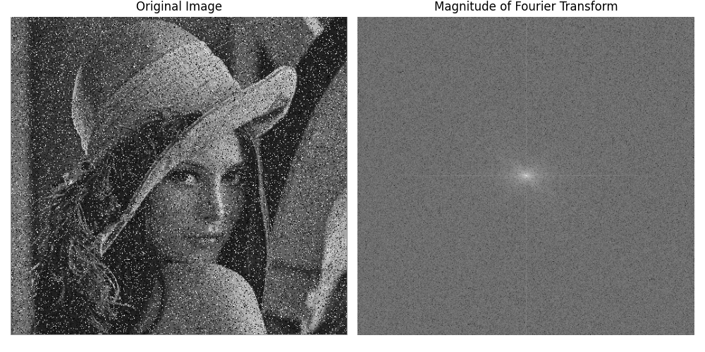
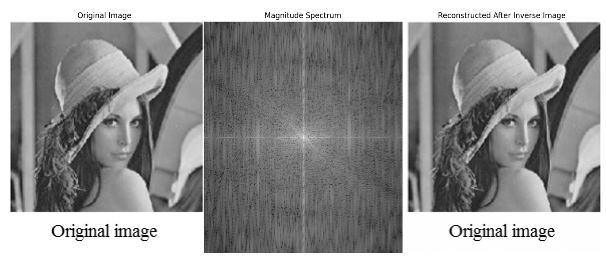

# 5.1:Fundamentals of Fourier Transform


<video width="800" height="410" controls>
    <source src="photows/FourierTransform.mp4" type="video/mp4">
    Your browser does not support the video tag.
  </video>

---

## Overview

- The Fourier transform converts a signal from the spatial (or time) domain to the frequency domain. It's based on the idea that any signal can be represented as a sum of sines and cosines.

## Frequency Domain Filtering Steps

### Steps:

1. Apply Fourier Transform
2. Multiply by filter (in frequency domain)
3. Apply inverse Fourier Transform

### Important Concepts
- Low frequencies: represent smooth regions
- High frequencies: represent edges, noise

## Fourier Series Equation

- The Fourier series is a way to represent a function as a sum of sinusoids. The equation for the Fourier series of a periodic function \( f(t) \) is given by:

\[
f(t) = \sum_{n=-\infty}^{\infty} c_n e^{i n \omega t}
\]

Where:
- \( c_n \) are the Fourier coefficients.
- \( \omega \) is the angular frequency.

# 1.Fourier Transform (Continuous)

- The continuous Fourier transform of a function \( f(t) \) is defined as:

\[
F(\omega) = \int_{-\infty}^{\infty} f(t) e^{-i \omega t} \, dt
\]

- This transform converts the time-domain signal into its frequency-domain representation, allowing for analysis of frequency components.


## Python Code Fourier Transform

```python

# Import the OpenCV library for image processing
import cv2  
# Import NumPy for numerical operations
import numpy as np  
# Import Matplotlib for plotting
import matplotlib.pyplot as plt  

# Read the image as grayscale using the unified image name
img = cv2.imread('sample.jpg', cv2.IMREAD_GRAYSCALE)  # Read the image in grayscale

# Perform the 2D Fourier Transform
f_transform = np.fft.fft2(img)  # Compute the 2D Fourier Transform
# Shift the zero frequency component to the center
f_transform_shifted = np.fft.fftshift(f_transform)  

# Compute the magnitude spectrum (log scale for visibility)
magnitude_spectrum = np.log(np.abs(f_transform_shifted) + 1)  

# Create a figure to display the original image and its Fourier Transform
plt.figure(figsize=(10, 5))  # Set the figure size

# Display the original image
plt.subplot(1, 2, 1)  # 1 row, 2 columns, 1st subplot
plt.imshow(img, cmap='gray')  # Show the original image
plt.title('Original Image')  # Title for the original image
plt.axis('off')  # Hide axes

# Display the magnitude spectrum
plt.subplot(1, 2, 2)  # 1 row, 2 columns, 2nd subplot
plt.imshow(magnitude_spectrum, cmap='gray')  # Show the magnitude spectrum
plt.title('Magnitude of Fourier Transform')  # Title for the magnitude spectrum
plt.axis('off')  # Hide axes

# Show the combined figure
plt.tight_layout()  # Adjust layout for better spacing
plt.show()  # Display the images

```

## MATLAB Code Fourier Transform

```MATLAB

% Read the image in grayscale
img = imread('sample.jpg');
img = rgb2gray(img);  % Convert to grayscale if it's RGB

% Perform 2D Fourier Transform
F = fft2(double(img));  % Compute FFT
F_shifted = fftshift(F);  % Shift zero frequency to center

% Compute the magnitude spectrum
magnitude_spectrum = log(abs(F_shifted) + 1);  % Log scale

% Display the original and its Fourier magnitude
figure;

% Show original image
subplot(1, 2, 1);
imshow(img, []);
title('Original Image');

% Show magnitude spectrum
subplot(1, 2, 2);
imshow(magnitude_spectrum, []);
title('Magnitude of Fourier Transform');

```



---

# 2.Inverse Fourier Transform

## Formula:
\[
f(x) = \int_{-\infty}^{\infty} F(u) e^{j2\pi ux} du
\]

## Notes
- \( F(u) \) is complex: it has a magnitude and phase.
- Power Spectrum: \( |F(u)|^2 \)


## Python Code Inverse Transform

  
```python

# Import the OpenCV library for image processing
import cv2  
# Import NumPy for numerical operations
import numpy as np  
# Import Matplotlib for plotting
import matplotlib.pyplot as plt  

# Read the input image in grayscale mode using the unified image name
img = cv2.imread('sample.jpg', cv2.IMREAD_GRAYSCALE) 

# Perform the 2D Fourier Transform
f_transform = np.fft.fft2(img)  # Compute the 2D Fourier Transform
# Shift the zero frequency component to the center
f_transform_shifted = np.fft.fftshift(f_transform) 

# Compute the magnitude spectrum
# Log scale for visibility
magnitude_spectrum = np.log(np.abs(f_transform_shifted) + 1) 

# Perform the inverse Fourier Transform
# Inverse transform
reconstructed_image = np.fft.ifft2(np.fft.ifftshift(f_transform_shifted)).real 

# Normalize the reconstructed image to the range [0, 255]
reconstructed_image = cv2.normalize(reconstructed_image, None, 0, 255, cv2.NORM_MINMAX).astype(np.uint8)

# Create a figure to display the original, frequency domain, and reconstructed images
plt.figure(figsize=(18, 6))  # Set the figure size

# Display the original image
plt.subplot(1, 3, 1)  # 1 row, 3 columns, 1st subplot
plt.imshow(img, cmap='gray')  # Show the original image
plt.title('Original Image')  # Title for the original image
plt.axis('off')  # Hide axes

# Display the magnitude spectrum
plt.subplot(1, 3, 2)  # 1 row, 3 columns, 2nd subplot
plt.imshow(magnitude_spectrum, cmap='gray')  # Show the magnitude spectrum
plt.title('Magnitude Spectrum')  # Title for the magnitude spectrum
plt.axis('off')  # Hide axes

# Display the reconstructed image
plt.subplot(1, 3, 3)  # 1 row, 3 columns, 3rd subplot
plt.imshow(reconstructed_image, cmap='gray')  # Show the reconstructed image
plt.title('Reconstructed After Inverse Image')  # Title for the reconstructed image
plt.axis('off')  # Hide axes

# Show the combined figure
plt.tight_layout()  # Adjust layout for better spacing
plt.show()  # Display the images

```


## MATLAB Code Inverse Transform

```MATLAB

% Import and convert image to grayscale
img = imread('sample.jpg');           % Read the input image
gray_img = rgb2gray(img);            % Convert to grayscale if needed

% Perform 2D Fourier Transform
F = fft2(double(gray_img));          % Compute the 2D FFT
F_shifted = fftshift(F);             % Shift zero-frequency to the center

% Compute the magnitude spectrum
magnitude_spectrum = log(abs(F_shifted) + 1);  % Log scale for better visualization

% Perform Inverse Fourier Transform
F_ishifted = ifftshift(F_shifted);   % Inverse shift
reconstructed_img = ifft2(F_ishifted);         % Inverse FFT
reconstructed_img = real(reconstructed_img);   % Take the real part

% Normalize the reconstructed image to range [0, 255]
reconstructed_img = uint8(255 * mat2gray(reconstructed_img));  

% Display original image, magnitude spectrum, and reconstructed image
figure;
subplot(1,3,1);
imshow(gray_img);
title('Original Image');

subplot(1,3,2);
imshow(magnitude_spectrum, []);
title('Magnitude Spectrum');

subplot(1,3,3);
imshow(reconstructed_img);
title('Reconstructed Image After Inverse FFT');

```


---

# 3.Discrete Fourier Transform (DFT)

## Formula:

For \( u = 0, 1, ..., M-1 \):

\[
F(u) = \sum_{x=0}^{M-1} f(x) e^{-j2\pi ux/M}
\]

For \( x = 0, 1, ..., M-1 \):

\[
f(x) = \frac{1}{M} \sum_{u=0}^{M-1} F(u) e^{j2\pi ux/M}
\]

---
## Python Code (DFT)

```python

# Import the OpenCV library for image processing
import cv2  
# Import NumPy for numerical operations
import numpy as np  
# Import Matplotlib for plotting
import matplotlib.pyplot as plt  

# Read the input image in grayscale mode using the unified image name
img = cv2.imread('sample.jpg', cv2.IMREAD_GRAYSCALE) 

# Perform the 2D Discrete Fourier Transform
dft = np.fft.fft2(img)  # Compute the 2D DFT
# Shift the zero frequency component to the center
dft_shifted = np.fft.fftshift(dft)  

# Compute the magnitude spectrum
# Log scale for visibility
magnitude_spectrum = np.log(np.abs(dft_shifted) + 1) 

# Create a figure to display the original and DFT images
plt.figure(figsize=(12, 6))  # Set the figure size

# Display the original image
plt.subplot(1, 2, 1)  # 1 row, 2 columns, 1st subplot
plt.imshow(img, cmap='gray')  # Show the original image
plt.title('Original Image')  # Title for the original image
plt.axis('off')  # Hide axes

# Display the magnitude spectrum
plt.subplot(1, 2, 2)  # 1 row, 2 columns, 2nd subplot
plt.imshow(magnitude_spectrum, cmap='gray')  # Show the magnitude spectrum
plt.title('Magnitude Spectrum of DFT')  # Title for the DFT magnitude spectrum
plt.axis('off')  # Hide axes

# Show the combined figure
plt.tight_layout()  # Adjust layout for better spacing
plt.show()  # Display the images

```


## MATLAB Code (DFT)

```MATLAB

% Read the input image in grayscale mode
img = imread('sample.jpg');          % Read the image from file
if size(img,3) == 3
    img = rgb2gray(img);             % Convert to grayscale if the image is RGB (3 channels)
end

% Perform the 2D Discrete Fourier Transform
dft = fft2(double(img));             % Compute the 2D Discrete Fourier Transform (DFT) of the image
dft_shifted = fftshift(dft);         % Shift the zero-frequency component to the center of the spectrum

% Compute the magnitude spectrum with log scale for visibility
magnitude_spectrum = log(abs(dft_shifted) + 1);  % Calculate the log magnitude of the shifted DFT for better visualization

% Create figure to display images
figure;                             % Create a new figure window

% Display original image
subplot(1, 2, 1);                   % Create subplot 1 in a 1x2 grid for the original image
imshow(img);                       % Display the grayscale original image
title('Original Image');           % Set title for the original image plot
axis off;                         % Hide axis ticks and labels

% Display magnitude spectrum of the DFT
subplot(1, 2, 2);                   % Create subplot 2 in a 1x2 grid for the magnitude spectrum
imshow(magnitude_spectrum, []);     % Display the magnitude spectrum, scaling pixel values automatically
title('Magnitude Spectrum of DFT');% Set title for the magnitude spectrum plot
axis off;                         % Hide axis ticks and labels

```

.png)

