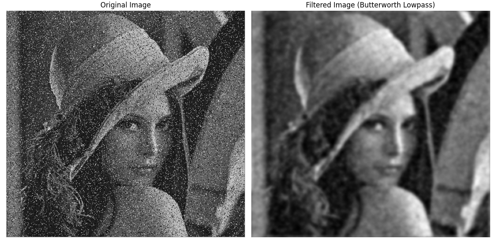

# 5.Frequency Domain Filters


## 1-Ideal Lowpass Filter (ILPF)
$$
H(u,v) = \begin{cases}
1 & \text{if } D(u,v) \le D_0 \\
0 & \text{if } D(u,v) > D_0
\end{cases}
$$

---

### Python Code Ideal Lowpass Filter

```python

# Import the OpenCV library for image processing
import cv2  
# Import NumPy for numerical operations
import numpy as np  
# Import Matplotlib for plotting images
import matplotlib.pyplot as plt  

# Read the input image in grayscale mode
img = cv2.imread('sample.jpg', cv2.IMREAD_GRAYSCALE)  # Load image as grayscale

# Compute the 2D Fast Fourier Transform (FFT) of the image
f = np.fft.fft2(img)  

# Shift the zero frequency component to the center of the spectrum
fshift = np.fft.fftshift(f)  

# Get image dimensions
rows, cols = img.shape  
crow, ccol = rows // 2, cols // 2  # Calculate center coordinates

# Create an Ideal Lowpass Filter mask with a circular pass region
radius = 30  # Radius of the lowpass filter circle
mask = np.zeros((rows, cols), np.uint8)  # Initialize mask with zeros (block all frequencies)

# Draw a filled circle in the mask center to pass low frequencies
cv2.circle(mask, (ccol, crow), radius, 1, thickness=-1)  

# Apply the Ideal Lowpass Filter mask on the shifted FFT of the image
filtered_fshift = fshift * mask  

# Shift the zero frequency component back to the original position
f_ishift = np.fft.ifftshift(filtered_fshift)  

# Compute the inverse FFT to reconstruct the filtered image in spatial domain
img_back = np.fft.ifft2(f_ishift)  
img_back = np.abs(img_back)  # Take magnitude to get the real part (discard imaginary residuals)

# Plot the original and filtered images side by side
plt.subplot(1, 2, 1)
plt.imshow(img, cmap='gray')
plt.title('Original Image')
plt.axis('off')

plt.subplot(1, 2, 2)
plt.imshow(img_back, cmap='gray')
plt.title('Image after Ideal Lowpass Filter')
plt.axis('off')

plt.tight_layout()
plt.show()

```

### MATLAB Code Ideal Lowpass Filter

```matlab
% Read the input image in grayscale
img = imread('sample.jpg');
if size(img,3) == 3
    img = rgb2gray(img);           % Convert RGB to grayscale if needed
end
img = double(img);                 % Convert to double for FFT

% Compute the 2D FFT of the image
F = fft2(img);

% Shift zero frequency component to center
Fshift = fftshift(F);

% Get image size and center coordinates
[rows, cols] = size(img);
crow = floor(rows/2);
ccol = floor(cols/2);

% Create Ideal Lowpass Filter mask with zeros everywhere
mask = zeros(rows, cols);

% Create a circular mask with radius 30 around the center (pass low frequencies)
radius = 30;
[x, y] = meshgrid(1:cols, 1:rows);
mask(((x - ccol).^2 + (y - crow).^2) <= radius^2) = 1;

% Apply the mask on the shifted FFT
filtered_Fshift = Fshift .* mask;

% Shift zero frequency component back
F_ishift = ifftshift(filtered_Fshift);

% Compute inverse FFT to get the filtered image
img_back = ifft2(F_ishift);

% Take magnitude (real part) to reconstruct image
img_back = abs(img_back);

% Display original and filtered images
figure;

subplot(1,2,1);
imshow(uint8(img));
title('Original Image');
axis off;

subplot(1,2,2);
imshow(uint8(img_back));
title('Image after Ideal Lowpass Filter');
axis off;

```


---

## 2-Butterworth Lowpass
$$
H(u,v) = \frac{1}{1 + \left(\frac{D(u,v)}{D_0}\right)^{2n}}
$$


### Python Code Butterworth Lowpass

```python

# Import the OpenCV library for image processing
import cv2  
# Import NumPy for numerical operations
import numpy as np  
# Import Matplotlib for plotting
import matplotlib.pyplot as plt  

# Read the input image in grayscale mode using the unified image name
img = cv2.imread('sample.jpg', cv2.IMREAD_GRAYSCALE)  # Load the image as grayscale
# MATLAB equivalent:
# img = imread('sample.jpg');
# img = rgb2gray(img); % convert to grayscale if needed

# Perform the 2D Fourier Transform
dft = np.fft.fft2(img)  # Compute the 2D Discrete Fourier Transform (DFT)
# MATLAB equivalent:
# dft = fft2(double(img));

# Shift the zero frequency component to the center
dft_shifted = np.fft.fftshift(dft)  
# MATLAB equivalent:
# dft_shifted = fftshift(dft);

# Define the Butterworth Lowpass Filter parameters
D0 = 30  # Cutoff frequency for lowpass filter
n = 2    # Order of the Butterworth filter

# Create the Butterworth filter mask
rows, cols = img.shape
crow, ccol = rows // 2, cols // 2  # Find the center point of the frequency domain
x, y = np.ogrid[:rows, :cols]  # Create coordinate grids
distance = np.sqrt((x - crow)**2 + (y - ccol)**2)  # Distance from center frequency
butterworth_filter = 1 / (1 + (distance / D0)**(2 * n))  # Butterworth lowpass formula
# MATLAB equivalent:
# [rows, cols] = size(img);
# crow = floor(rows/2);
# ccol = floor(cols/2);
# [X, Y] = meshgrid(1:cols, 1:rows);
# distance = sqrt((X - ccol).^2 + (Y - crow).^2);
# butterworth_filter = 1 ./ (1 + (distance / D0).^(2 * n));

# Apply the Butterworth filter in frequency domain
filtered_dft = dft_shifted * butterworth_filter
# MATLAB equivalent:
# filtered_dft = dft_shifted .* butterworth_filter;

# Perform the inverse Fourier Transform to get the filtered image back to spatial domain
filtered_image = np.fft.ifft2(np.fft.ifftshift(filtered_dft)).real  # Compute inverse FFT and take real part
# MATLAB equivalent:
# filtered_image = real(ifft2(ifftshift(filtered_dft)));

# Normalize the filtered image to range [0, 255] for display
filtered_image = cv2.normalize(filtered_image, None, 0, 255, cv2.NORM_MINMAX).astype(np.uint8)
# MATLAB equivalent:
# filtered_image = mat2gray(filtered_image);
# filtered_image = uint8(filtered_image * 255);

# Plot the original and filtered images side by side
plt.figure(figsize=(12, 6))  # Create a figure with specified size

# Display original grayscale image
plt.subplot(1, 2, 1)
plt.imshow(img, cmap='gray')
plt.title('Original Image')
plt.axis('off')  # Hide axis ticks

# Display filtered image after Butterworth lowpass filtering
plt.subplot(1, 2, 2)
plt.imshow(filtered_image, cmap='gray')
plt.title('Filtered Image (Butterworth Lowpass)')
plt.axis('off')  # Hide axis ticks

plt.tight_layout()  # Adjust subplot spacing
plt.show()  # Show the figure window

```

### MATLAB Code Butterworth Lowpass

```matlab
% Read the image and convert to grayscale if it's RGB
img = imread('sample.jpg');           % Load the image
if size(img, 3) == 3
    img = rgb2gray(img);              % Convert to grayscale if it's a color image
end
img = double(img);                    % Convert to double for processing

% Perform the 2D Fourier Transform
F = fft2(img);                        % Compute the 2D FFT
F_shifted = fftshift(F);             % Shift zero-frequency to center

% Define Butterworth filter parameters
D0 = 30;     % Cutoff frequency
n = 2;       % Order of the Butterworth filter

% Create Butterworth Lowpass Filter
[rows, cols] = size(img);
crow = floor(rows / 2);
ccol = floor(cols / 2);
[X, Y] = meshgrid(1:cols, 1:rows);
D = sqrt((X - ccol).^2 + (Y - crow).^2);  % Distance from center

% Butterworth filter formula
H = 1 ./ (1 + (D / D0).^(2 * n));         % Filter transfer function

% Apply the filter in the frequency domain
G = F_shifted .* H;                       % Multiply FFT by filter

% Perform the inverse FFT to get the filtered image
G_unshifted = ifftshift(G);              % Shift back frequencies
filtered_img = real(ifft2(G_unshifted)); % Inverse FFT and take real part

% Normalize the image to [0, 255]
filtered_img = mat2gray(filtered_img);         % Normalize to [0, 1]
filtered_img = uint8(filtered_img * 255);      % Convert to 8-bit image

% Display original and filtered images
figure;
subplot(1, 2, 1);
imshow(uint8(img));  % Original image
title('Original Image');

subplot(1, 2, 2);
imshow(filtered_img);  % Filtered image
title('Filtered Image (Butterworth Lowpass)');

```


---

## 3-Gaussian Lowpass
$$
H(u,v) = e^{-D^2(u,v)/2D_0^2}
$$


### Python Code Gaussian Lowpass

```python
# Import the OpenCV library for image processing
import cv2  
# Import NumPy for numerical operations
import numpy as np  
# Import Matplotlib for plotting
import matplotlib.pyplot as plt  

# Read the input image in grayscale mode
img = cv2.imread('sample.jpg', cv2.IMREAD_GRAYSCALE)

# Perform the 2D Fourier Transform
dft = np.fft.fft2(img)  # Compute the 2D DFT
dft_shifted = np.fft.fftshift(dft)  # Shift the zero frequency to the center

# Define parameters for the Gaussian Lowpass Filter
rows, cols = img.shape
crow, ccol = rows // 2, cols // 2
sigma = 30  # Standard deviation for the Gaussian filter

# Create a grid of distances from the center
x = np.arange(0, cols) - ccol
y = np.arange(0, rows) - crow
X, Y = np.meshgrid(x, y)
distance = np.sqrt(X**2 + Y**2)

# Create the Gaussian filter
gaussian_filter = np.exp(-(distance**2) / (2 * sigma**2))

# Apply the filter in the frequency domain
filtered_dft = dft_shifted * gaussian_filter

# Perform the inverse Fourier Transform to get the filtered image
filtered_image = np.fft.ifft2(np.fft.ifftshift(filtered_dft)).real

# Normalize the filtered image to the range [0, 255]
filtered_image = cv2.normalize(filtered_image, None, 0, 255, cv2.NORM_MINMAX).astype(np.uint8)

# Display the original and filtered images
plt.figure(figsize=(10, 5))

plt.subplot(1, 2, 1)
plt.imshow(img, cmap='gray')
plt.title('Original Image')
plt.axis('off')

plt.subplot(1, 2, 2)
plt.imshow(filtered_image, cmap='gray')
plt.title('Filtered Image (Gaussian Lowpass)')
plt.axis('off')

plt.tight_layout()
plt.show()

```

### MATLAB Code Gaussian Lowpass

```matlab
% Read the input image in grayscale
img = imread('sample.jpg');            % Load the image
gray_img = rgb2gray(img);              % Convert to grayscale if needed
gray_img = double(gray_img);           % Convert to double for processing

% Perform the 2D Fourier Transform
F = fft2(gray_img);                    % Compute the 2D FFT
F_shifted = fftshift(F);              % Shift zero frequency to the center

% Define parameters for the Gaussian Lowpass Filter
sigma = 30;                            % Standard deviation of the Gaussian
[rows, cols] = size(gray_img);         % Get image size
crow = floor(rows/2);                  % Center row
ccol = floor(cols/2);                  % Center column

% Create the meshgrid of distances from the center
[x, y] = meshgrid(1:cols, 1:rows);
distance = sqrt((x - ccol).^2 + (y - crow).^2);

% Construct the Gaussian Lowpass Filter
H = exp(-(distance.^2) / (2 * sigma^2));  % Gaussian filter formula

% Apply the filter in the frequency domain
F_filtered = F_shifted .* H;              % Multiply filter with FFT

% Perform the inverse Fourier Transform
F_inverse = ifft2(ifftshift(F_filtered)); % Inverse FFT and unshift
filtered_img = real(F_inverse);           % Take the real part

% Normalize the filtered image to [0, 255]
filtered_img = uint8(255 * mat2gray(filtered_img));

% Display the original and filtered images
figure;
subplot(1, 2, 1);
imshow(uint8(gray_img));
title('Original Image');

subplot(1, 2, 2);
imshow(filtered_img);
title('Filtered Image (Gaussian Lowpass)');

```


