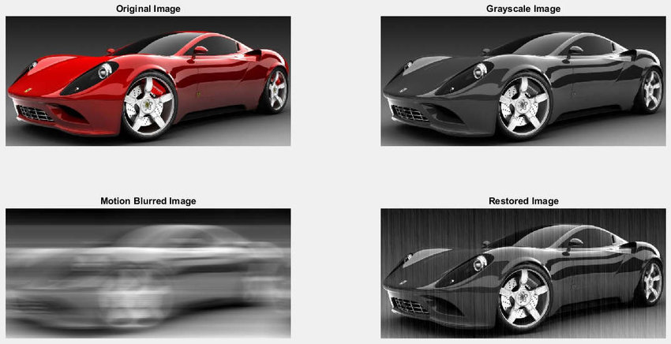

# 6.2 Inverse Filtering


**Inverse filtering** is one of the basic techniques used to restore a degraded image. It assumes we know the degradation function and tries to invert it to recover the original image.

It works well only if there is no noise or very low noise.


---

## 📐 Mathematical Model

Let the degraded image be represented as:

$$
G(u,v) = H(u,v)F(u,v) + N(u,v)
$$

Where:
- \( G(u,v) \): Fourier transform of the degraded image
- \( H(u,v) \): Degradation function
- \( F(u,v) \): Fourier transform of the original image
- \( N(u,v) \): Noise

**Inverse filtering** restores the image as:

$$
\\hat{F}(u,v) = \\frac{G(u,v)}{H(u,v)}
$$

---

## 🐍 Python (OpenCV) Code

```python
import cv2
import numpy as np
import matplotlib.pyplot as plt

# Load grayscale image
img = cv2.imread('car.png', 0)
img = np.float32(img)

# Simulate blur (degradation)
psf = np.ones((5, 5)) / 25
blurred = cv2.filter2D(img, -1, psf)

# Fourier transforms
G = np.fft.fft2(blurred)
H = np.fft.fft2(psf, s=img.shape)

# Inverse filtering
H[H == 0] = 1e-6  # avoid division by zero
F_hat = G / H
f_restored = np.abs(np.fft.ifft2(F_hat))

# Display
plt.subplot(1,3,1), plt.imshow(img, cmap='gray'), plt.title("Original")
plt.subplot(1,3,2), plt.imshow(blurred, cmap='gray'), plt.title("Blurred")
plt.subplot(1,3,3), plt.imshow(f_restored, cmap='gray'), plt.title("Restored")
plt.show()
```
### 🧮 MATLAB Code
```matlab
img = imread('car.png');
gray = rgb2gray(img);
gray = im2double(gray);

% Simulate degradation with motion blur
PSF = fspecial('motion', 20, 45);
blurred = imfilter(gray, PSF, 'conv', 'circular');

% Inverse filtering
G = fft2(blurred);
H = fft2(PSF, size(gray,1), size(gray,2));
H(H == 0) = 1e-6; % avoid division by 0
F_hat = G ./ H;
restored = abs(ifft2(F_hat));

% Display
figure;
subplot(1,3,1), imshow(gray), title('Original');
subplot(1,3,2), imshow(blurred), title('Blurred');
subplot(1,3,3), imshow(restored, []), title('Restored with Inverse Filter');

```
