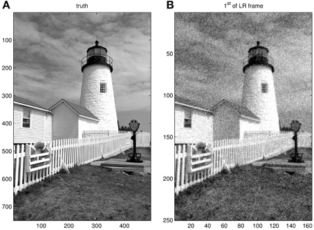

# 6.3 Wiener Filter

<video src="photo/WienerrestorationfilterinPython.mp4" width="800" height="410" controls>
  </video>


**Wiener filtering** is a powerful technique for image restoration that takes into account both the degradation function and the statistical characteristics of noise. It provides better results than inverse filtering when the image is corrupted by noise.

---

## 📐 Mathematical Model

The Wiener filter minimizes the **mean square error** between the estimated image and the original one.

$$
\\hat{F}(u,v) = \\frac{H^*(u,v)}{|H(u,v)|^2 + \\frac{S_n(u,v)}{S_f(u,v)}} G(u,v)
$$

Where:
- \( H(u,v) \): Degradation function
- \( H^*(u,v) \): Conjugate of the degradation function
- \( S_n(u,v) \): Power spectrum of noise
- \( S_f(u,v) \): Power spectrum of the original image
- \( G(u,v) \): Observed degraded image in frequency domain

---

## 🐍 Python (OpenCV) Code

```python
import cv2
import numpy as np
import matplotlib.pyplot as plt

def wiener_filter(img, kernel, K):
    dummy = np.copy(img)
    kernel /= np.sum(kernel)
    dummy = np.fft.fft2(dummy)
    kernel = np.fft.fft2(kernel, s=img.shape)
    kernel_conj = np.conj(kernel)
    wiener = kernel_conj / (np.abs(kernel) ** 2 + K)
    result = wiener * dummy
    result = np.abs(np.fft.ifft2(result))
    return result

# Load image and blur
img = cv2.imread('lena.png', 0)
img = np.float32(img)
kernel = np.ones((5,5)) / 25
blurred = cv2.filter2D(img, -1, kernel)

# Add Gaussian noise
noise = np.random.normal(0, 10, img.shape)
noisy_blurred = blurred + noise

# Apply Wiener filter
K = 0.01
restored = wiener_filter(noisy_blurred, kernel, K)

# Display
plt.subplot(1,3,1), plt.imshow(img, cmap='gray'), plt.title("Original")
plt.subplot(1,3,2), plt.imshow(noisy_blurred, cmap='gray'), plt.title("Noisy + Blurred")
plt.subplot(1,3,3), plt.imshow(restored, cmap='gray'), plt.title("Wiener Restored")
plt.show()

```
---
### 🧮 MATLAB Code
```matlab
img = imread('lena.png');
gray = rgb2gray(img);
gray = im2double(gray);

% Simulate blur and noise
PSF = fspecial('motion', 15, 45);
blurred = imfilter(gray, PSF, 'conv', 'circular');
noise = imnoise(zeros(size(gray)), 'gaussian', 0, 0.001);
noisy_blurred = blurred + noise;

% Apply Wiener filter
estimated_nsr = 0.01;
restored = deconvwnr(noisy_blurred, PSF, estimated_nsr);

% Display
figure;
subplot(1,3,1), imshow(gray), title('Original');
subplot(1,3,2), imshow(noisy_blurred), title('Noisy + Blurred');
subplot(1,3,3), imshow(restored), title('Wiener Restored');

```
