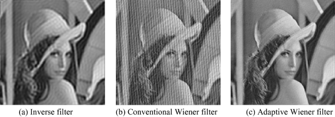

# 6.4 Comparison of Image Restoration Techniques

- In this section, we compare the key image restoration methods discussed previously, focusing on their performance, assumptions, and best use cases.

---

## 📊 Comparison Table

| Feature                      | Inverse Filtering                          | Wiener Filtering             |
| ---------------------------- | ------------------------------------------ | ---------------------------- |
| **Noise Handling**           | ❌ Poor                                     | ✅ Excellent                  |
| **Blur Handling**            | ✅ Good (if noise-free)                     | ✅ Good                       |
| **Requires PSF**             | ✅ Yes                                      | ✅ Yes                        |
| **Computational Complexity** | (Low)                                      | (Moderate)                   |
| **Domain**                   | Frequency domain (FFT)                     | Frequency domain (FFT)       |
| **Mathematical Model**       | \( \hat{F}(u,v) = \frac{G(u,v)}{H(u,v)} \) | See Wiener equation          |
| **Best Use Case**            | Pure blur without noise                    | Blur with Gaussian/S&P noise |

---

## 📝 Summary

- **Inverse filtering** is simple but fails in the presence of noise.
- **Wiener filtering** is more sophisticated and handles noise effectively, especially when the noise characteristics are known or estimated.
- Wiener is usually the better choice in real-world scenarios where noise is inevitable.

---

