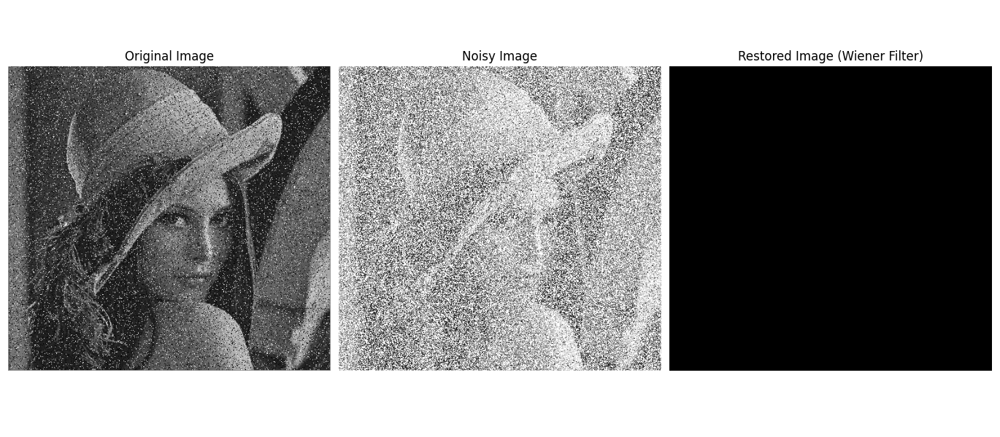

# 6.3 Wiener Filter

<video width="800" height="410" controls>
    <source src="photows/WienerrestorationfilterinPython.mp4" type="video/mp4">
    Your browser does not support the video tag.
  </video>

---

## Wiener Filter

- Wiener filtering is a powerful technique for image restoration that takes into account both the degradation function and the statistical characteristics of noise. It provides better results than inverse filtering when the image is corrupted by noise.

---

## Mathematical Model

- The Wiener filter minimizes the mean square error between the estimated image and the original one.

\[
\\hat{F}(u,v) = \\frac{H^*(u,v)}{|H(u,v)|^2 + \\frac{S_n(u,v)}{S_f(u,v)}} G(u,v)
\]

- Where:
- \( H(u,v) \): Degradation function
- \( H^*(u,v) \): Conjugate of the degradation function
- \( S_n(u,v) \): Power spectrum of noise
- \( S_f(u,v) \): Power spectrum of the original image
- \( G(u,v) \): Observed degraded image in frequency domain

---

## Python Code Wiener Filter

```python

# Import the OpenCV library for image processing
import cv2
# Import NumPy for numerical operations
import numpy as np
# Import Matplotlib for plotting images
import matplotlib.pyplot as plt

# Read the input image in grayscale mode
img = cv2.imread('sample.jpg', cv2.IMREAD_GRAYSCALE)

# Simulate Gaussian noise with mean 0 and sigma 25
mean_noise = 0
sigma_noise = 25
noise = np.random.normal(mean_noise, sigma_noise, img.shape).astype(np.uint8)

# Add the Gaussian noise to the image
noisy_img = cv2.add(img, noise)

# Define the Wiener filter function
def wiener_filter(noisy_image, kernel, noise_var):
    # Compute the Fourier transform of the kernel (padded to image size)
    kernel_ft = np.fft.fft2(kernel, s=noisy_image.shape)
    kernel_ft_conj = np.conj(kernel_ft)
    
    # Compute the Fourier transform of the noisy image
    noisy_image_ft = np.fft.fft2(noisy_image)
    
    # Apply the Wiener filter formula in the frequency domain
    wiener_ft = (kernel_ft_conj / (np.abs(kernel_ft)**2 + noise_var)) * noisy_image_ft
    
    # Compute the inverse Fourier transform to get the restored image
    restored_image = np.fft.ifft2(wiener_ft).real
    
    # Clip values to [0, 255] and convert to uint8
    restored_image = np.clip(restored_image, 0, 255).astype(np.uint8)
    
    return restored_image

# Define a simple averaging kernel (for blur)
kernel = np.ones((5, 5), np.float32) / 25

# Noise variance is the square of sigma
noise_variance = sigma_noise ** 2

# Apply the Wiener filter
restored_image = wiener_filter(noisy_img, kernel, noise_variance)

# Display the original, noisy, and restored images
plt.figure(figsize=(18, 6))

plt.subplot(1, 3, 1)
plt.imshow(img, cmap='gray')
plt.title('Original Image')
plt.axis('off')

plt.subplot(1, 3, 2)
plt.imshow(noisy_img, cmap='gray')
plt.title('Noisy Image')
plt.axis('off')

plt.subplot(1, 3, 3)
plt.imshow(restored_image, cmap='gray')
plt.title('Restored Image (Wiener Filter)')
plt.axis('off')

plt.tight_layout()
plt.show()

```

## MATLAB Code Wiener Filter

```matlab
% Read the input image in grayscale
img = imread('sample.jpg');
if size(img,3) == 3
    img = rgb2gray(img); % Convert to grayscale if it's RGB
end
img = double(img);

% Simulate Gaussian noise
mean_noise = 0;
sigma_noise = 25;
noise = sigma_noise * randn(size(img)) + mean_noise;

% Add Gaussian noise to the image
noisy_img = img + noise;
noisy_img = uint8(max(min(noisy_img, 255), 0)); % Clip to [0,255]

% Define a simple averaging kernel (blur filter)
kernel = ones(5,5) / 25;

% Wiener filter function implementation
function restored = wiener_filter(noisy_img, kernel, noise_var)
    % Compute the Fourier transform of the kernel with the size of the image
    kernel_ft = fft2(kernel, size(noisy_img,1), size(noisy_img,2));
    kernel_ft_conj = conj(kernel_ft);
    
    % Compute the Fourier transform of the noisy image
    noisy_img_ft = fft2(noisy_img);
    
    % Wiener filter formula in frequency domain
    wiener_ft = (kernel_ft_conj ./ (abs(kernel_ft).^2 + noise_var)) .* noisy_img_ft;
    
    % Inverse Fourier transform to get restored image
    restored = real(ifft2(wiener_ft));
    
    % Clip values to valid range
    restored = uint8(max(min(restored, 255), 0));
end

% Noise variance
noise_variance = sigma_noise^2;

% Apply Wiener filter
restored_image = wiener_filter(noisy_img, kernel, noise_variance);

% Display the original, noisy, and restored images
figure;
subplot(1,3,1);
imshow(uint8(img));
title('Original Image');

subplot(1,3,2);
imshow(noisy_img);
title('Noisy Image');

subplot(1,3,3);
imshow(restored_image);
title('Restored Image (Wiener Filter)');


```
