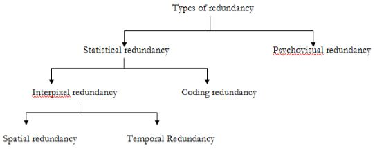
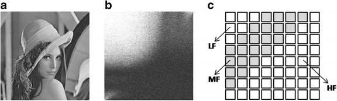

# 1. Introduction & Redundancy Types

<video width="800" height="410" controls>
    <source src="photo/imagecompression.mp4" type="video/mp4">
    Your browser does not support the video tag.
  </video>

---

##  What is Image Compression?

- Image compression is the process of reducing the amount of data required to represent a digital image while preserving its quality as much as possible.

### Compression helps in:

- Reducing storage space
- Speeding up image transmission
- Enhancing system performance

##  Redundancy Types

- Image compression eliminates redundancies in image data. There are three main types:

###   1.Coding Redundancy

- Occurs when fixed-length codes are used instead of variable-length codes.

Example:
- Using Huffman coding to replace repeated patterns.

### 2. Interpixel Redundancy

- Arises from correlations among neighboring pixels.
Example:
- Run-length Encoding (RLE) 
  

### 3. Psychovisual Redundancy
Refers to information that the human eye can't perceive and can be removed without noticeable quality loss.

Example:

- Removing high-frequency components in DCT (JPEG)
  

