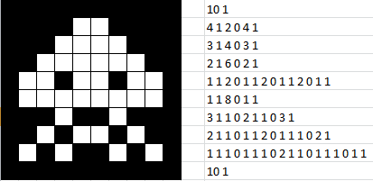

# 1. Introduction & Redundancy Types


<video src="photo/imagecompression.mp4" width="800" height="410" controls>
  </video>


---

## 📌 What is Image Compression?
Image compression is the process of reducing the amount of data required to represent a digital image while preserving its quality as much as possible.

Compression helps in:
- Reducing storage space
- Speeding up image transmission
- Enhancing system performance
---
## 🔁 Redundancy Types
Image compression eliminates redundancies in image data. There are three main types:


### 1. Coding Redundancy
Occurs when fixed-length codes are used instead of variable-length codes.

**Example:**
- Using Huffman coding to replace repeated patterns.


---

### 2. Interpixel Redundancy
Arises from correlations among neighboring pixels.
**Example:**
- Run-length Encoding (RLE) 
  


---

### 3. Psychovisual Redundancy
Refers to information that the human eye can't perceive and can be removed without noticeable quality loss.

**Example:**

- Removing high-frequency components in DCT (JPEG)
  


## 📊 Mathematical Insight
Information content \( I \) of a symbol with probability \( P \) is:

\[
I = -\log_2(P)
\]

Average Information (Entropy):
\[
H = -\sum_{i=1}^{n} P_i \log_2(P_i)
\]

## 🐍 Python Example (OpenCV)
```python
import cv2
import numpy as np

# Load grayscale image using OpenCV (0 flag loads the image in grayscale)
img = cv2.imread('image.jpg', 0)

# Show the original size (total number of pixels in the image)
print(f"Original size: {img.size} pixels")  # `img.size` gives the total number of elements (pixels) in the image

# Function to simulate RLE (Run-Length Encoding)
def rle_encode(img):
    flat = img.flatten()  # Flatten the 2D image into a 1D array for easier processing
    encoding = []  # List to store the encoded values (pixel, count)
    prev = flat[0]  # Set the first pixel as the previous pixel
    count = 1  # Initialize the count for consecutive identical pixels
    for pixel in flat[1:]:  # Loop through the rest of the pixels
        if pixel == prev:  # If the current pixel is the same as the previous one
            count += 1  # Increment the count
        else:
            encoding.append((prev, count))  # Add the (pixel, count) to the encoding list
            prev = pixel  # Update the previous pixel to the current pixel
            count = 1  # Reset the count
    encoding.append((prev, count))  # Append the last pixel and its count
    return encoding

# Apply the RLE encoding function to the grayscale image
rle = rle_encode(img)

# Print the length of the RLE encoding (number of runs)
print(f"RLE Length: {len(rle)}")  # The length is the number of distinct pixel value sequences

```

## 🧠 MATLAB Example
```matlab
% Read the image and convert it to grayscale
img = imread('image.jpg'); % Read the image
gray = rgb2gray(img); % Convert the image to grayscale

% Show the original size of the grayscale image
disp(['Original size: ', num2str(numel(gray)), ' pixels']); % Display the number of pixels in the grayscale image

% Initialize RLE (Run-Length Encoding) simulation
flat = gray(:); % Flatten the grayscale image into a column vector
rle = []; % Initialize an empty array to store the RLE result
prev = flat(1); % Set the first pixel value as the previous value
count = 1; % Initialize the count for the consecutive pixels

% Loop through the flattened image to perform RLE encoding
for i = 2:length(flat) % Start from the second element
    if flat(i) == prev % If the current pixel is the same as the previous one
        count = count + 1; % Increase the count
    else
        % Otherwise, store the previous pixel value and its count in the RLE array
        rle = [rle; prev, count]; 
        prev = flat(i); % Update the previous pixel value
        count = 1; % Reset the count
    end
end

% Add the last pixel value and count to the RLE array
rle = [rle; prev, count];

% Display the length of the RLE result
disp(['RLE Length: ', num2str(size(rle, 1))]); % Display the number of unique value sequences in the RLE result

```

## 🖼️ Image Example


