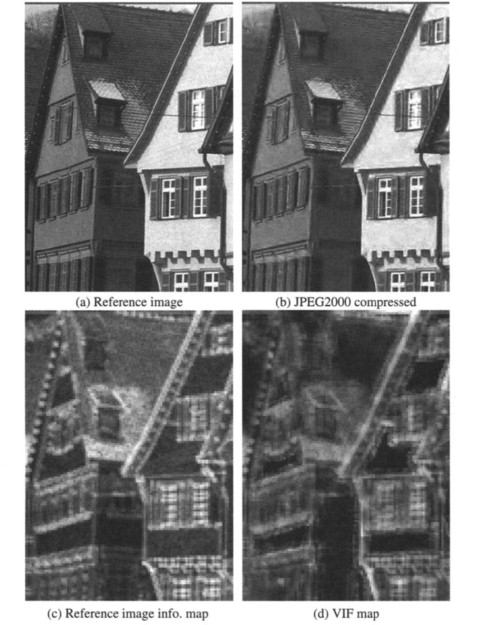

# 3. Fidelity Criteria


##  What is Fidelity in Image Compression?

- Fidelity refers to the quality of the reconstructed image after compression. It measures how closely the output image resembles the original.

### There are two main types of fidelity criteria:

- Subjective Fidelity: Based on human visual judgment.
- Objective Fidelity: Based on mathematical measures.
  
 


##  Objective Fidelity Measures

### 1. Mean Absolute Error (MAE)
\[
\text{MSE} = \frac{1}{MN} \sum_{i=1}^M \sum_{j=1}^N [f(i,j) - \hat{f}(i,j)]
\]
### 2. Mean Squared Error (MSE)

\[
\text{MSE} = \frac{1}{MN} \sum_{i=1}^M \sum_{j=1}^N [f(i,j) - \hat{f}(i,j)]^2
\]

### 3. Peak Signal-to-Noise Ratio (PSNR)
\[
\text{PSNR} = 10 \cdot \log_{10} \left( \frac{255^2}{\text{MSE}} \right)
\]

###  Python Code

```python

# Import OpenCV library for image reading and processing
import cv2
import numpy as np
import matplotlib.pyplot as plt

# Import custom function to get the image file path
from file_handler import get_image_path  

def calculate_mae(img1, img2):
    # Mean Absolute Error
    return np.mean(np.abs(img1 - img2))

def calculate_mse(img1, img2):
    # Mean Squared Error
    return np.mean((img1 - img2) ** 2)

def calculate_psnr(img1, img2):
    # Peak Signal-to-Noise Ratio
    mse = calculate_mse(img1, img2)
    if mse == 0:
        return float('inf')
    max_pixel = 255.0
    psnr = 20 * np.log10(max_pixel / np.sqrt(mse))
    return psnr

# Get the image file path from the helper function
path = get_image_path()

# Load the original image in grayscale
original = cv2.imread(path, cv2.IMREAD_GRAYSCALE)

# If image not found, raise error
if original is None:
    raise FileNotFoundError(f"Image file not found at path: {path}")

# Create a noisy version of the image (simulate processed image)
noise = np.random.normal(0, 25, original.shape).astype(np.float32)
noisy_img = original.astype(np.float32) + noise
noisy_img = np.clip(noisy_img, 0, 255).astype(np.uint8)

# Calculate metrics
mae = calculate_mae(original, noisy_img)
mse = calculate_mse(original, noisy_img)
psnr = calculate_psnr(original, noisy_img)

# Plot images and results
fig, axes = plt.subplots(1, 2, figsize=(12, 6))

axes[0].imshow(original, cmap='gray')
axes[0].set_title('Original Image')
axes[0].axis('off')

axes[1].imshow(noisy_img, cmap='gray')
axes[1].set_title('Noisy Image')
axes[1].axis('off')

# Add text box with metrics below the images
fig.text(0.5, 0.05, f'MAE: {mae:.2f}    MSE: {mse:.2f}    PSNR: {psnr:.2f} dB',
         ha='center', fontsize=14, bbox=dict(facecolor='white', alpha=0.6, boxstyle='round,pad=0.5'))

plt.tight_layout(rect=[0, 0.1, 1, 1])
plt.show()

```

###  MATLAB Code

```matlab

% Read the original image in grayscale
original = imread(path);
if size(original,3) == 3
    original = rgb2gray(original);
end
original = double(original);

% Create noisy image by adding Gaussian noise
noise = 25 * randn(size(original));
noisy_img = original + noise;
noisy_img = uint8(min(max(noisy_img,0),255));

% Convert noisy image to double for calculations
noisy_img_double = double(noisy_img);

% Calculate Mean Absolute Error (MAE)
mae = mean(abs(original(:) - noisy_img_double(:)));

% Calculate Mean Squared Error (MSE)
mse = mean((original(:) - noisy_img_double(:)).^2);

% Calculate PSNR
if mse == 0
    psnr_val = Inf;
else
    max_pixel = 255;
    psnr_val = 20 * log10(max_pixel / sqrt(mse));
end

% Display images and results
figure('Position',[100 100 800 400])

subplot(1,2,1)
imshow(uint8(original))
title('Original Image')

subplot(1,2,2)
imshow(noisy_img)
title('Noisy Image')

% Display metrics below the images
dim = [0.25 0.05 0.5 0.1]; % Position for annotation text box
metrics_str = sprintf('MAE: %.2f    MSE: %.2f    PSNR: %.2f dB', mae, mse, psnr_val);
annotation('textbox',dim,'String',metrics_str,'EdgeColor','none','FontSize',14,'HorizontalAlignment','center','BackgroundColor',[1 1 1 0.6]);

```


