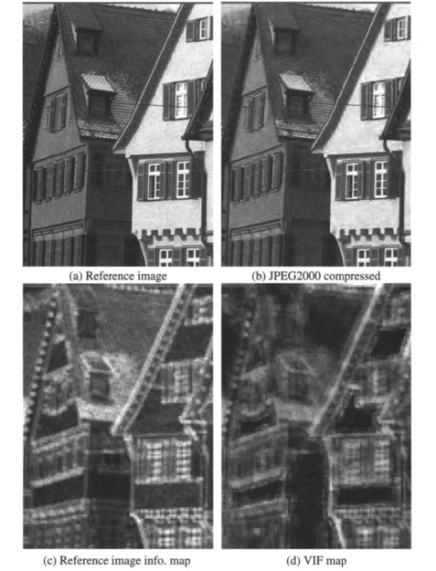

# 3. Fidelity Criteria


## 🎯 What is Fidelity in Image Compression?
Fidelity refers to the quality of the reconstructed image after compression. It measures how closely the output image resembles the original.

There are two main types of fidelity criteria:
- **Subjective Fidelity**: Based on human visual judgment.
- **Objective Fidelity**: Based on mathematical measures.
  
 

---

## 📏 Objective Fidelity Measures

### 1. Mean Squared Error (MSE)
\[
\text{MSE} = \frac{1}{MN} \sum_{i=1}^M \sum_{j=1}^N [f(i,j) - \hat{f}(i,j)]^2
\]

### 2. Peak Signal-to-Noise Ratio (PSNR)
\[
\text{PSNR} = 10 \cdot \log_{10} \left( \frac{255^2}{\text{MSE}} \right)
\]

## 🐍 Python Code
```python
import cv2
import numpy as np

# Load the original and compressed images in grayscale
original = cv2.imread('original.jpg', 0)  # Load the original image in grayscale
compressed = cv2.imread('compressed.jpg', 0)  # Load the compressed image in grayscale

# Calculate the Mean Squared Error (MSE) between the original and compressed images
mse = np.mean((original - compressed) ** 2)  # MSE is the average of the squared differences between the original and compressed images

# Calculate the Peak Signal-to-Noise Ratio (PSNR)
psnr = 10 * np.log10(255**2 / mse)  # PSNR is calculated using the formula: PSNR = 10 * log10((MAX_I^2) / MSE)

# Print the MSE and PSNR values
print(f"MSE: {mse:.2f}, PSNR: {psnr:.2f} dB")  # Display MSE and PSNR with 2 decimal places

```
---

## 🧠 MATLAB Code
```matlab
% Load the original and compressed images
original = imread('original.jpg');  % Read the original image
compressed = imread('compressed.jpg');  % Read the compressed image

% Convert both images to grayscale (if they are RGB)
original = rgb2gray(original);  % Convert the original image to grayscale
compressed = rgb2gray(compressed);  % Convert the compressed image to grayscale

% Calculate the Mean Squared Error (MSE) between the original and compressed images
mse = immse(original, compressed);  % immse computes the Mean Squared Error (MSE)

% Calculate the Peak Signal-to-Noise Ratio (PSNR)
psnr = 10 * log10(255^2 / mse);  % PSNR is calculated using the formula: PSNR = 10 * log10((MAX_I^2) / MSE)

% Print the MSE and PSNR values
fprintf('MSE: %.2f, PSNR: %.2f dB\n', mse, psnr);  % Display MSE and PSNR with 2 decimal places
```
.png)

---