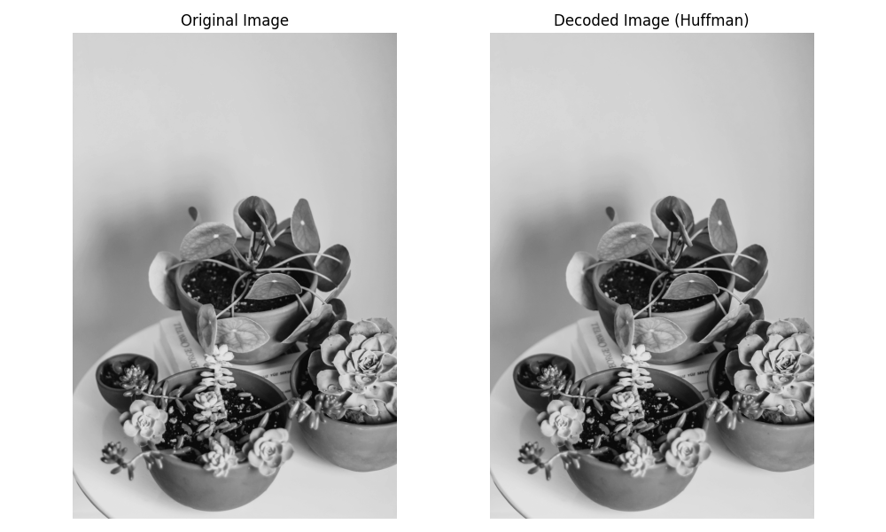

# 4. Huffman (Lossless)


##  What is Huffman Coding?
- Huffman coding is a variable-length, prefix-free coding algorithm used for lossless data compression. It reduces coding redundancy by assigning shorter codes to more frequent symbols.


###  Huffman Tree Construction Steps:

1. Count frequency of each symbol.
2. Create leaf nodes and insert into a priority queue.
3. While more than one node in the queue:
   - Remove two nodes with lowest frequency.
   - Combine them into a new node with frequency equal to sum.
   - Insert the new node into the queue.
4. Generate codes by traversing the tree.


###  Python Code 

```python

# Import OpenCV library for image reading and processing
import cv2  
# Import numpy for array manipulations
import numpy as np
# Import PIL Image for easy image format conversion
from PIL import Image
# Import Counter and defaultdict for frequency counting and data structures
from collections import Counter, defaultdict
# Import heapq for priority queue implementation (min-heap) used in Huffman coding
import heapq
# Import Matplotlib for plotting images side by side
import matplotlib.pyplot as plt  
# Import custom function to get the image file path
from file_handler import get_image_path  

# Get the image file path from the helper function
path = get_image_path()
# Read the input image in color mode using OpenCV (though not used further here)
img = cv2.imread(path)  # Read the image

# Step 1: Load the image again using PIL and convert it to grayscale ('L' mode)
img = Image.open(path).convert('L')  # 'L' mode converts to grayscale
# Convert the grayscale image to a numpy array for pixel-level processing
img_array = np.array(img)

# Step 2: Build Huffman coding for pixel values

# Count the frequency of each pixel value in the flattened image array
freq = Counter(img_array.flatten())

# Initialize a priority queue (min-heap) with (frequency, [symbol, code]) pairs
# Each symbol is a pixel value; code starts as an empty string
heap = [[weight, [symbol, ""]] for symbol, weight in freq.items()]
heapq.heapify(heap)  # Convert the list into a heap structure

# Build the Huffman tree by combining two lowest frequency nodes repeatedly
while len(heap) > 1:
    low = heapq.heappop(heap)   # Pop node with lowest frequency
    high = heapq.heappop(heap)  # Pop node with second lowest frequency
    # Append '0' to the code of all symbols in the low frequency node
    for pair in low[1:]:
        pair[1] = '0' + pair[1]
    # Append '1' to the code of all symbols in the high frequency node
    for pair in high[1:]:
        pair[1] = '1' + pair[1]
    # Push the combined node back into the heap with summed frequency
    heapq.heappush(heap, [low[0] + high[0]] + low[1:] + high[1:])

# Extract the final Huffman codes from the heap and sort them by code length
huff_codes = sorted(heapq.heappop(heap)[1:], key=lambda p: (len(p[-1]), p))

# Create dictionaries for encoding (symbol to code) and decoding (code to symbol)
encode_dict = {symbol: code for symbol, code in huff_codes}
decode_dict = {code: symbol for symbol, code in huff_codes}

# Step 3: Encode the image pixels into a string of Huffman codes
encoded_image = "".join(encode_dict[pixel] for pixel in img_array.flatten())

# Step 4: Decode the encoded string back into pixel values
decoded_pixels = []
code = ""  # Temporary variable to accumulate bits
for bit in encoded_image:
    code += bit  # Add one bit at a time
    if code in decode_dict:  # If current bit sequence matches a code
        decoded_pixels.append(decode_dict[code])  # Append decoded pixel value
        code = ""  # Reset code accumulator

# Convert the list of decoded pixels back into a numpy array with original shape
decoded_array = np.array(decoded_pixels, dtype=np.uint8).reshape(img_array.shape)

# Step 5: Plot the original and decoded images side by side for comparison
fig, axes = plt.subplots(1, 2, figsize=(10, 6))

# Plot original grayscale image
axes[0].imshow(img_array, cmap='gray')
axes[0].set_title('Original Image')
axes[0].axis('off')  # Hide axis ticks

# Plot the decoded image (should look identical if lossless)
axes[1].imshow(decoded_array, cmap='gray')
axes[1].set_title('Decoded Image (Huffman)')
axes[1].axis('off')  # Hide axis ticks

# Adjust layout and display the plots
plt.tight_layout()
plt.show()

```


###  MATLAB Code 

```matlab

% Step 0: Read and convert image to grayscale

img = imread(path);
if size(img,3) == 3
    img_gray = rgb2gray(img);  % Convert to grayscale if color image
else
    img_gray = img;
end

% Flatten the image matrix into a vector
pixels = img_gray(:);

% Step 1: Count frequency of each pixel value
pixel_values = unique(pixels);
freq = histc(pixels, pixel_values);

% Step 2: Build Huffman tree and codes
% Create a priority queue as a cell array: {frequency, symbols, codes}
% Initialize queue with each symbol and empty code
queue = cell(length(freq), 3);
for i = 1:length(freq)
    queue{i,1} = freq(i);
    queue{i,2} = pixel_values(i);
    queue{i,3} = '';
end

% Build Huffman tree
while length(queue) > 1
    % Sort queue by frequency ascending
    [~, idx] = sort(cell2mat(queue(:,1)));
    queue = queue(idx,:);

    % Pop two nodes with smallest frequencies
    low = queue(1,:);
    high = queue(2,:);

    % Append '0' to codes of low-frequency node symbols
    for j = 1:length(low{2})
        low{3}{j} = ['0' low{3}{j}];
    end
    if isempty(low{3})
        low{3} = repmat({''}, size(low{2}));
        low{3} = cellfun(@(c) ['0' c], low{3}, 'UniformOutput', false);
    end

    % Append '1' to codes of high-frequency node symbols
    for j = 1:length(high{2})
        high{3}{j} = ['1' high{3}{j}];
    end
    if isempty(high{3})
        high{3} = repmat({''}, size(high{2}));
        high{3} = cellfun(@(c) ['1' c], high{3}, 'UniformOutput', false);
    end

    % Combine symbols and codes
    combined_symbols = [low{2} high{2}];
    combined_codes = [low{3} high{3}];
    combined_freq = low{1} + high{1};

    % Remove the two nodes and add the combined node
    queue(1:2,:) = [];
    queue(end+1,:) = {combined_freq, combined_symbols, combined_codes};
end

% Extract Huffman codes for each symbol (pixel value)
symbols = queue{1,2};
codes = queue{1,3};

% Create encoding map: pixel value -> code
encode_map = containers.Map('KeyType','double','ValueType','char');
for i = 1:length(symbols)
    encode_map(symbols(i)) = codes{i};
end

% Step 3: Encode the image pixels using Huffman codes
encoded_image = '';
for i = 1:length(pixels)
    encoded_image = [encoded_image encode_map(pixels(i))]; %#ok<AGROW>
end

% Step 4: Decode the encoded string back to pixel values
decode_map = containers.Map(codes, num2cell(symbols));  % code -> pixel value

decoded_pixels = zeros(length(pixels),1,'uint8');
code_buffer = '';
idx = 1;
for i = 1:length(encoded_image)
    code_buffer = [code_buffer encoded_image(i)];
    if isKey(decode_map, code_buffer)
        decoded_pixels(idx) = decode_map(code_buffer);
        idx = idx + 1;
        code_buffer = '';
    end
end

% Reshape decoded pixels to original image size
decoded_img = reshape(decoded_pixels, size(img_gray));

% Step 5: Display original and decoded images side by side
figure;
subplot(1,2,1);
imshow(img_gray);
title('Original Image');

subplot(1,2,2);
imshow(decoded_img);
title('Decoded Image (Huffman)');

```




